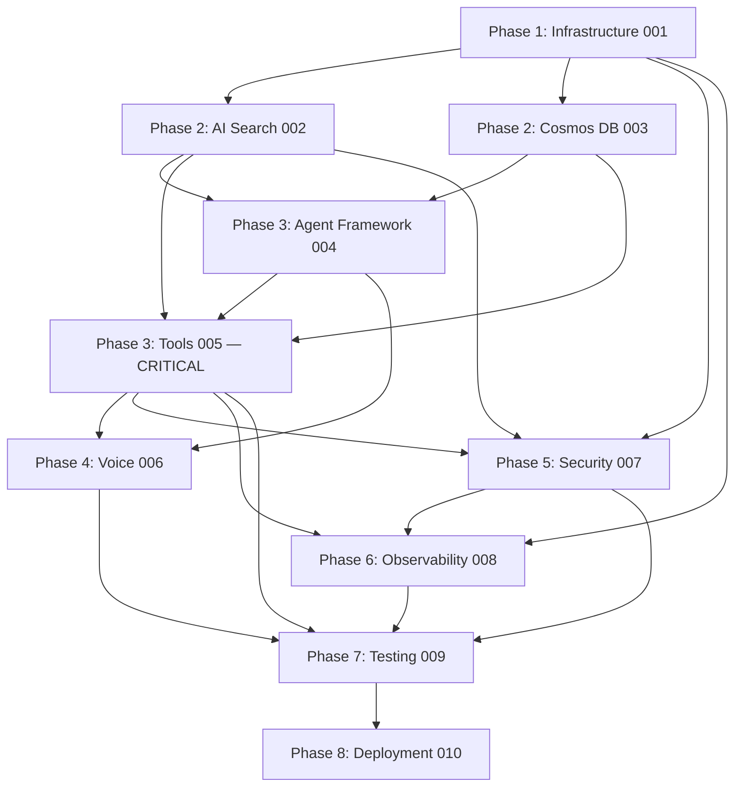

# Implementation Roadmap — Flint Quiz

This roadmap orchestrates the 10 dev-story prompts in `tasks/prompts/` into a phased, traceable execution sequence. Every prompt is anchored to its task pack, specs, ADRs, and governance docs so the work stays auditable, consistent, and architecturally stable.

## Traceability chain

```
Requirement → Architecture → Task → Implementation → Validation
   (specs)        (specs)     (tasks)     (code)         (tests/gates)
```

Each prompt in `tasks/prompts/` follows the same enterprise structure:

1. IMPLEMENTATION CONTEXT (phase + scope)
2. TASK REFERENCES
3. SPEC REFERENCES
4. ADR REFERENCES
5. GOVERNANCE REFERENCES
6. OBJECTIVE
7. IMPLEMENTATION RULES
8. OUTPUT FILES
9. VALIDATION REQUIREMENTS
10. FORBIDDEN ACTIONS

## Phase map

| Phase | Task Pack | Prompt | Description |
|-------|-----------|--------|-------------|
| 1 — Infrastructure Foundation | `tasks/001-infrastructure.md` | `tasks/prompts/001-infrastructure.prompt.md` | Bicep IaC, `azd up`, UAMI, RBAC, AppConfig, Key Vault, Foundry hub, Hosted Agent, Realtime endpoint, observability sinks |
| 2 — Core Data Layer (AI Search) | `tasks/002-ai-search.md` | `tasks/prompts/002-ai-search.prompt.md` | `questions` index schema, per-language analyzers, seed loader, two-method search client (the LLM-safety boundary) |
| 2 — Core Data Layer (Cosmos DB) | `tasks/003-cosmos-db.md` | `tasks/prompts/003-cosmos-db.prompt.md` | Containers, Pydantic models, repository, `ifMatch` conditional writes, state machine, reproducible shuffle, retention, sweeper |
| 3 — Agent Layer | `tasks/004-agent-framework.md` | `tasks/prompts/004-agent-framework.prompt.md` | MAF agent, system prompt + per-language phrasing blocks, tool dispatcher, prompt-hash, AgentThread, resumption, output cap |
| 3 — Tool Layer (**CRITICAL**) | `tasks/005-tools.md` | `tasks/prompts/005-tools.prompt.md` | Five tools, multilingual normalizer, TTS shaper, defensive strip, coverage-fallback consent, server-side timers |
| 4 — Voice Layer | `tasks/006-voice-realtime.md` | `tasks/prompts/006-voice-realtime.prompt.md` | Realtime endpoint wiring, STT/TTS streaming, voice idle handler, session cap, voice dashboard |
| 5 — Security Hardening | `tasks/007-security.md` | `tasks/prompts/007-security.prompt.md` | MI audit, RBAC verification, Key Vault, ISO allowlist, leak enforcement, injection corpus, Entra E2E, GDPR cascade, pre-public gate |
| 6 — Observability | `tasks/008-observability.md` | `tasks/prompts/008-observability.prompt.md` | App Insights + Foundry tracing, `grading_event`, dashboards, span discipline, alerts, `agent.*` event taxonomy |
| 7 — Testing & Evaluation | `tasks/009-testing.md` | `tasks/prompts/009-testing.prompt.md` | TEST-006..TEST-028, multilingual matrix, voice normalisation, per-language Foundry Evaluation, CI orchestration |
| 8 — Deployment & Operational Polish | `tasks/010-deployment.md` | `tasks/prompts/010-deployment.prompt.md` | `azd up` validation, seed reindex, smoke matrix, per-release + pre-public gates, rollback, cost monitoring, phase progression |

## Execution sequence with dependencies



## Validation checkpoints

| Checkpoint | When | What it asserts |
|------------|------|-----------------|
| **TEST-001** | After Phase 1 + Phase 8 TASK-203 | `azd up` from clean subscription deploys every resource; post-provision hook prints `OK` per resource; runtime UAMIs cannot escalate |
| **TEST-002** | After Phase 8 TASK-204 | Seed loader produces ≥ 90 docs across en/fr/es; per-language counts equal expected |
| **TEST-006** | Every PR touching tools / search client / agent | No `correct_answer` in any tool response across en/fr/es; AST check rejects `get_answer_key` outside `submit_answer` |
| **TEST-007** | Every merge | Two concurrent `submit_answer` calls → one persisted answer + one event + one audit row |
| **TEST-003/004/005** | Post-deploy + per-release | Text en, text fr, voice es smokes complete end-to-end |
| **TEST-010** | Post-deploy | `grading_event` emitted with required dimensions; `expected`/`receivedRaw` absent from App Insights, present in `audit` |
| **TEST-011** | Every reindex / per-release | Per-language Foundry Evaluation gates publish; regressing language blocks |
| **TEST-018..028** | PR/merge/release per `009-testing TASK-175` tiers | Every GOV-* rule has exactly one enforcing test |
| **TEST-028** | Per-release | GDPR cascade end-to-end with real Cosmos + Key Vault; cascade / repeat / auth-negative / salt-rotation |
| **Per-release gate** | Tag time | Full test suite + TEST-006 per language + TEST-011 parity tolerance |
| **Pre-public gate** | Before any public traffic | APIM quotas active + retention applied + LLM-boundary reviewed |

## Project-phase rollup (per `specs/007-operational-runbook.md §7`)

| Project Phase | Duration | Prompt Packs | Smoke |
|---------------|----------|--------------|-------|
| **Phase 1 — PoC core** | 2–3 days | 001 + 002 (subset) + 003 + 004 + 005 | TEST-003 in Playground text mode |
| **Phase 2 — Voice + hardening** | 3–4 days | 006 + 005 TASK-086/087 + 003 TASK-047 + 007 TASK-120/121/131 + 008 TASK-140/141 + 009 TASK-160 | TEST-005 voice + TEST-006 leak |
| **Phase 3 — Operational polish** | 2–3 days | 009 TASK-167 + 003 TASK-050/051 + 007 TASK-129 + 008 TASK-147 + 010 TASK-211 + 009 TASK-171 | Full smoke matrix + per-language eval + channel-switch |

Feature freeze per phase. No scope creep across phases.

## What this approach prevents

- **AI drift** — every code-generation step is anchored to its task, specs, ADRs, and governance docs.
- **Architectural inconsistency** — the FORBIDDEN ACTIONS section in each prompt is explicit about what does NOT belong in each pack.
- **Undocumented shortcuts** — VALIDATION REQUIREMENTS demands evidence; every claim maps to a test or a runtime check.
- **Security regressions** — TEST-006 (leak), TEST-007 (idempotency), TEST-018..028 (governance), TEST-028 (GDPR) gate every merge or release.

## How to execute

For each prompt, paste it verbatim into a fresh Claude session with the repo loaded. The prompt is self-contained: it states scope, references, rules, outputs, validation, and forbidden actions. Claude implements the pack; you (or CI) verify against the VALIDATION REQUIREMENTS before moving to the next prompt.

Run prompts in dependency order (per the Mermaid graph above). Phase 1 must complete before any Phase 2 prompt; Phase 2 must complete before Phase 3; etc. Within a phase, AI Search (002) and Cosmos DB (003) can run in parallel.
