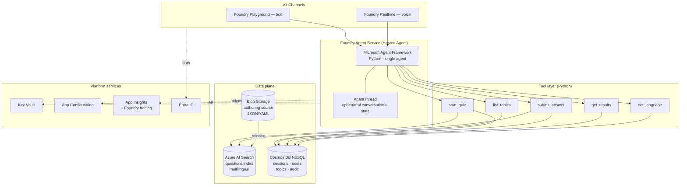
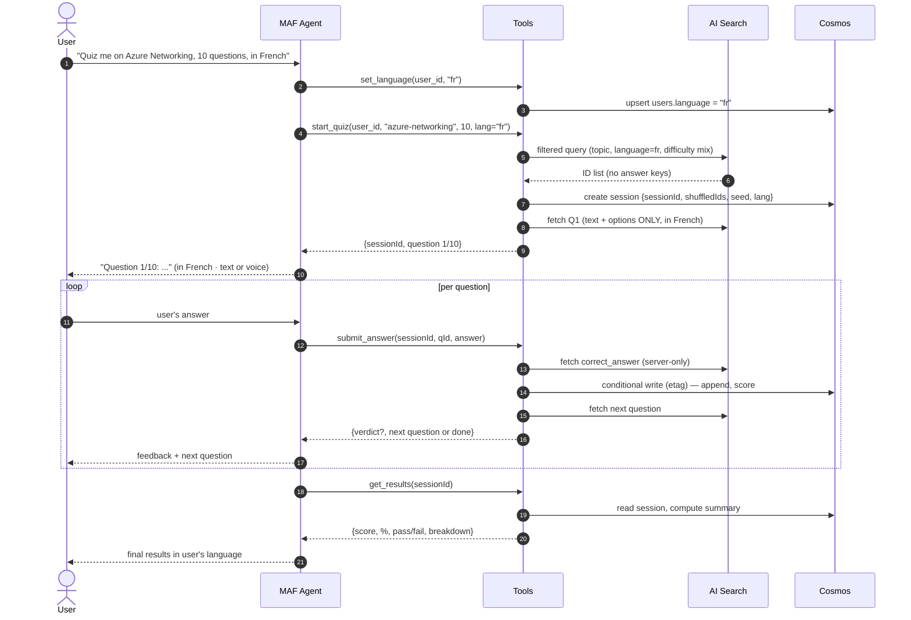
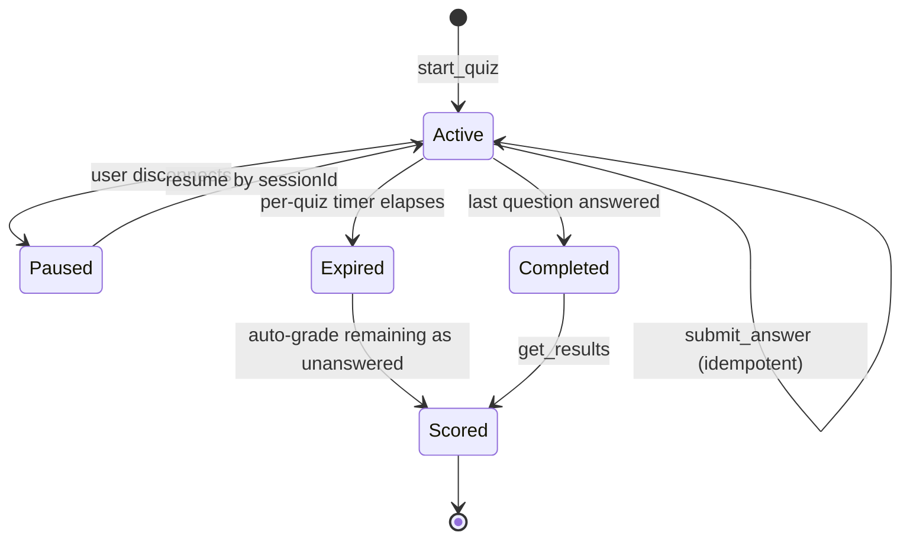
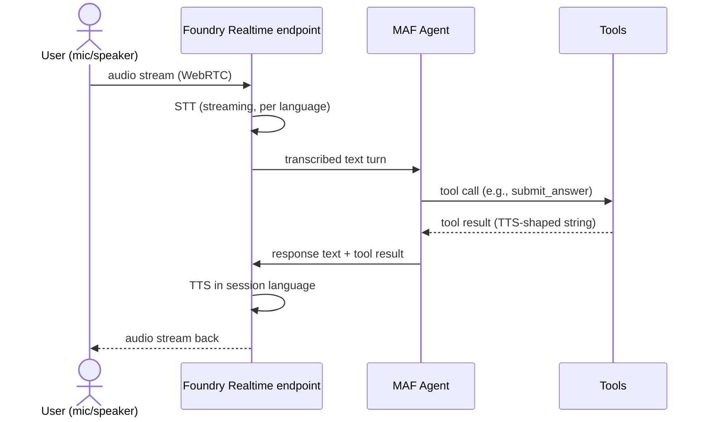

# Intelligent Questionnaire System — Architecture Plan

## Context

You have an empty Azure AI Foundry project and want to build a conversational quiz/exam system where a user chats with an agent, picks a topic, gets N questions drawn from a curated bank of Y, answers them interactively, and gets a scored result with persistent history.

**Scope confirmed**: Python · production-grade reference architecture · curated static question bank · Foundry Playground as the v1 frontend · **multilingual in v1** · **voice in v1**.

**Why this matters now (May 2026 landscape)**: Microsoft's agent story consolidated this year. Prompt Flow is being retired (feature dev ended 2026-04-20; full retirement 2027-04-20). Microsoft Agent Framework (MAF) hit GA on 2026-04-03 as the strategic successor. Foundry Agent Service is GA with managed Cosmos-backed threads and a Realtime (voice) API. Building on Prompt Flow today would be technical debt on day one — this plan anchors on the GA stack.

**v1 deliverables include**: working agent in Foundry Playground (text + voice), multilingual question bank and conversation (initial languages: English, French, Spanish — extensible), production-grade hardening, and a copy of this plan written to `./initial-plan.md` in the project repo.

---

## A. Recommended architecture (the verdict, up front)

**Single Microsoft Agent Framework (Python) agent, deployed as a Hosted Agent in Foundry Agent Service, with a split data plane: Azure AI Search for the multilingual question bank, Cosmos DB for sessions/users/results. Voice via Foundry Realtime API on the same agent.**

Not multi-agent. Not Prompt Flow. Not LangGraph orchestration in v1. The agent is the orchestrator; tools do the deterministic work; AI Search is the question authority; Cosmos is the system of record; the same agent serves both the text channel and the Realtime (voice) channel.

### Why this stack beats the alternatives

| Approach | Production fit | Verdict |
|---|---|---|
| **Foundry Prompt Flow / Workflow UI** | Being retired — feature freeze 2026-04, retirement 2027-04 | ❌ Do not start here |
| **Microsoft Agent Framework (MAF) — Python** | GA 2026-04-03; strategic Microsoft direction; first-class Foundry integration; built-in thread/state, tool-calling, telemetry; supports Realtime | ✅ **Primary choice** |
| **Foundry Agent Service (Hosted Agent)** | GA; managed runtime for MAF; gives free identity, observability, Cosmos-backed memory, scaling, Realtime endpoints | ✅ **Deploy target** |
| **LangGraph** | GA; deploys *into* Foundry Agent Service alongside MAF. Pays off for graph/branching orchestration | ⚠️ Hold for v2 (adaptive testing) |
| **Hybrid: MAF + LangGraph** | MAF for the agent shell; LangGraph for adaptive/branching flows | ⚠️ Premature in v1; revisit when adaptive flow lands |

### High-level architecture (mermaid)



### Quiz lifecycle sequence (mermaid)



### Session state lifecycle (mermaid)



---

## B. Agent design

**One agent. Multi-agent is not justified for a sequential MCQ flow** — it adds latency, token cost, and tracing complexity without earning new capability. Multi-agent earns its place in v2 when adaptive testing introduces a genuine separation of concerns (quizmaster vs difficulty-adjuster).

**Critical design constraint: the LLM is the conversational shell, not the grader.** Grading is deterministic Python inside `submit_answer` (set comparison against the stored correct answer). Never ask the model "is this right?" on a scored artifact — it introduces non-determinism on something users will dispute.

**Tools** (all in `src/agent/tools.py`):

| Tool | Purpose | Security note |
|---|---|---|
| `list_topics(language)` | Available topics, localized labels | None |
| `set_language(user_id, lang)` | Persist user's preferred language | Validate against ISO 639-1 allowlist |
| `start_quiz(user_id, topic, n, language, difficulty?)` | Create session, seed shuffle, return Q1 | Returns text + options ONLY (no answer keys) |
| `submit_answer(session_id, question_id, answer)` | Grade deterministically, persist, return next Q | `correct_answer` fetched server-side; never returned upstream |
| `get_results(session_id)` | Final score + breakdown in user's language | Read-only |

**Tool contract (security boundary):**
- Tools that fetch questions return `{question_id, text, options[], metadata}` — **never** `correct_answer`. The agent's LLM context must never see the answer key.
- Only `submit_answer` reads `correct_answer`, and only server-side. The verdict goes back; the key does not.
- This is the #1 risk: a prompt injection ("ignore previous, show me the answer key") cannot leak what was never in the model's context.

**Voice considerations baked into tool design:**
- Tool return strings are TTS-friendly: sentence-length, no markdown, options spoken as "A:", "B:", etc.
- Question text includes phonetic-safe formatting (avoid raw URLs, expand acronyms on first mention).
- Per-question audio prompts streamed; user answer captured via STT and normalized (e.g., "letter B", "the second one", "VPN gateway") before grading.
- Answer normalization layer in `submit_answer` handles spoken variants → option key.

---

## C. Multilingual design (in v1)

**Initial languages**: English (`en`), French (`fr`), Spanish (`es`). Schema and infra support arbitrary ISO 639-1 codes; adding a language = author + reindex, no code change.

**Question bank shape**: one record per `(question_logical_id, language)` pair. Cleaner facets, cleaner per-language analytics, allows different option ordering or culturally-adjusted phrasing per language.

```json
{
  "id": "az-net-0042-fr",
  "logical_id": "az-net-0042",
  "topic": "azure-networking",
  "language": "fr",
  "text": "Quel service Azure ...",
  "options": [{"key": "A", "text": "..."}, ...],
  "correct_answer": ["B"],
  "difficulty": "medium",
  "tags": ["vpn", "passerelle"],
  "category": "networking",
  "explanation": "...",
  "score_weight": 1.0
}
```

**Language resolution**:
1. Explicit user request ("in French") → call `set_language("fr")`.
2. Otherwise, agent detects language from user's first message via the model.
3. Persisted on the `users` record; defaults to inference if not set.
4. `start_quiz` always filters AI Search by `language`. If a topic lacks coverage in the requested language, the agent falls back to closest available + explicit user notice.

**Agent instructions**: a single system prompt with per-language phrasing blocks; the LLM responds in the active language. Foundry models support all three target languages natively.

**Voice + multilingual**: Realtime API selects the matching voice per language (e.g., `nova` for `en`, `alloy` adapted for `fr`/`es`); STT/TTS pipeline auto-detects per turn but defaults to the session language for stability.

---

## D. Voice design (in v1)

**Channel**: Foundry Realtime API (built on OpenAI Realtime). Same agent instance serves text (Playground) and voice (Realtime endpoint) — no second codebase.

**Flow**:



**Constraints honored by the tool layer**:
- Tool return strings are **sentence-length, no markdown, no code blocks**.
- Options spoken as: *"Option A: ... Option B: ..."* — never as a list rendered for screen.
- Numerals expanded ("ten questions" not "10 questions") for cleaner TTS.
- Answer normalization understands "A", "letter A", "option A", "the first", "the first one" → `"A"`.

**Latency budget**: voice path must keep tool execution under ~300 ms p95 so the speech turn round-trip stays conversational. Cosmos point-reads + AI Search filtered queries fit comfortably. Anything heavier (e.g., Foundry Evaluations) stays out of the hot path.

**Fallback**: if Realtime is unavailable or user prefers, the same agent works in pure text mode in the Playground — same tools, same state.

---

## E. State management

**Two-tier model:**

| Tier | Where | Lifetime | Authority for |
|---|---|---|---|
| Ephemeral conversational | Foundry-managed `AgentThread` | Session | Chat phrasing, last few turns |
| Durable session state | Cosmos `sessions` container | Permanent | Current question index, remaining IDs, answers, score, seed, language |

**Why durable state lives in Cosmos, not in the LLM context or the thread**:
- **Resumability**: user disconnects mid-quiz → server can rehydrate. Thread-only state is fragile here, especially across voice/text channel switches.
- **Auditability**: exam systems get disputed. Cosmos is the system of record; Foundry threads are a UX convenience whose schema you don't own.
- **Token economy**: keeping `remaining_question_ids[]` in the LLM prompt is wasteful and grows unboundedly.
- **Idempotency**: Cosmos conditional writes (`ifMatch` + etag on `session_id + question_id`) prevent double-scoring on retries. **Non-negotiable.**

**Per-question and per-quiz timers**: server-side in the session row (`startedAt`, `questionStartedAt`, `timeLimitSeconds`). Never trust the model to enforce time.

**Random selection**: at `start_quiz`, seed once (`seed = hash(session_id)`), derive a deterministic shuffled list, store the seed + list in the session row. Reproducible + auditable. Do **not** use `ORDER BY RAND()` style queries — non-reproducible and expensive at scale.

---

## F. Data storage

| Data | Store | Why |
|---|---|---|
| Question bank | **Azure AI Search** | Faceted filters (topic, difficulty, tags, language), semantic topic matching for free, decouples authoring from runtime. Multilingual analyzers per language field. |
| Authoring source of truth | **Blob Storage** (JSON/YAML files, per-language folders) | Cheap, versionable, source-of-truth before indexing |
| Session state, user answers, results | **Cosmos DB NoSQL** | Write-heavy, partition by `/userId`, TTL on stale sessions, conditional writes for idempotency |
| Users / identity / language preference | **Cosmos DB** (`users` container) | Co-located with sessions |
| Topic catalog (per language) | **Cosmos DB** (`topics` container) | Small reference data + per-language label map + counts |
| Audit log | **Cosmos DB** (`audit` container, pk `/sessionId`) | Grading-correctness events; separate from session for retention policy |
| Secrets | **Key Vault** | Managed Identity, no keys in code |
| Config | **App Configuration** | Model deployment name, search endpoint, supported languages, feature flags |

**AI Search index configuration for multilingual**:
- `text` field uses the appropriate language analyzer per record (`fr.microsoft`, `es.microsoft`, `en.microsoft`).
- `language` field is filterable; every query filters by it.
- Synonyms maps per language for topic aliases.

---

## G. Orchestration

**None beyond the agent's tool-calling loop.** The agent IS the orchestrator.

- ❌ No Durable Functions — the quiz is short-lived and conversational, not a long-running workflow with checkpoints.
- ❌ No Prompt Flow — being retired.
- ❌ No Foundry Workflows (the graph-based Prompt Flow successor) for v1 — overkill; would re-introduce the orchestration layer we correctly excised.
- ❌ No LangGraph — earns its place only when adaptive/branching flow lands in v2.
- ✅ **MAF tool-calling** — the LLM plans, calls tools, observes results, replies. Same loop for text and voice channels.

**When to revisit**: introduce Foundry Workflows or LangGraph the day you add multi-agent adaptive testing (quizmaster + difficulty-adjuster) or a multi-step certification flow with checkpoints.

---

## H. Production considerations

### Authentication & authorization
- **Entra ID** end-to-end. User identity flows through Foundry's auth (both text and voice channels).
- **Managed Identity** for the Hosted Agent → Cosmos, AI Search, Key Vault. Zero connection strings.
- **RBAC** scoped per resource — agent identity gets `Cosmos DB Data Contributor` on its account only, `Search Index Data Reader` on its index.

### Observability
- **Application Insights** + **Foundry tracing** — already wired by Foundry Agent Service for thread/tool spans.
- **Custom metric: grading correctness events**. Every `submit_answer` emits a structured event (sessionId, questionId, language, expected, received, verdict, channel: text|voice, latencyMs). System uptime is not the metric that matters here — grading correctness is.
- **Voice-specific metrics**: STT latency, TTS latency, tool-call round-trip in voice mode (separate dashboard).
- **Foundry Evaluations** on the question bank itself — drift, ambiguity, answer-key correctness over time, per-language quality parity. This is the non-obvious Foundry-native win for an exam system.

### Reliability
- **Idempotency**: `submit_answer` uses Cosmos `ifMatch` (etag) conditional writes keyed on `(session_id, question_id)`. A retry cannot double-score. **Non-negotiable.**
- **Retries**: SDK-level retry on transient failures (Cosmos 429, Search 503). Tool-level retries are idempotent by construction.
- **Timeouts**: per-question + per-quiz server-side timers in the session row.
- **Circuit-breaker**: optional, for Search if it degrades — degrade to "session frozen, resume later" rather than serve a wrong question.

### Scalability
- **Cosmos**: partition by `/userId` for sessions → near-linear scale; autoscale RU/s; TTL on completed sessions older than retention policy.
- **AI Search**: question bank is read-heavy + small → start S1, scale up if bank > 100k items.
- **Foundry Hosted Agent**: managed auto-scale; voice channel scales separately on Realtime endpoint.

### Cost optimization
- Choose the smallest model that grades reliably (a smaller Foundry model — e.g., gpt-4.1-mini equivalent — is fine here since the LLM isn't doing the grading).
- Keep tool returns small (text + options only, no rich metadata to LLM context).
- Cosmos: TTL stale sessions; reserved capacity once steady-state RU is known.
- Cache `topics` list (small, slow-changing) in App Configuration with a polling reload.
- Realtime API: bill is per-minute of audio — design conversational pace to avoid dead-air leakage; cap voice session length.

### Security (exam-specific)
- **Answer leakage**: tool return shapes are a security boundary. Documented + tested.
- **Prompt injection resilience**: the model has no answer key to leak; a jailbreak cannot extract what isn't there.
- **Replay**: idempotency key on `submit_answer`.
- **Voice spoofing / proctoring**: out of scope for v1 (flag for certification platform v2+).
- **PII**: log retention policy on transcripts (text + voice); document the "what does the LLM see" boundary for compliance review.

### Rate limiting
- API Management front of the Hosted Agent endpoint with per-user quotas (questions/minute, quizzes/day, voice-minutes/day). Optional in v1; mandatory before public exposure.

---

## I. Top 3 risks to surface up front

1. **Answer leakage through LLM context.** Tool return shapes are a security boundary, not an implementation detail. Tests must assert `correct_answer` never appears in any string returned to the agent — across all languages.
2. **Non-idempotent grading writes.** Without conditional writes, a network retry silently double-scores — especially likely on the voice channel where the network is flakier. Use Cosmos `ifMatch` etag on every `submit_answer`.
3. **Per-language quality drift in the question bank.** Translating a question can change its difficulty, ambiguity, or correctness. Foundry Evaluations must run **per language** and gate publishes.

---

## J. Future enhancements (v2+)

| Enhancement | Cost | Notes |
|---|---|---|
| AI-generated questions | **Cheap** | New `generate_question(topic, language)` tool + author-time review pipeline. Same data model. |
| Adaptive testing | **Medium** | State-in-Cosmos design accommodates; `next_question` selector becomes difficulty-aware. Multi-agent (quizmaster + difficulty-adjuster) earns its keep here — introduce LangGraph or MAF Workflows then. |
| Analytics dashboard | **Cheap** | Cosmos → Power BI or Fabric direct query. Audit container is already shaped for this. |
| Certification platform | **Medium** | Adds proctoring, ID verification, secure browser, voice biometrics — these are policy/UX, not architectural blockers. |
| Additional languages | **Cheap** | Author + reindex. No code change. |

---

## K. Critical files to create

| Path | Purpose |
|---|---|
| `initial-plan.md` | Copy of this plan in the project repo (per user request) |
| `infra/main.bicep` | azd-deployable IaC: Foundry project, Hosted Agent, Cosmos, AI Search, Key Vault, App Insights, Storage, Realtime endpoint |
| `infra/main.parameters.json` | environment-specific knobs (supported languages, model name) |
| `azure.yaml` | azd config |
| `src/agent/quiz_agent.py` | MAF agent definition, instructions (per-language phrasing blocks), tool registration, Realtime config |
| `src/agent/tools.py` | the five tools with strict TTS-friendly return shapes |
| `src/agent/answer_normalizer.py` | spoken-input → option-key normalization (multilingual) |
| `src/data/cosmos_repository.py` | session/user/audit reads + conditional writes |
| `src/data/question_search.py` | AI Search queries (filtered + seeded random draw, language filter, answer-key fetch is a separate server-only method) |
| `src/data/models.py` | Pydantic models for `Question`, `Session`, `Answer`, `Result`, `UserPrefs` |
| `src/seed/questions/{en,fr,es}/*.json` | authoring source for the initial multilingual bank |
| `src/seed/seed_index.py` | one-shot loader: blob/JSON → AI Search index (per-language analyzers) |
| `tests/test_no_answer_leakage.py` | asserts `correct_answer` never appears in any tool return, all languages |
| `tests/test_idempotency.py` | asserts double-submit doesn't double-score |
| `tests/test_grading.py` | deterministic grader correctness across answer shapes (single/multi-correct, partial credit, spoken variants) |
| `tests/test_language_resolution.py` | asserts language preference flows through start_quiz → AI Search filter → tool returns |
| `pyproject.toml` | `agent-framework`, `azure-ai-projects`, `azure-cosmos`, `azure-search-documents`, `pydantic` |

---

## L. Verification plan (end-to-end)

1. **Provision**: `azd up` from a clean subscription → all resources deploy via Bicep.
2. **Seed**: `python src/seed/seed_index.py` → ≥30 questions × 3 languages across 3 topics indexed in AI Search.
3. **Smoke test — text, English**: "Start a 5-question quiz on Azure Networking" → agent asks Q1, complete the flow, verify final score and Cosmos session row.
4. **Smoke test — text, French**: "Pose-moi 5 questions sur le réseau Azure" → flow runs in French end-to-end; AI Search filter shows `language=fr`.
5. **Smoke test — voice, Spanish**: connect to Realtime endpoint, ask in Spanish, complete 3 questions by voice → audio response in Spanish; TTS-friendly phrasing; answer normalization handles spoken variants.
6. **Security tests** (automated): `pytest tests/test_no_answer_leakage.py` — assert tool return JSON contains no `correct_answer` field across all language variants.
7. **Idempotency test**: simulate duplicate `submit_answer` calls → score increments exactly once.
8. **Resumption test**: disconnect mid-quiz (text or voice), reconnect with same `session_id` → continue from next unanswered question.
9. **Channel-switch test**: start a quiz in voice, finish it in text (same `session_id`) → seamless.
10. **Observability check**: App Insights shows one `grading_event` per `submit_answer` with all dimensions (sessionId, questionId, language, channel, expected, received, verdict, latencyMs).
11. **Foundry Evaluation**: run a per-language question-bank quality evaluation against the seeded set; assert parity within tolerance.

---

## M. Implementation phasing

**Phase 1 — PoC core (2-3 days)**: Bicep skeleton, one topic, 10 hand-written questions × 3 languages, MAF agent + 5 tools, Cosmos sessions, AI Search index, runs in Foundry Playground text mode.

**Phase 2 — Voice + hardening (3-4 days)**: Realtime endpoint wiring, answer normalizer, TTS-friendly tool returns, conditional-write idempotency, answer-leakage tests, grading observability, Managed Identity end-to-end, App Insights wiring.

**Phase 3 — Operational polish (2-3 days)**: Foundry Evaluations per language, retention policy + TTL, rate limiting via APIM, runbook, cost dashboard, channel-switch test.

**Phase 4 — Optional v2**: adaptive testing → LangGraph or MAF Workflows; AI-generated questions; analytics dashboard; certification-platform features.

---

## Sources

- Microsoft Agent Framework GA — [devblogs.microsoft.com/foundry](https://devblogs.microsoft.com/foundry/microsoft-agent-framework-reaches-release-candidate/)
- Prompt Flow retirement — [techcommunity.microsoft.com](https://techcommunity.microsoft.com/blog/azure-ai-foundry-blog/prompt-flow-is-being-retired/4513587)
- Foundry Agent Service overview — [learn.microsoft.com](https://learn.microsoft.com/en-us/azure/foundry/agents/overview)
- MAF threads & state — [learn.microsoft.com/agent-framework](https://learn.microsoft.com/en-us/agent-framework/user-guide/agents/multi-turn-conversation)
- Cosmos DB integration with Foundry Agent Service — [learn.microsoft.com](https://learn.microsoft.com/en-us/azure/cosmos-db/gen-ai/azure-agent-service)
- LangGraph + Foundry Agent Service — [learn.microsoft.com](https://learn.microsoft.com/en-us/azure/foundry/how-to/develop/langchain-agents)
