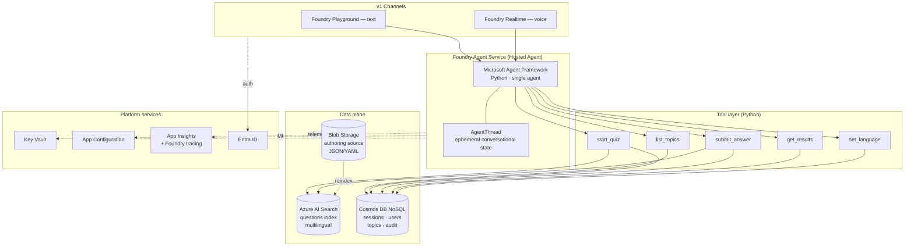
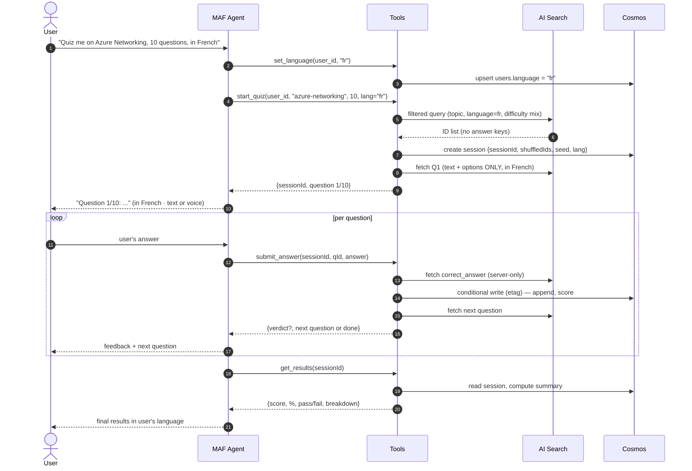
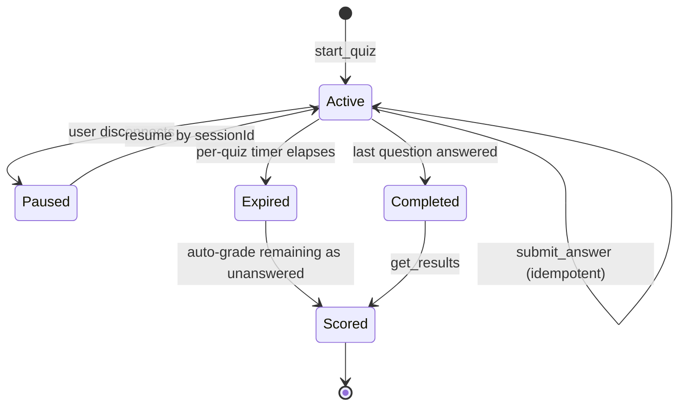
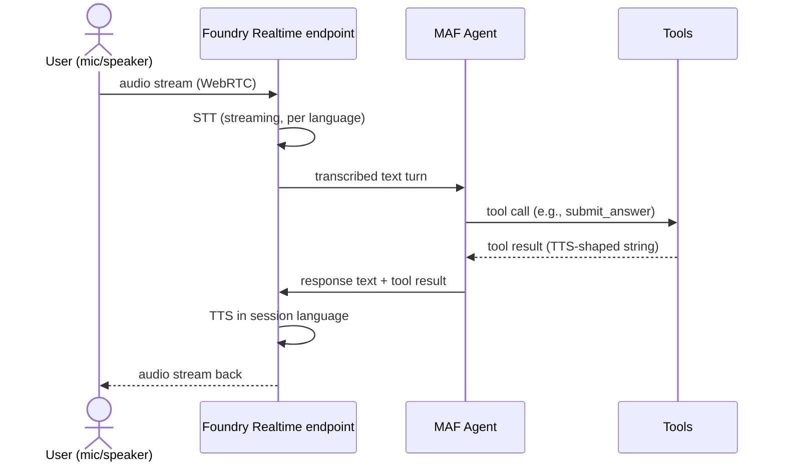

# 002 — System Architecture

- **Version**: v1.0
- **Last reviewed**: 2026-05-17
- **Owner**: Platform
- **Status**: Accepted

## 1. Verdict (up front)

**Single Microsoft Agent Framework (Python) agent, deployed as a Hosted Agent in Foundry Agent Service, with a split data plane: Azure AI Search for the multilingual question bank, Cosmos DB for sessions/users/results. Voice via Foundry Realtime API on the same agent.**

Not multi-agent. Not Prompt Flow. Not LangGraph orchestration in v1. The agent is the orchestrator; tools do the deterministic work; AI Search is the question authority; Cosmos is the system of record; the same agent serves both the text channel and the Realtime (voice) channel.

See ADR [001-use-microsoft-agent-framework](../adr/001-use-microsoft-agent-framework.md) and [002-single-agent-architecture](../adr/002-single-agent-architecture.md).

## 2. Why This Stack Beats the Alternatives

| Approach                                          | Production fit                                                                                                                                              | Verdict                  |
| ------------------------------------------------- | ----------------------------------------------------------------------------------------------------------------------------------------------------------- | ------------------------ |
| **Foundry Prompt Flow / Workflow UI**             | Being retired — feature freeze 2026-04, retirement 2027-04                                                                                                  | ❌ Do not start here     |
| **Microsoft Agent Framework (MAF) — Python**      | GA 2026-04-03; strategic Microsoft direction; first-class Foundry integration; built-in thread/state, tool-calling, telemetry; supports Realtime            | ✅ **Primary choice**    |
| **Foundry Agent Service (Hosted Agent)**          | GA; managed runtime for MAF; gives free identity, observability, Cosmos-backed memory, scaling, Realtime endpoints                                          | ✅ **Deploy target**     |
| **LangGraph**                                     | GA; deploys *into* Foundry Agent Service alongside MAF. Pays off for graph/branching orchestration                                                          | ⚠️ Hold for v2 (adaptive testing) |
| **Hybrid: MAF + LangGraph**                       | MAF for the agent shell; LangGraph for adaptive/branching flows                                                                                             | ⚠️ Premature in v1; revisit when adaptive flow lands |

## 3. High-Level Architecture

## 4. Quiz Lifecycle (Sequence)

## 5. Session State Lifecycle

## 6. Components

### 6.1 Channels (v1)

- **Foundry Playground** — text channel.
- **Foundry Realtime endpoint** — voice channel (WebRTC, streaming STT/TTS) on the same agent instance.

### 6.2 Foundry Agent Service (Hosted Agent)

- Managed runtime for the MAF agent.
- Provides identity (Managed Identity), observability hooks, Cosmos-backed `AgentThread`, autoscale, Realtime endpoints.

### 6.3 Microsoft Agent Framework (MAF) Agent

- Python, single agent.
- Conversational shell + tool-calling planner.
- Same agent instance serves both channels (text + voice).

### 6.4 Tool Layer

The agent calls deterministic Python tools to do all stateful work. See [004-agent-behavior](./004-agent-behavior.md) for tool design and [003-data-contracts](./003-data-contracts.md) for tool signatures.

### 6.5 Data Plane (Split)

- **Azure AI Search** — multilingual question bank index. Authority for questions; serves filtered (topic, language, difficulty) queries; never returns answer keys to the agent's LLM context.
- **Blob Storage** — authoring source of truth (JSON/YAML, per-language folders). Reindexed into AI Search.
- **Cosmos DB (NoSQL)** — system of record for sessions, users, topics catalog, audit log.

See ADR [003-use-cosmos-db-for-session-state](../adr/003-use-cosmos-db-for-session-state.md) and [004-use-ai-search-for-question-bank](../adr/004-use-ai-search-for-question-bank.md).

### 6.6 Platform Services

- **Key Vault** — secrets, accessed via Managed Identity.
- **App Configuration** — model deployment name, search endpoint, supported languages, feature flags.
- **App Insights + Foundry tracing** — telemetry.
- **Entra ID** — identity end-to-end across both channels.

## 7. State Architecture (Two-Tier)

| Tier                       | Where                          | Lifetime  | Authority for                                                                  |
| -------------------------- | ------------------------------ | --------- | ------------------------------------------------------------------------------ |
| Ephemeral conversational   | Foundry-managed `AgentThread`  | Session   | Chat phrasing, last few turns                                                  |
| Durable session state      | Cosmos `sessions` container    | Permanent | Current question index, remaining IDs, answers, score, seed, language          |

**Why durable state lives in Cosmos, not in the LLM context or the thread:**

- **Resumability**: user disconnects mid-quiz → server can rehydrate. Thread-only state is fragile here, especially across voice/text channel switches.
- **Auditability**: exam systems get disputed. Cosmos is the system of record; Foundry threads are a UX convenience whose schema you don't own.
- **Token economy**: keeping `remaining_question_ids[]` in the LLM prompt is wasteful and grows unboundedly.
- **Idempotency**: Cosmos conditional writes (`ifMatch` + etag on `session_id + question_id`) prevent double-scoring on retries. **Non-negotiable** (see NFR-002).

## 8. Orchestration

**None beyond the agent's tool-calling loop.** The agent IS the orchestrator.

- ❌ No Durable Functions — the quiz is short-lived and conversational, not a long-running workflow with checkpoints.
- ❌ No Prompt Flow — being retired.
- ❌ No Foundry Workflows (the graph-based Prompt Flow successor) for v1 — overkill; would re-introduce the orchestration layer we correctly excised.
- ❌ No LangGraph — earns its place only when adaptive/branching flow lands in v2.
- ✅ **MAF tool-calling** — the LLM plans, calls tools, observes results, replies. Same loop for text and voice channels.

**When to revisit**: introduce Foundry Workflows or LangGraph the day you add multi-agent adaptive testing (quizmaster + difficulty-adjuster) or a multi-step certification flow with checkpoints.

## 9. Voice Path

**Channel**: Foundry Realtime API (built on OpenAI Realtime). Same agent instance serves text (Playground) and voice (Realtime endpoint) — no second codebase.

**Latency budget** (NFR-001): the voice path must keep tool execution under ~300 ms p95 so the speech turn round-trip stays conversational. Cosmos point-reads + AI Search filtered queries fit comfortably. Anything heavier (e.g., Foundry Evaluations) stays out of the hot path.

**Fallback**: if Realtime is unavailable or the user prefers, the same agent works in pure text mode in the Playground — same tools, same state.

## 10. Random Selection (Reproducibility)

At `start_quiz`, seed once (`seed = hash(session_id)`), derive a deterministic shuffled list, store the seed + list in the session row. Reproducible + auditable. Do **not** use `ORDER BY RAND()`-style queries — non-reproducible and expensive at scale. (See NFR-003.)

## 11. Scalability Plan

- **Cosmos**: partition by `/userId` for sessions → near-linear scale; autoscale RU/s; TTL on completed sessions older than retention policy. (NFR-005)
- **AI Search**: question bank is read-heavy + small → start S1, scale up if bank > 100k items. (NFR-006)
- **Foundry Hosted Agent**: managed auto-scale; the voice channel scales separately on the Realtime endpoint.
