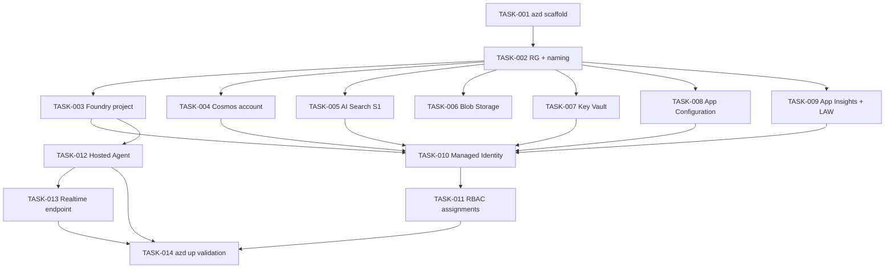

# 001 — Infrastructure (Azure Foundation)

## Scope

Provision every Azure resource the v1 quiz system depends on, via Bicep IaC deployable end-to-end with `azd up` from a clean subscription. This task pack stops at "resources exist, identities are wired, role assignments resolve" — runtime configuration (containers, indexes, agent code) lives in tasks 002–006.

**Driving requirements**: NFR-007 (Managed Identity), NFR-008 (observability wiring), NFR-012 (`azd up` from clean sub), SEC-003/004/005/013, TEST-001.

## Dependency Graph

---

## TASK-001 — azd + Bicep skeleton

- **Objective**: Initialise `azure.yaml`, `infra/main.bicep`, `infra/main.parameters.json` so `azd up` is the single deployment command.
- **Dependencies**: none.
- **Implementation**:
  1. Create `azure.yaml` declaring services (`api: hosted-agent`).
  2. Create `infra/main.bicep` as the entry point with subscription-scoped target and a single resource-group module.
  3. Create `infra/main.parameters.json` with placeholders for `environmentName`, `location`, `supportedLanguages` (default `["en","fr","es"]`), `modelDeploymentName`.
  4. Add `infra/modules/` directory for per-resource modules.
- **Acceptance criteria**:
  - `azd init` succeeds in a clean checkout.
  - `azd provision --preview` returns a valid plan (zero resources, since modules are stubs).
- **Risks**: drift between `azure.yaml` services and Bicep outputs — assert via `azd env get-values` in TASK-014.
- **Testing**: TEST-001 entry condition.
- **Complexity**: S.
- **Refs**: NFR-012, §007-operational-runbook §1.

---

## TASK-002 — Resource group, naming conventions, tagging

- **Objective**: Single RG per environment, deterministic resource names, mandatory tags for cost and ownership.
- **Dependencies**: TASK-001.
- **Implementation**:
  1. Module `infra/modules/resource-group.bicep` creating RG with tags `{environment, owner, costCenter, app="flint-quiz"}`.
  2. Adopt naming token: `${prefix}-${environment}-${resource}` (e.g., `fq-dev-cosmos`).
  3. Emit RG name + location as Bicep outputs.
- **Acceptance criteria**:
  - `azd provision --preview` shows RG with tags applied.
  - All downstream modules consume RG name via output, not literal.
- **Risks**: name collisions across environments — enforce uniqueness with `uniqueString(resourceGroup().id)` suffix where the resource demands global uniqueness (Storage, Key Vault).
- **Testing**: TEST-001.
- **Complexity**: S.

---

## TASK-003 — Azure AI Foundry project

- **Objective**: Provision a Foundry project resource as the runtime home for the MAF agent.
- **Dependencies**: TASK-002.
- **Implementation**:
  1. Module `infra/modules/foundry-project.bicep` creating the AI Foundry hub + project.
  2. Output `projectId`, `projectEndpoint`, `discoveryUrl`.
  3. Pin location to a region that supports Foundry Realtime API.
  4. **System-assigned identity (SAMI) is NOT enabled** on the project. All workload identities are User-Assigned (UAMI) per `infra/README §3.1`: UAMI gives stable principal IDs across recreates and lets RBAC be wired before the resource exists. The Hosted Agent (TASK-012) attaches the UAMI from TASK-010.
- **Acceptance criteria**:
  - Foundry project visible in portal; project endpoint reachable.
  - Project has `identityType: "None"` (or equivalent — no SAMI). All Foundry-MI access uses the attached UAMI.
- **Risks**: region availability of Realtime API may differ from project region — verify region-eligibility table before pinning.
- **Testing**: TEST-001.
- **Complexity**: M.
- **Refs**: §002-system-architecture §6.2, `infra/README §3.1`.

---

## TASK-004 — Cosmos DB account (NoSQL)

- **Objective**: Provision the Cosmos DB account. Container creation lives in 003-cosmos-db.
- **Dependencies**: TASK-002.
- **Implementation**:
  1. Module `infra/modules/cosmos.bicep`: SQL API, single-region first, **disable local auth** (Entra-only — supports SEC-004).
  2. Enable autoscale; allow public network for v1; reserve VNET integration for v2.
  3. Output `cosmosAccountName`, `cosmosEndpoint`.
- **Acceptance criteria**:
  - Account exists with local-auth disabled (`disableLocalAuth: true`).
  - No keys retrievable.
- **Risks**: disabling local auth blocks any code path that uses keys — must be paired with TASK-010/011 before agent code runs (intentional ordering).
- **Testing**: TEST-001; SEC-004 verification.
- **Complexity**: M.
- **Refs**: NFR-005, NFR-007, SEC-004, ADR-003.

---

## TASK-005 — Azure AI Search (S1)

- **Objective**: Provision the AI Search service. Index schema lives in 002-ai-search.
- **Dependencies**: TASK-002.
- **Implementation**:
  1. Module `infra/modules/search.bicep`: tier S1, semantic search enabled, **`disableLocalAuth: true`**.
  2. Output `searchServiceName`, `searchEndpoint`.
- **Acceptance criteria**:
  - Service exists; admin keys are disabled.
- **Risks**: S1 capacity ceiling at 100k items — re-evaluate per NFR-006.
- **Testing**: TEST-001.
- **Complexity**: S.
- **Refs**: NFR-006, ADR-004.

---

## TASK-006 — Blob Storage (authoring source)

- **Objective**: Provision Storage account hosting authored question JSON/YAML per-language folders.
- **Dependencies**: TASK-002.
- **Implementation**:
  1. Module `infra/modules/storage.bicep`: StorageV2, LRS, **`allowSharedKeyAccess: false`**, blob soft-delete 7d.
  2. Container `questions` with per-language virtual folders (`en/`, `fr/`, `es/`).
  3. Output `storageAccountName`, `blobEndpoint`.
- **Acceptance criteria**:
  - Storage account exists; key-based auth disabled.
- **Risks**: Foundry/agent identity needs `Storage Blob Data Reader` — handled in TASK-011.
- **Testing**: TEST-001.
- **Complexity**: S.
- **Refs**: §003-data-contracts §2.3.

---

## TASK-007 — Key Vault

- **Objective**: Provision Key Vault for any required secrets (e.g., third-party API keys if needed later); zero connection strings in code.
- **Dependencies**: TASK-002.
- **Implementation**:
  1. Module `infra/modules/keyvault.bicep`: RBAC-mode access (not access-policy), soft-delete + purge protection on.
  2. Output `keyVaultName`, `keyVaultUri`.
- **Acceptance criteria**:
  - KV exists in RBAC mode.
  - Purge protection enabled (cannot be undone — confirm in review).
- **Risks**: purge protection blocks re-deploy with same name for 90 days post-delete — accept in shared envs.
- **Testing**: TEST-001.
- **Complexity**: S.
- **Refs**: SEC-013, NFR-007.

---

## TASK-008 — App Configuration

- **Objective**: Centralise runtime configuration: model deployment name, search endpoint, supported languages allowlist, feature flags.
- **Dependencies**: TASK-002.
- **Implementation**:
  1. Module `infra/modules/appconfig.bicep`: standard tier, **`disableLocalAuth: true`**.
  2. Seed initial keys via `Microsoft.AppConfiguration/configurationStores/keyValues`:
     - `model:deploymentName`
     - `search:endpoint`
     - `languages:supported` = `en,fr,es`
     - `features:apim` = `false`
  3. Output `appConfigEndpoint`.
- **Acceptance criteria**:
  - AppConfig endpoint reachable; seeded keys present.
  - Local auth disabled.
- **Risks**: language allowlist drift between AppConfig and code — TASK-123 validates at runtime.
- **Testing**: TEST-001; SEC-010 supporting infra.
- **Complexity**: S.
- **Refs**: §003-data-contracts §5, SEC-010.

---

## TASK-009 — Application Insights + Log Analytics workspace

- **Objective**: Provision telemetry sink for Foundry tracing and custom `grading_event` events.
- **Dependencies**: TASK-002.
- **Implementation**:
  1. Module `infra/modules/observability.bicep`: Log Analytics workspace, App Insights workspace-based.
  2. Output `appInsightsConnectionString`, `logAnalyticsId`.
  3. Wire to Foundry project via diagnostic settings (TASK-003 output).
- **Acceptance criteria**:
  - App Insights resource exists; connection string emitted.
  - Foundry project diagnostic settings target the LAW.
- **Risks**: connection string in env vars is acceptable (not a secret per Microsoft guidance); do not store in Key Vault.
- **Testing**: TEST-001; TEST-010 prerequisite.
- **Complexity**: S.
- **Refs**: NFR-008, NFR-009.

---

## TASK-010 — Managed Identity

- **Objective**: User-Assigned Managed Identity (UAMI) used by the Hosted Agent for all platform access. Zero connection strings.
- **Dependencies**: TASK-003..009.
- **Implementation**:
  1. Module `infra/modules/uami.bicep` creating the UAMI.
  2. Attach UAMI to the Foundry Hosted Agent (consumed in TASK-012).
  3. Output `uamiPrincipalId`, `uamiClientId`, `uamiResourceId`.
- **Acceptance criteria**:
  - UAMI exists; principal ID resolvable in Entra.
- **Risks**: SAMI vs UAMI choice — UAMI is preferred so role assignments survive Hosted Agent re-creation.
- **Testing**: TEST-001; SEC-004 prerequisite.
- **Complexity**: S.
- **Refs**: NFR-007, SEC-004.

---

## TASK-011 — RBAC role assignments

- **Objective**: Grant the UAMI least-privilege roles per resource. Zero connection strings; everything via Entra. Three runtime identities — `uami-agent-*` (read-mostly), `uami-indexer-*` (write to the index, read from blob), `uami-deploy-*` (CI/CD, RG-scoped).
- **Dependencies**: TASK-010.
- **Implementation**:
  Assign on `uami-agent-*` (runtime, read-mostly):
  - **Cosmos DB Built-in Data Contributor** (custom data-plane role) scoped to the Cosmos account, restricted to the four containers (`sessions`, `users`, `audit` read/write; `topics` read).
  - **Search Index Data Reader** scoped to the AI Search service. **Read-only.**
  - **Key Vault Secrets User** scoped to the Key Vault.
  - **App Configuration Data Reader** scoped to the AppConfig store.
  - **Monitoring Metrics Publisher** for telemetry emit.

  Assign on `uami-indexer-*` (seed loader, write to index):
  - **Search Index Data Contributor** scoped to the AI Search service. **Index write only — does NOT include `Search Service Contributor` (which would let it create/delete indexes).**
  - **Storage Blob Data Reader** scoped to the storage account `authoring` container.

  Assign on `uami-deploy-*` (CI/CD, federated via GitHub OIDC):
  - **Contributor** scoped to the env RG (PIM-elevated in prod).
  - **Search Service Contributor** scoped to the AI Search service. **CI is the only principal that creates/deletes the index** — index creation lives in Bicep deployment scripts (TASK-020), not in the runtime seed loader. This splits control plane (CI) from data plane (indexer).

- **Acceptance criteria**:
  - Each role assignment resolves at the smallest possible scope (resource, not RG, not subscription).
  - No `Owner` / `Contributor` granted to runtime identities (`uami-agent-*`, `uami-indexer-*`).
  - `uami-indexer-*` cannot create or delete an index — verified by a post-deploy assertion that attempts an index-create call with that identity and expects 403.
  - `uami-agent-*` cannot write to the AI Search index — verified by a post-deploy assertion that attempts a document write and expects 403.
- **Risks**: confusing the two AI Search roles (Data Contributor = write documents; Service Contributor = create/delete indexes). Mitigated by naming convention (`-indexer-` writes data; `-deploy-` manages indexes) + the post-deploy assertions.
- **Testing**: TEST-001; SEC-005 verification.
- **Complexity**: M.
- **Refs**: SEC-005, NFR-007.

---

## TASK-012 — Hosted Agent runtime in Foundry Agent Service

- **Objective**: Provision the Hosted Agent shell where the MAF Python agent will run. Code deploy lives in 004-agent-framework.
- **Dependencies**: TASK-003, TASK-010, TASK-011.
- **Implementation**:
  1. Module `infra/modules/hosted-agent.bicep` declaring the agent in the Foundry project.
  2. Attach the UAMI from TASK-010.
  3. Wire App Insights connection string + AppConfig endpoint via env config.
  4. Output `agentId`, `agentEndpoint`.
- **Acceptance criteria**:
  - Hosted Agent resource exists with UAMI attached.
  - Agent endpoint reachable.
- **Risks**: Hosted Agent re-creation drops attached identity — UAMI (not SAMI) makes this safe (role assignments survive).
- **Testing**: TEST-001.
- **Complexity**: M.
- **Refs**: §002-system-architecture §6.2, ADR-001.

---

## TASK-013 — Realtime (voice) endpoint

- **Objective**: Provision the Foundry Realtime endpoint serving the voice channel on the same agent instance.
- **Dependencies**: TASK-012.
- **Implementation**:
  1. Module `infra/modules/realtime.bicep` enabling Realtime API on the agent.
  2. Configure session length cap (NFR-013) and supported voices for `en`/`fr`/`es`.
  3. Output `realtimeEndpoint`.
- **Acceptance criteria**:
  - Realtime endpoint reachable; voice options listable for each supported language.
- **Risks**: per-minute billing — voice session cap in config prevents runaway dead-air.
- **Testing**: TEST-005 prerequisite.
- **Complexity**: M.
- **Refs**: FR-007, NFR-001, NFR-013.

---

## TASK-014 — `azd up` end-to-end validation

- **Objective**: Verify the entire infrastructure deploys cleanly from a clean subscription via `azd up`.
- **Dependencies**: all preceding tasks in this pack.
- **Implementation**:
  1. `azd up` against a fresh subscription/RG.
  2. Run a Bash post-provision hook asserting `az ... show` for every resource returns a healthy state.
  3. Capture outputs into `.azure/<env>/.env`.
- **Acceptance criteria**:
  - `azd up` exits 0 with all resources deployed.
  - Bash hook prints "OK" for each resource.
- **Risks**: subscription quotas (AI Search, Cognitive Services) — pre-check quotas in the post-provision hook.
- **Testing**: TEST-001 (verbatim).
- **Complexity**: M.
- **Refs**: NFR-012, TEST-001.

---

## Cross-cutting acceptance for this task pack

- All resources have `disableLocalAuth: true` where the property exists (Cosmos, Search, AppConfig, Storage).
- UAMI is attached everywhere a runtime identity is needed; no connection strings in any Bicep output, env file, or code.
- App Insights is wired to Foundry; tracing surface is alive (verified in 008-observability).
