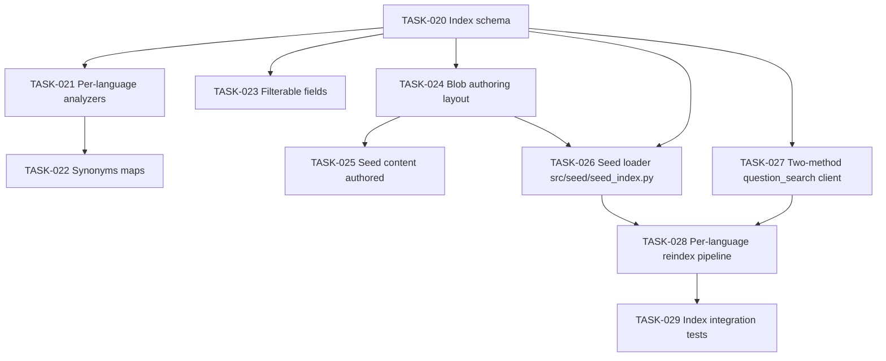

# 002 — AI Search (Multilingual Question Bank)

## Scope

Define the AI Search index schema, per-language analyzers, synonyms, the Blob-to-index seed loader, and the two-method search client that enforces the answer-leakage boundary. The runtime question authority lives here; the answer key never crosses the LLM boundary.

**Driving requirements**: FR-002, FR-003, FR-005, FR-012, NFR-006, NFR-010, NFR-011, SEC-001, SEC-002, ADR-004, ADR-005.

## Dependency Graph



---

## TASK-020 — Index schema (`questions` index)

- **Objective**: Define the `questions` index with one record per `(question_logical_id, language)` pair (NFR-011).
- **Dependencies**: 001-infrastructure TASK-005.
- **Implementation**:
  1. Index name: `questions`.
  2. Fields:
     - `id` (key, string)
     - `logical_id` (string, filterable)
     - `topic` (string, filterable, facetable)
     - `language` (string, filterable, facetable) — ISO 639-1
     - `text` (string, searchable, analyzer per language — TASK-021)
     - `options` (collection of complex `{key, text}`)
     - `correct_answer` (collection string, **not retrievable via public client** — see TASK-027)
     - `difficulty` (string, filterable, facetable)
     - `tags` (collection string, filterable)
     - `category` (string, filterable)
     - `explanation` (string, retrievable, analyzer per language)
     - `score_weight` (double)
  3. **Index lifecycle is Bicep-owned, not runtime-owned.** Define via Bicep deployment script (using the `uami-deploy-*` identity which has `Search Service Contributor`, see `tasks/001 TASK-011`). The runtime seed loader (`tasks/002 TASK-026`) only **writes documents** to an existing index — it cannot create or delete the index. This split is the load-bearing distinction between `Search Index Data Contributor` (data plane, indexer-only) and `Search Service Contributor` (control plane, CI-only).
- **Acceptance criteria**:
  - Index exists with expected field set.
  - `language` is filterable; `correct_answer` is retrievable but **only by the server-only search method** (TASK-027).
- **Risks**: omitting `filterable` on `language` breaks every query — explicit acceptance test enumerates filterability.
- **Testing**: TEST-002 prerequisite; integration test in TASK-029.
- **Complexity**: M.
- **Refs**: §003-data-contracts §2.1, NFR-011, ADR-004.

---

## TASK-021 — Per-language analyzers

- **Objective**: Apply the correct Microsoft language analyzer per record so `text` matching respects morphology in each language.
- **Dependencies**: TASK-020.
- **Implementation**:
  1. Configure analyzers `en.microsoft`, `fr.microsoft`, `es.microsoft`.
  2. Set per-field analyzer through `analyzer` per field (not per record) — apply at index level using language-aware indexing convention: separate analyzer fields (`text_en`, `text_fr`, `text_es`) **OR** use index-time analyzer selection via a `searchAnalyzer`/`indexAnalyzer` pair keyed on `language`.
  3. Recommended: single `text` field, multi-language analyzer is applied by using language-suffixed search profiles. Validate the chosen approach with a small benchmark before locking in.
- **Acceptance criteria**:
  - A French query for "passerelle" matches the French index but not English variants.
  - A Spanish query for "redes" matches the Spanish index analyzer.
- **Risks**: analyzer mismatch silently degrades recall — covered by per-language smoke tests in TASK-029.
- **Testing**: TEST-002, TEST-004, TEST-005.
- **Complexity**: M.
- **Refs**: ADR-004, NFR-011, FR-005.

---

## TASK-022 — Synonyms maps per language

- **Objective**: Synonyms for topic aliases per language (e.g., `vpn, ipsec, p2s` in `en`; `passerelle, vpn` in `fr`).
- **Dependencies**: TASK-021.
- **Implementation**:
  1. Create three synonyms maps: `topic-synonyms-en`, `-fr`, `-es`.
  2. Attach to `text` field (per-analyzer profile).
- **Acceptance criteria**:
  - Querying "ipsec gateway" in English surfaces VPN-tagged questions.
  - Each map has at least one validated alias entry.
- **Risks**: synonyms maps are global per service; namespacing per language prevents cross-talk.
- **Testing**: TEST-002.
- **Complexity**: S.
- **Refs**: ADR-004.

---

## TASK-023 — Filterable / facetable field config

- **Objective**: Every runtime query filters by `language` + `topic` + (optional) `difficulty`. Make those filters first-class.
- **Dependencies**: TASK-020.
- **Implementation**:
  1. Assert `filterable: true` on `topic`, `language`, `difficulty`, `tags`, `category`, `logical_id`.
  2. Add `facetable: true` on `topic`, `language`, `difficulty` for per-language counts.
- **Acceptance criteria**:
  - `$filter=language eq 'fr' and topic eq 'azure-networking'` returns only matching records.
- **Risks**: missing filter on `language` would silently let questions leak across languages — TEST-004/005 fail fast.
- **Testing**: TEST-004, TEST-005; integration test TASK-029.
- **Complexity**: S.
- **Refs**: FR-005, NFR-011.

---

## TASK-024 — Blob authoring layout

- **Objective**: Lock the on-disk shape for authored questions in Blob Storage.
- **Dependencies**: 001-infrastructure TASK-006.
- **Implementation**:
  1. Directory shape under container `questions/`:
     ```
     en/azure-networking/<logical_id>.json
     fr/azure-networking/<logical_id>.json
     es/azure-networking/<logical_id>.json
     ```
  2. JSON validated against `Question` Pydantic model (see 003-cosmos-db TASK-045).
  3. README in repo at `src/seed/questions/README.md` documenting the layout.
- **Acceptance criteria**:
  - Sample JSON validates against the model.
  - One file per `(logical_id, language)` pair (NFR-011).
- **Risks**: authors put translations in one file — schema validator rejects.
- **Testing**: TEST-002 prerequisite.
- **Complexity**: S.
- **Refs**: §003-data-contracts §2.3.

---

## TASK-025 — Initial seed content

- **Objective**: Hand-author ≥30 questions × 3 languages across 3 topics for v1 smoke tests.
- **Dependencies**: TASK-024.
- **Implementation**:
  1. Pick 3 topics: e.g., `azure-networking`, `azure-storage`, `azure-security`.
  2. Author ≥30 logical questions, each translated into `en`/`fr`/`es`. Authors confirm correctness and idiomatic phrasing per language.
  3. Commit to repo under `src/seed/questions/`.
- **Acceptance criteria**:
  - 90 total JSON files (30 × 3).
  - Manual spot-check: 5 questions reviewed per language for ambiguity.
- **Risks**: translation drift — Foundry Evaluations per language (009-testing TASK-167) catches this at publish time.
- **Testing**: TEST-002.
- **Complexity**: L (authoring effort, not code).
- **Refs**: FR-005, NFR-010.

---

## TASK-026 — Seed loader `src/seed/seed_index.py`

- **Objective**: One-shot Python loader: Blob → AI Search documents. Runs as `uami-indexer-*` (Storage Blob Data Reader + Search Index Data Contributor) — **never** as the runtime agent identity, and **never** with control-plane (index-create) authority.
- **Dependencies**: TASK-020 (index exists, created by CI per TASK-001/TASK-011), TASK-024, 001-infrastructure TASK-011.
- **Implementation**:
  1. Authenticate to Storage + Search via `DefaultAzureCredential` resolved to `uami-indexer-*`.
  2. **Assert at startup** that the running identity does NOT have `Search Service Contributor` — if it does, abort with a clear error (defense in depth: a misconfigured identity should not silently write to a wider scope).
  3. Walk `questions/{lang}/<topic>/*.json` in Blob.
  4. Validate each record against the per-language `Question` source model.
  5. Upsert into `questions` index documents, using `id = f"{logical_id}-{language}"`.
  6. Emit a per-language count summary at end.
- **Acceptance criteria**:
  - Running the loader twice produces the same index state (idempotent).
  - Final index document count = author count × language count.
- **Risks**: schema drift between authored JSON and index schema — loader rejects with clear error.
- **Testing**: TEST-002.
- **Complexity**: M.
- **Refs**: §007-operational-runbook §1.

---

## TASK-027 — Two-method `question_search.py` client (security boundary)

- **Objective**: Enforce the answer-leakage boundary at the data client level. The LLM-safe method returns text + options only via an **explicit allowlist projection**; the server-only method fetches `correct_answer`. Method names match `specs/008-api-contracts.md §3.3`.
- **Dependencies**: TASK-020.
- **Implementation**:
  1. `src/data/question_search.py` exposes exactly two question-fetch methods plus the topic-search helper:
     - `async def get_question_view(question_id: str) -> QuestionView` — returns the LLM-safe projection. Implemented by passing an **explicit `selected_fields` allowlist** to AI Search (`["id", "logical_id", "topic", "language", "text", "options", "difficulty"]`) so the result document literally does not contain `correct_answer`. Matches `008-api §3.3.1`.
     - `async def get_answer_key(question_id: str) -> AnswerKey` — server-only path. Selects only `["id", "correct_answer", "score_weight"]` and returns an `AnswerKey` dataclass with no JSON serializer that could leak via a logging mistake. Matches `008-api §3.3.2`. Called from `submit_answer` only.
     - `async def search_topic(topic: str, language: str, difficulty: str | None) -> list[str]` — returns logical IDs only.
  2. The `get_question_view` allowlist is the first defense for SEC-001; the type system (`QuestionView` vs `AnswerKey`) is the second; the recursive strip in `tasks/005 TASK-088` is the third.
  3. A module-level docstring on `get_answer_key` reads: "**Server-only. Never exposed via `src/agent/tools.py`.**" Static lint (`tasks/007 TASK-125`) enforces this.
- **Acceptance criteria**:
  - Static review: only the `submit_answer` body in `src/agent/tools.py` imports `get_answer_key`.
  - Unit test asserts the dict returned to `QuestionView(**doc)` literally has no `correct_answer` key.
  - AST-level lint rejects any other tool function importing `get_answer_key`.
- **Risks**: future contributors call the wrong method — TEST-006 leak test will fail; ADR-005 documents the constraint; code review checklist enforces.
- **Testing**: TEST-006 (SEC-001 / SEC-002).
- **Complexity**: M.
- **Refs**: SEC-001, SEC-002, ADR-005, `specs/008-api-contracts.md §3.3`.

---

## TASK-028 — Per-language reindex pipeline

- **Objective**: Re-running the seed loader after content edits picks up adds, updates, deletes — without operator intervention. **Reconciles `topics.counts` in Cosmos against the post-reindex AI Search facet counts as the final step**, so `list_topics` never lies about availability (audit P2.15 / §4.6).
- **Dependencies**: TASK-026, 003-cosmos-db TASK-043 (topics container).
- **Implementation**:
  1. Loader fetches existing index doc IDs, diffs against authored set.
  2. Upserts new/changed; deletes records no longer in authored set.
  3. Emits a per-language summary: `{added, updated, deleted}`.
  4. **Topic-counts reconciliation** (new step):
     - Query AI Search with `facet=language,count:50` and `facet=topic,count:50` (and a faceted `(topic, language)` cross-tab via a small query loop, since AI Search single-field facets do not natively cross-tab).
     - For each `(topic, language)` pair, capture the count.
     - For each `topic_id` in the `topics` container: read the doc, replace `counts` with the freshly observed map, write back with `ifMatch(_etag)`.
     - If the index has a topic that `topics` does not have (or vice versa), emit `seed_loader.topic_mismatch` warning event and skip the count write for that topic — do **not** silently create or delete topic catalog rows from this path; topic-catalog lifecycle is an authoring decision (see `tasks/003 TASK-043`).
     - Emits a reconciliation summary: `{topics_reconciled, topic_mismatch_count}`.
  5. The reconciliation step uses `uami-indexer-*` for the Search read and a separate Cosmos `Data Contributor` on `topics` only (least privilege).
- **Acceptance criteria**:
  - Edit a single authored file → next loader run reflects only that change.
  - Delete an authored file → next run removes the matching index doc.
  - **After a reindex that changed per-`(topic, language)` counts, `topics.counts` reflects the new facet counts within one loader run** — verified by an integration test that adds a new question and asserts `topics.counts[topic][lang]` increments.
  - Topic-mismatch warning fires when index/topics disagree on the topic set; no silent creation/deletion of topic rows.
- **Risks**: accidental mass-delete if Blob auth is misconfigured — loader requires `--confirm` flag if delete count > 10% of index. Reconciliation against a partially-loaded index could write stale counts — solved by running the facet query **after** all upserts/deletes complete and pass the AI Search indexer sync window (sleep 5 s + verify doc count matches expected).
- **Testing**: TEST-002, TEST-011 publication gate, new reconciliation integration test.
- **Complexity**: M.
- **Refs**: NFR-010, ADR-004, audit P2.15.

---

## TASK-029 — Index integration tests

- **Objective**: Tests that exercise the live (or emulator) index to assert the boundary, filters, and analyzer behavior.
- **Dependencies**: TASK-021, TASK-022, TASK-023, TASK-026, TASK-027.
- **Implementation**:
  1. `tests/integration/test_question_search.py`:
     - Asserts `language` filter narrows result set.
     - Asserts `get_question_view` never includes `correct_answer`.
     - Asserts `get_answer_key` returns `correct_answer` and is *not* re-exported in `src/agent/tools.py` (AST check).
  2. Parametrize across `en`, `fr`, `es`.
- **Acceptance criteria**:
  - All assertions green.
  - AST check fails build if any tool function (other than the `submit_answer` body) imports `get_answer_key`.
- **Risks**: AST check is brittle to refactors — accept; the cost of a false positive is far lower than a real leak.
- **Testing**: TEST-002, TEST-006.
- **Complexity**: M.
- **Refs**: ADR-005, SEC-001.

---

## Cross-cutting acceptance for this task pack

- `correct_answer` cannot exit the AI Search client via the public method.
- Per-language analyzers verifiable by smoke search in each language.
- Loader is idempotent and per-language.
