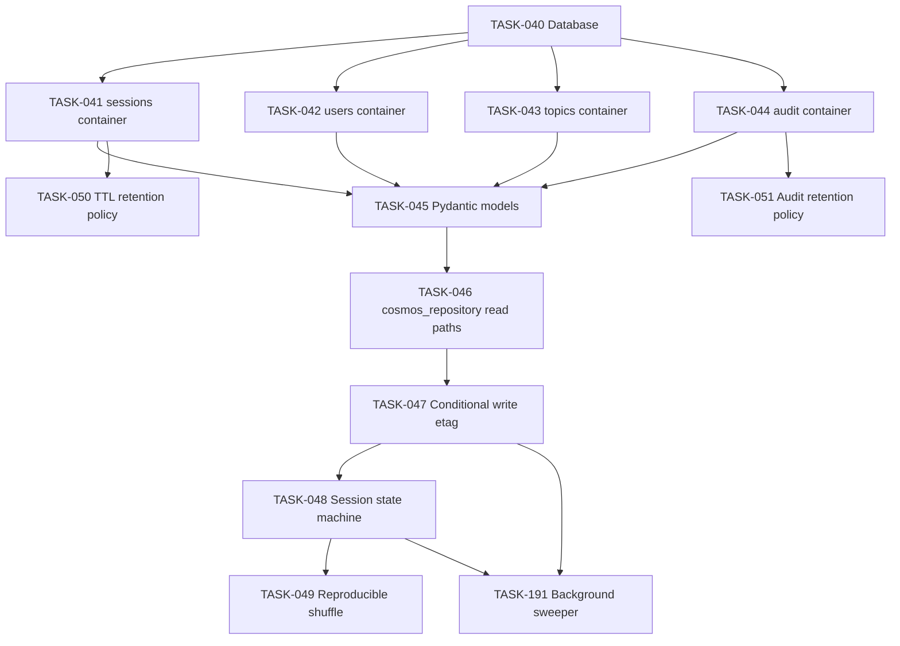

# 003 — Cosmos DB (Durable Session State)

## Scope

Define every Cosmos container, the Pydantic data models, the repository layer that enforces `ifMatch` etag conditional writes, the session lifecycle state machine, and the reproducible-shuffle algorithm seeded at `start_quiz`.

**Driving requirements**: FR-004, FR-008, FR-009, FR-013, FR-015, NFR-002, NFR-003, NFR-004, NFR-005, SEC-006, SEC-014, ADR-003.

## Dependency Graph



---

## TASK-040 — Database

- **Objective**: Provision Cosmos database `flint-quiz` inside the account from 001-infrastructure TASK-004.
- **Dependencies**: 001-infrastructure TASK-004.
- **Implementation**:
  1. Database with autoscale provisioned at the database level (containers inherit, override per container if needed).
  2. Initial max RU/s: 4000 (autoscale).
- **Acceptance criteria**:
  - Database exists; autoscale enabled.
- **Risks**: per-container vs database-level throughput — start database-level for cost; revisit if hot containers emerge.
- **Testing**: TEST-001.
- **Complexity**: S.
- **Refs**: NFR-005.

---

## TASK-041 — `sessions` container

- **Objective**: Authoritative session state; partition by `/userId`; supports `ifMatch` conditional writes.
- **Dependencies**: TASK-040.
- **Implementation**:
  1. Container `sessions`, partition key `/userId`.
  2. Default TTL: -1 (off by default; per-doc TTL applied on completion — see TASK-050).
  3. Indexing policy: default. Exclude large unused paths if any.
- **Acceptance criteria**:
  - Container exists with correct PK + TTL stance.
- **Risks**: wrong partition key change requires re-create — verify before promote.
- **Testing**: TEST-001, TEST-003/004/005.
- **Complexity**: S.
- **Refs**: NFR-005, NFR-002, ADR-003.

---

## TASK-042 — `users` container

- **Objective**: Per-user preferences (language pin, timestamps).
- **Dependencies**: TASK-040.
- **Implementation**:
  1. Container `users`, partition key `/userId`.
  2. No TTL.
- **Acceptance criteria**: Container exists; PK = `/userId`.
- **Risks**: none material.
- **Testing**: TEST-001.
- **Complexity**: S.
- **Refs**: FR-010, FR-014.

---

## TASK-043 — `topics` container

- **Objective**: Reference data for available topics with per-language labels and counts.
- **Dependencies**: TASK-040.
- **Implementation**:
  1. Container `topics`, partition key `/topicId` (or single-partition for small catalogs — pick `/topicId` for forward-compat).
  2. Seed initial 3 topics matching the authored content from 002-ai-search TASK-025.
- **Acceptance criteria**: Container exists; seeded entries reachable.
- **Risks**: counts drift relative to AI Search — reconciled at every reindex by `tasks/002 TASK-028` (audit P2.15). The `topics` container is not the system of record for counts; it is a read-cached projection of AI Search facets.
- **Testing**: TEST-001, smoke `list_topics`.
- **Complexity**: S.
- **Refs**: FR-002, §003-data-contracts §4.3.

---

## TASK-044 — `audit` container

- **Objective**: Grading-correctness audit trail for dispute resolution. Retention independent of `sessions`.
- **Dependencies**: TASK-040.
- **Implementation**:
  1. Container `audit`, partition key `/sessionId`.
  2. Indexing policy: include `language`, `verdict`, `channel` for analytics queries; exclude `expected`, `received` from index to save RU.
- **Acceptance criteria**: Container exists with PK = `/sessionId`.
- **Risks**: high-cardinality partition keys (sessionId) acceptable — short-lived sessions, hot-key risk is mitigated by per-question fan-out.
- **Testing**: TEST-010.
- **Complexity**: S.
- **Refs**: NFR-009, SEC-014.

---

## TASK-045 — Pydantic models in `src/data/models.py`

- **Objective**: Define the typed contracts shared across tools, repository, and tests.
- **Dependencies**: TASK-041–044, 002-ai-search TASK-020.
- **Implementation**:
  1. `QuestionView` (LLM-safe projection — no `correct_answer` field at all), `AnswerKey` (server-only dataclass, no JSON serializer). Names match [`specs/008-api-contracts.md §1.5.4` and §3.3](../specs/008-api-contracts.md).
  2. `SessionDoc`, `Answer`, `ResultsSummary`, `UserDoc`, `TopicDoc`, `AuditEvent`. Names match `008-api §2`.
  3. **Casing bridge**: tool I/O uses **snake_case** (per `008-api §0.4`); Cosmos docs use **camelCase**. Configure Pydantic v2 models with `model_config = ConfigDict(populate_by_name=True, alias_generator=to_camel)` for Cosmos-bound models and explicit snake_case field names for tool-I/O models. The bridge is **deterministic** (one source of names, two casings), not field-by-field aliasing.
  4. Models include `etag: str | None = Field(alias="_etag")` for conditional writes.
  5. Strict validation: language codes via ISO 639-1 allowlist (see 007-security TASK-123).
- **Acceptance criteria**:
  - `mypy --strict src/data/models.py` clean.
  - Round-trip serialisation to/from Cosmos JSON preserves all fields with camelCase keys; round-trip to tool-I/O JSON yields snake_case keys.
  - A round-trip property test: `from_cosmos(to_cosmos(model)) == model` and `from_tool(to_tool(model)) == model`.
- **Risks**: Pydantic v2 alias handling for `_etag` differs from v1 — pin the version in `pyproject.toml`. Mixed-case in test fixtures is the most common bug; lock the convention via the property test.
- **Testing**: unit tests in 009-testing.
- **Complexity**: M.
- **Refs**: §003-data-contracts §6, SEC-010.

---

## TASK-046 — `cosmos_repository.py` read paths

- **Objective**: Point reads for sessions/users/topics with Managed Identity.
- **Dependencies**: TASK-045, 001-infrastructure TASK-011.
- **Implementation**:
  1. `src/data/cosmos_repository.py` constructs `CosmosClient` with `DefaultAzureCredential`.
  2. Methods:
     - `async def get_session(session_id, user_id) -> Session`
     - `async def get_user(user_id) -> UserPrefs | None`
     - `async def list_topics() -> list[Topic]`
  3. All reads partition-aware (no cross-partition).
- **Acceptance criteria**:
  - Reads succeed under MI with **no key or connection string** in source.
  - Cross-partition reads forbidden by code review check.
- **Risks**: lazy `userId` discovery (you don't have it at read-time) — sessions are looked up by `(sessionId, userId)` pair only; tools must carry both.
- **Testing**: integration via TEST-003.
- **Complexity**: M.
- **Refs**: NFR-007, SEC-004.

---

## TASK-047 — Conditional write with `ifMatch` etag (**non-negotiable**)

- **Objective**: All `submit_answer` writes are idempotent keyed on `(session_id, question_id)` via Cosmos `ifMatch` etag. A network retry cannot double-score.
- **Dependencies**: TASK-046.
- **Implementation**:
  1. `async def append_answer_conditional(session: Session, answer: Answer) -> Session`:
     - Reads current session (captures `_etag`).
     - Mutates `answers[]`, `score`, `currentIndex`, `status`.
     - Calls `replace_item(..., if_match=session.etag)`.
     - On 412 (precondition failed): re-read, check whether the same `(question_id)` is already present → if yes, treat as no-op (idempotent) and return existing `Session`. If no, retry once with fresh etag.
  2. Bounded retry (max 1 retry) — beyond that, propagate.
  3. The "already present" check is on `question_id` exactly; this is what makes the operation idempotent against duplicates.
- **Acceptance criteria**:
  - Concurrent duplicate `submit_answer` calls for the same `(session_id, question_id)` produce exactly one persisted answer and the second returns the same verdict (idempotent).
  - The implementation never falls back to last-write-wins.
- **Risks**: hidden non-idempotent side effects (e.g., emitting `grading_event` twice) — emit the event **inside** the conditional write success branch only, never on the idempotent no-op return.
- **Testing**: TEST-007 (TASK-161 in 009-testing).
- **Complexity**: L.
- **Refs**: NFR-002, SEC-006, ADR-003.

---

## TASK-048 — Session state machine

- **Objective**: Enforce the lifecycle: `Active → Active | Paused | Expired | Completed → Scored`.
- **Dependencies**: TASK-047.
- **Implementation**:
  1. State transitions only via dedicated methods in the repository (`pause_session`, `resume_session`, `expire_session`, `complete_session`).
  2. Illegal transitions raise (e.g., `submit_answer` on `Expired` → reject with explicit error).
  3. Expiry is **server-side computed** from `startedAt + timeLimitSeconds` on every read; the model never decides time.
- **Acceptance criteria**:
  - Illegal transitions rejected.
  - `submit_answer` on an expired session marks remaining as `unanswered` and flips status to `Scored`.
- **Risks**: clock skew — use Cosmos server timestamps where possible; tolerate ±5s drift on the client.
- **Testing**: TEST-008 (resume), TEST-009 (channel switch), negative test for expired session.
- **Complexity**: M.
- **Refs**: NFR-004, FR-015, FR-008, FR-009.

---

## TASK-049 — Reproducible shuffle (seed at `start_quiz`)

- **Objective**: Question ordering is deterministic per session; auditable; reproducible.
- **Dependencies**: TASK-048.
- **Implementation**:
  1. At `start_quiz`: `seed = hashlib.sha256(session_id.encode()).hexdigest()`.
  2. Use `random.Random(int(seed[:16], 16))` to derive a shuffled list of logical IDs.
  3. Persist `seed` and `shuffledIds[]` on the session row.
  4. Do **not** use `ORDER BY RAND()`-style queries against AI Search (non-reproducible, expensive).
- **Acceptance criteria**:
  - Recomputing the shuffle from `seed` yields the persisted `shuffledIds[]`.
  - The session is fully reconstructible from `(sessionId, seed, candidateIds[])`.
- **Risks**: changing the RNG algorithm later breaks reproducibility for old sessions — comment in code; if RNG changes, version the field.
- **Testing**: TEST-003; unit test on shuffle determinism.
- **Complexity**: S.
- **Refs**: NFR-003.

---

## TASK-050 — TTL retention policy for `sessions`

- **Objective**: Stale/completed sessions are reclaimed without operator effort, per retention policy.
- **Dependencies**: TASK-041, TASK-048.
- **Implementation**:
  1. On status transition to `Scored`, set `ttl` field to retention seconds (default 30 days; configurable via App Configuration).
  2. Active sessions older than `maxActiveAgeSeconds` (default 24h) also get `ttl` set on the next read.
- **Acceptance criteria**:
  - Completed sessions disappear after the configured TTL.
  - Active sessions never get reclaimed prematurely (TTL not set until terminal state).
- **Risks**: regulatory retention may exceed default — AppConfig flag enables override.
- **Testing**: integration test with short TTL (e.g., 60s).
- **Complexity**: S.
- **Refs**: NFR-005, SEC-008.

---

## TASK-051 — Audit retention policy (two-stage: hot Cosmos + immutable archive)

- **Objective**: Audit records survive independent of `sessions` retention so disputes can be triaged after session TTL. Total retention = 7 years (per `infra/README §12.1`) split between Cosmos (hot, queryable) and immutable Blob storage (cold, evidentiary).
- **Dependencies**: TASK-044, 001-infrastructure TASK-006 (storage account).
- **Implementation**:
  1. `audit` container Cosmos TTL set to **365 days** (configurable; default sourced from AppConfig `retention:auditHotDays`). Matches `008-api-contracts.md §2.4`.
  2. A scheduled job (Azure Function or `azd`-deployed timer) reads audit rows approaching TTL and writes them to an **immutable Blob container** (`audit-archive`, time-based immutability policy, retention 7 years per `infra/README §12.1`).
  3. The archive job is idempotent — re-running over a row that was already archived is a no-op.
  4. Document the two-stage policy in `docs/retention.md` (per `tasks/007 TASK-132`).
- **Acceptance criteria**:
  - `audit` rows survive `sessions` TTL by ≥ 11 months in Cosmos and **7 years in archive**.
  - A row archived to Blob is byte-equivalent to the Cosmos row at archive time.
  - Re-running the archive job produces no duplicate Blob objects.
- **Risks**: archive job lags TTL → row deleted before archived. Mitigation: job runs daily; archives rows with `_ts + ttl - 30 days <= now` (i.e., archive 30 days before Cosmos delete).
- **Testing**: integration test verifying audit row outlives session row; archive test with shortened TTL.
- **Complexity**: M.
- **Refs**: SEC-008, SEC-014, `infra/README §12.1`.

---

## TASK-191 — Background sweeper: stranded + idle + expired transitions (`008-api §4.3`, §4.7)

- **Objective**: Implement the background job that performs the **non-user-triggered** state transitions: `Active → Paused` (inactivity heartbeat), `Active → Expired` (per-quiz timer elapsed without traffic), and the **stranded-session release** path that resolves `E_SESSION_ACTIVE` lockouts without an `abandon_quiz` tool (see [`008-api §1.5.6`](../specs/008-api-contracts.md), audit P1.9).
- **Dependencies**: TASK-041, TASK-047 (conditional-write contract), TASK-048 (state machine).
- **Implementation**:
  1. **Deploy target**: Azure Function with a Timer trigger (Bicep module `infra/modules/foundry/sweeper.bicep`) running every **60 s**. UAMI matches the agent runtime (`uami-agent-*`); RBAC: Cosmos Data Contributor on the `sessions` container only.
  2. **Cross-partition feed query** (cross-partition is acceptable here — sweeper is a maintenance path, not the hot path):
     ```
     SELECT c.id, c.userId, c._etag, c.status, c.startedAt, c.questionStartedAt,
            c.timeLimitSeconds, c.currentIndex, c.shuffledIds, c.answers, c.channel
     FROM c
     WHERE c.status IN ("Active", "Paused")
       AND c._ts < now() - 60   /* age-out latency tolerance */
     ```
  3. **Transition rules** (per row, evaluated in order; first match wins):
     - **Stranded release**: `status = "Active"` AND `currentIndex == 0` AND `now - startedAt > voice:maxStrandedSeconds` (default 300 s) → flip to `Expired`; auto-grade is a no-op (no answers).
     - **Per-quiz expiry**: `status IN ("Active", "Paused")` AND `now - startedAt > timeLimitSeconds` → flip to `Expired`; auto-grade remaining questions as `unanswered`; emit one `grading_event` per remaining slot.
     - **Inactivity pause**: `status = "Active"` AND `now - questionStartedAt > pauseThresholdSeconds` (default 600 s) AND `currentIndex > 0` → flip to `Paused`. No grading; the user can resume.
  4. **Writes use `ifMatch(_etag)`** per TASK-047. A 412 PreconditionFailed is logged and skipped (the row was just mutated by a real user turn — the sweeper does not race).
  5. **Idempotency**: re-running the sweeper over the same row is a no-op once the row reaches a terminal state.
  6. **Observability**: emit one custom metric per tick — `sweeper.{stranded_released, expired_swept, paused_swept}` counts.
- **Acceptance criteria**:
  - A session left at `currentIndex == 0` with no traffic for 5 minutes is auto-flipped to `Expired`, freeing the user to start fresh on the same topic.
  - A session past its per-quiz timer with no traffic is flipped to `Expired` and its remaining questions auto-graded `unanswered` (verified by TEST-027 sweeper case).
  - The sweeper does not flip a session that has had recent `submit_answer` traffic (etag race → 412 → skip).
  - The sweeper does not advance any session past `Scored` (terminal states are not in the feed query).
- **Risks**: (a) the cross-partition query at scale gets expensive — mitigated by `c._ts < now() - 60` predicate that prunes recently-touched rows; budget a Cosmos cost ceiling per deploy. (b) clock skew between Function and Cosmos — use Cosmos `_ts` for comparisons, not the Function's wall clock.
- **Testing**: TEST-027 (timer enforcement, sweeper case); integration test with a 60-s tick and shortened thresholds.
- **Complexity**: M.
- **Refs**: `008-api §4.3`, `008-api §4.7`, `008-api §1.5.6`, audit P1.8 + P1.9.

---

## Cross-cutting acceptance for this task pack

- Every write path is partition-scoped; no cross-partition writes from tool-path code (the sweeper's cross-partition feed query is the only exception, justified above).
- `submit_answer` is provably idempotent (TEST-007).
- No connection string or Cosmos key appears in code or env (verified by grep in CI).
- Sweeper-driven transitions use `ifMatch` and do not race real user turns (TASK-191).
