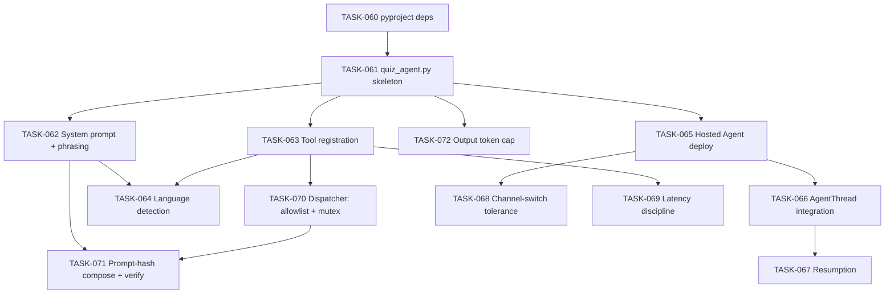

# 004 — Microsoft Agent Framework (MAF) Agent

## Scope

Build the single MAF Python agent: dependencies, agent definition, system prompt with per-language phrasing blocks, tool registration, language detection, channel-agnostic behaviour, latency discipline, and resumption logic. Tool implementation lives in 005-tools; voice specifics in 006-voice-realtime.

**Driving requirements**: FR-001, FR-005, FR-006, FR-007, FR-008, FR-009, FR-010, FR-011, FR-014, NFR-001, NFR-008, ADR-001, ADR-002.

## Dependency Graph



---

## TASK-060 — `pyproject.toml` dependencies

- **Objective**: Pin the Python dependencies needed at runtime.
- **Dependencies**: none.
- **Implementation**:
  ```toml
  [project]
  requires-python = ">=3.11"
  dependencies = [
    "agent-framework>=1.0",
    "azure-ai-projects",
    "azure-cosmos",
    "azure-search-documents",
    "azure-identity",
    "azure-keyvault-secrets",
    "azure-appconfiguration",
    "azure-monitor-opentelemetry",
    "pydantic>=2.5",
  ]
  ```
- **Acceptance criteria**:
  - `pip install -e .` resolves in a clean venv.
  - `python -c "import agent_framework"` succeeds.
- **Risks**: MAF is young (GA 2026-04-03) — pin a minor version; track release notes.
- **Testing**: CI install step.
- **Complexity**: S.
- **Refs**: ADR-001.

---

## TASK-061 — `quiz_agent.py` skeleton

- **Objective**: Define the `QuizAgent` class in `src/agent/quiz_agent.py`, instantiated by the Hosted Agent runtime.
- **Dependencies**: TASK-060.
- **Implementation**:
  1. Import MAF agent primitives + Foundry project client.
  2. Build the agent with a configurable model deployment name (read from App Configuration).
  3. Expose `def create_agent() -> Agent` factory.
- **Acceptance criteria**:
  - `create_agent()` returns a configured agent instance.
  - Model name resolved from AppConfig at construction, not hard-coded.
- **Risks**: configuration drift between local dev and hosted — pull from AppConfig in both.
- **Testing**: unit test mocking AppConfig client.
- **Complexity**: M.
- **Refs**: §002-system-architecture §6.3.

---

## TASK-062 — System prompt + per-language phrasing blocks

- **Objective**: One system prompt with per-language phrasing blocks for greetings, topic prompts, question framing, results, and fallback messaging.
- **Dependencies**: TASK-061.
- **Implementation**:
  1. `src/agent/prompts.py` defines `SYSTEM_PROMPT` + `PHRASING_BLOCKS: dict[str, dict[str, str]]` keyed `[language][slot]`.
  2. Slots: `greeting`, `ask_topic`, `frame_question`, `feedback_correct`, `feedback_incorrect`, `topic_unavailable_fallback`, `coverage_gap_consent` (GOV-025 / TASK-189), `score_preview_decline` (GOV-052), `refusal_off_topic` (GOV-072 soft decline), `refusal_answer_key` (GOV-070 hard refuse), `stay_on_task` (GOV-061 post-injection redirect), `results_summary`, `pass_message`, `fail_message`, `idle_reprompt` (GOV-014 voice 30 s prompt).
  3. Initial languages: `en`, `fr`, `es`. New languages add a block; no code change.
  4. System prompt instructs the model to **not grade** ("you are a conversational shell; grading is performed by the `submit_answer` tool — never assert correctness yourself") — ADR-005 reinforcement.
- **Acceptance criteria**:
  - All three languages have every slot populated.
  - The system prompt explicitly forbids the model from grading.
- **Risks**: phrasing drift between languages (tone, formality) — Foundry Evaluations per language flags drift (TEST-011).
- **Testing**: TEST-003, TEST-004, TEST-005.
- **Complexity**: M.
- **Refs**: §004-agent-behavior §7.3, ADR-002, ADR-005.

---

## TASK-063 — Tool registration

- **Objective**: Register the five tools on the agent. Tool implementations live in 005-tools.
- **Dependencies**: TASK-061, 005-tools (signatures only).
- **Implementation**:
  1. Register `list_topics`, `set_language`, `start_quiz`, `submit_answer`, `get_results`.
  2. Tool descriptions are localised-agnostic (English in metadata is fine — the model still chooses based on user intent).
  3. **No tool other than these five** is registered on the agent.
- **Acceptance criteria**:
  - `agent.tools` enumerates exactly the five tools.
  - A unit test fails if a sixth tool gets registered (defence against scope creep).
- **Risks**: contributors add helper tools that bypass the boundary — registration test guards.
- **Testing**: unit test enumerating tool names; TEST-006.
- **Complexity**: S.
- **Refs**: §004-agent-behavior §3, ADR-005.

---

## TASK-064 — Language detection on first message

- **Objective**: If the user has not set a language and the `users` record has none, detect from the first message (FR-011).
- **Dependencies**: TASK-062, 005-tools `set_language` signature.
- **Implementation**:
  1. System prompt instructs: on first turn, if user language unknown, infer from utterance and call `set_language(user_id, lang)`.
  2. The model returns one of the allowlisted ISO 639-1 codes (validated by the tool — SEC-010).
  3. If inference confidence is low (model self-reports), ask the user to confirm.
- **Acceptance criteria**:
  - First-message French triggers `set_language(user_id, "fr")`.
  - Subsequent turns respond in `fr`.
- **Risks**: code-switching first message confuses inference — TASK-068 / voice config defaults to session language for stability.
- **Testing**: `tests/test_language_resolution.py` (TEST per FR-010/011/012).
- **Complexity**: M.
- **Refs**: FR-010, FR-011, FR-012, FR-014.

---

## TASK-065 — Hosted Agent deployment integration

- **Objective**: Deploy the `QuizAgent` code into the Foundry Hosted Agent provisioned in 001-infrastructure TASK-012.
- **Dependencies**: TASK-061, 001-infrastructure TASK-012.
- **Implementation**:
  1. `azure.yaml` declares a service `quiz-agent` pointing at the `src/agent/` package.
  2. `azd deploy quiz-agent` packages and uploads the agent to the Hosted Agent runtime.
  3. UAMI from 001-infrastructure TASK-010 is attached.
- **Acceptance criteria**:
  - `azd deploy` succeeds.
  - The Playground "Try in playground" surface answers a simple greeting.
- **Risks**: package size — vendoring should be minimal; keep deps lean.
- **Testing**: TEST-003 pre-condition.
- **Complexity**: M.
- **Refs**: ADR-001, §007-operational-runbook §1.

---

## TASK-066 — AgentThread integration (ephemeral conversational state)

- **Objective**: Use Foundry-managed `AgentThread` for chat phrasing and the last few turns; **do not** rely on it for durable session state (that's Cosmos).
- **Dependencies**: TASK-065.
- **Implementation**:
  1. Agent invocation pattern: create or resume a thread per `session_id`.
  2. Persist `thread_id ↔ session_id` mapping on the Cosmos `sessions` row.
  3. On resume, look up `thread_id` from Cosmos and rehydrate.
- **Acceptance criteria**:
  - Reconnecting with the same `session_id` resumes the thread.
  - Cosmos remains the authority for current question index, answers, score (per ADR-003).
- **Risks**: thread becomes stale across long pauses — agent re-states context from Cosmos on resume.
- **Testing**: TEST-008.
- **Complexity**: M.
- **Refs**: ADR-003, FR-008.

---

## TASK-067 — Resumption behavior

- **Objective**: On resume by `session_id`, rehydrate from Cosmos and continue from the next unanswered question.
- **Dependencies**: TASK-066, 003-cosmos-db TASK-048.
- **Implementation**:
  1. Detect `session_id` from connection metadata or user utterance ("continue session X").
  2. Read `Session` from Cosmos; verify `status in {Active, Paused}`.
  3. Greet in the persisted session language; restate the current question.
- **Acceptance criteria**:
  - Resume after disconnect mid-quiz returns the next unanswered question, in the session language.
  - Score and answer history are preserved exactly.
- **Risks**: session in `Expired` state — the agent must explain and offer to start a new one rather than silently restart.
- **Testing**: TEST-008.
- **Complexity**: M.
- **Refs**: FR-008, §004-agent-behavior §10.

---

## TASK-068 — Channel-switch tolerance

- **Objective**: Same agent, same tools, same state across text ↔ voice on the same `session_id` (FR-009).
- **Dependencies**: TASK-066.
- **Implementation**:
  1. Channel is metadata, not state — the agent always reads the durable state from Cosmos.
  2. TTS-friendly tool return shape is used regardless of channel (cheap in text, essential in voice).
  3. On channel switch, the agent re-acknowledges the active question without re-issuing it.
- **Acceptance criteria**:
  - Start in voice, finish in text, same `session_id` → seamless.
- **Risks**: voice-to-text switch loses normalization context — handled by re-reading durable state.
- **Testing**: TEST-009.
- **Complexity**: M.
- **Refs**: FR-009, §004-agent-behavior §8.

---

## TASK-069 — Latency discipline (voice hot path)

- **Objective**: Keep tool execution under ~300 ms p95 on the voice channel (NFR-001).
- **Dependencies**: TASK-063.
- **Implementation**:
  1. No Foundry Evaluations in the hot path.
  2. No needless `list_topics` mid-quiz.
  3. Topic catalog is cached in-process with TTL polling against AppConfig (slow-changing data).
  4. Cosmos reads are point-reads; AI Search reads are filtered + small.
- **Acceptance criteria**:
  - Voice dashboard (008-observability TASK-142) reports tool-call p95 ≤ 300 ms under smoke load.
  - No agent run exceeds 4 tool calls per turn under normal flow.
- **Risks**: tool-call sprawl from over-eager LLM — system prompt explicitly forbids extraneous calls; trace review catches.
- **Testing**: TEST-005, ongoing voice dashboard.
- **Complexity**: M.
- **Refs**: NFR-001, §004-agent-behavior §11.

---

## TASK-070 — Tool dispatcher: allowlist + parallel-call mutex (GOV-010, GOV-012)

- **Objective**: A dispatcher in `src/agent/quiz_agent.py` sits between the MAF tool-call loop and the tool implementations. It (a) **fails closed on any tool name not in the registered five** and (b) **serializes concurrent `submit_answer` calls** for the same `(session_id, question_id)` so a second caller receives the cached in-flight result rather than racing the conditional write.
- **Dependencies**: TASK-063 (tool registration).
- **Implementation**:
  1. Registered tool names live in a frozen constant `ALLOWED_TOOLS = frozenset({"list_topics", "set_language", "start_quiz", "submit_answer", "get_results"})`.
  2. `async def dispatch(tool_name, args, principal) -> ToolResult`:
     - If `tool_name not in ALLOWED_TOOLS` → return `E_INTERNAL`-shaped error envelope, emit `agent.unknown_tool` custom event with the rejected name (and **nothing else** — no payload), refuse to proceed. (P1 per GOV-010 escalation table.)
     - Validate `args.user_id == principal.entra_oid` (rejects tool-arg impersonation, audit §5.8).
     - For `submit_answer` only: acquire an in-process asyncio lock keyed `(session_id, question_id)` from a TTL cache (60 s). The first caller proceeds; concurrent callers `await` the same future and receive the same `ToolResult`. (Distinct from the Cosmos `ifMatch` defense in TASK-047 — that handles cross-process; the lock handles intra-process so the second caller does not even attempt the conditional write.)
  3. Every dispatch records a span `agent.dispatch.{tool_name}` with `outcome`, `latency_ms`, `cache_hit` (for the mutex path).
- **Acceptance criteria**:
  - A synthetic tool-call request for `evil_tool` is rejected; `agent.unknown_tool` event fires; the tool body is not entered.
  - Two concurrent `submit_answer` calls for the same `(session_id, question_id)` → exactly one tool body invocation; the second receives the cached result.
  - The dispatcher cannot be bypassed: a code-path that calls a tool implementation directly fails a CI grep check (only `dispatch()` may import the tool functions).
- **Risks**: in-process mutex doesn't span instances — a horizontally-scaled agent could still race. Mitigation: the Cosmos `ifMatch` etag (TASK-047) handles the cross-process case; the in-process mutex is the optimization that avoids the wasted round-trip.
- **Testing**: TEST-019 (TASK-177 in 009-testing).
- **Complexity**: M.
- **Refs**: GOV-010, GOV-012, SEC-006.

---

## TASK-071 — Prompt composition + SHA-256 hash + per-turn verification (GOV-001..GOV-003)

- **Objective**: Compose the system prompt from four pinned layers (identity / contract / per-language phrasing block / session frame), hash the composed text with SHA-256 once at session start, persist the hash on the `SessionDoc`, and verify it on every subsequent tool invocation. A mid-session mismatch halts the session as P0.
- **Dependencies**: TASK-062 (prompt layers).
- **Implementation**:
  1. `src/agent/prompts/compose.py` exposes:
     - `def compose(language: ISO639-1, session_frame: SessionFrame) -> tuple[str, str]` — returns `(rendered_prompt, sha256_hex)`.
     - The four layers are read from pinned paths (`prompts/identity.txt`, `prompts/contract.txt`, `prompts/lang/{lang}.yaml`, `prompts/session-frame-template.txt`); layer files are **content-addressed at build time** (each carries its own hash in a manifest file `prompts/MANIFEST.json` committed to the repo).
  2. `start_quiz` calls `compose` and writes `promptHash` to `SessionDoc` before returning Q1.
  3. The dispatcher (TASK-070) re-computes `compose` for the current language on every turn and asserts equality against `session.promptHash`. Mismatch → emit `agent.prompt_hash_mismatch` (P0 per `009-gov §15`), set session `status = "Paused"`, page on-call, return a localized "session paused" error.
  4. `compose` is **deterministic** — no timestamps, no random elements, no model-generated content. Re-running `compose` with the same inputs at any time produces the same hash. Property-tested.
- **Acceptance criteria**:
  - `compose` is deterministic (same inputs → same hash) across two calls.
  - `start_quiz` persists `promptHash` on the session row.
  - Every subsequent tool call verifies the hash; a forced mid-session mutation produces the P0 halt path.
  - Forbidden-content lint (TEST-018) runs over the rendered prompt for each language.
- **Risks**: phrasing block files include a string interpolation that varies (e.g., user name) — explicitly forbidden. The session frame layer is the **only** place runtime values appear; everything else is static.
- **Testing**: TEST-018 (lint), TEST-025 (hash stability + mismatch halt).
- **Complexity**: M.
- **Refs**: GOV-001, GOV-002, GOV-003, GOV-005.

---

## TASK-072 — Output token cap + truncation event (GOV-091)

- **Objective**: Cap the agent's per-turn output at 600 tokens; on overflow, truncate and emit `agent.output_truncated` (P2).
- **Dependencies**: TASK-061 (agent skeleton).
- **Implementation**:
  1. Configure the MAF runtime's per-turn output budget to 600 tokens.
  2. On truncation, the runtime emits `agent.output_truncated` with `{ session_id, channel, language, requested_max, returned }` (no message content).
  3. Default phrasing blocks are budgeted to stay well under the cap (most turns < 200 tokens).
- **Acceptance criteria**:
  - A synthetically-long prompt produces a truncated response with the event emitted.
  - 95% of real turns fall under 200 tokens (sampled via observability dashboard).
- **Risks**: aggressive truncation chops a verdict mid-word — voice TTS is the worst-case. Mitigation: phrasing-block authoring keeps verdict + next-question framing well under the budget; lint review.
- **Testing**: synthetic over-length test in 009-testing; observability event verified by TEST-010 supplement.
- **Complexity**: S.
- **Refs**: GOV-091.

---

## Cross-cutting acceptance for this task pack

- One agent, five tools, three languages, two channels.
- Durable state lives in Cosmos; thread state is ephemeral (ADR-003).
- The model never grades (ADR-005 reinforced in the system prompt).
- The dispatcher is the **only** path from MAF tool-call loop to tool bodies (TASK-070).
- Every session is governed by a hashed, pinned system prompt (TASK-071).
