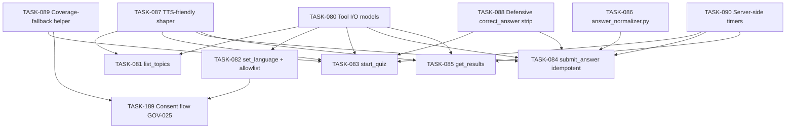

# 005 — Tools (`src/agent/tools.py`)

## Scope

Implement the five Python tools the agent calls, plus the multilingual answer normalizer and the TTS-friendly response shaper. Every tool enforces the boundary contracts defined in ADR-005 and §003-data-contracts §3.

**Driving requirements**: FR-002, FR-003, FR-004, FR-010, FR-012, FR-013, FR-014, FR-015, NFR-002, NFR-003, NFR-004, NFR-014, SEC-001, SEC-002, SEC-006, SEC-010, ADR-005.

## Dependency Graph

---

## TASK-080 — Tool I/O Pydantic models

- **Objective**: Strict typed inputs and outputs for every tool, reused by the model schema and the tests.
- **Dependencies**: 003-cosmos-db TASK-045.
- **Implementation**:
  1. In `src/data/models.py`, define request/response classes per tool:
     `ListTopicsResponse`, `SetLanguageRequest/Response`, `StartQuizRequest/Response`, `SubmitAnswerRequest/Response`, `GetResultsResponse`.
  2. Question payloads in tool responses use `Question` (public, **no `correct_answer`**), never `QuestionWithAnswer`.
- **Acceptance criteria**:
  - JSON schema generated from each model reflects exactly the contract documented in §003-data-contracts §3.
  - A test asserts `correct_answer` is absent from every response model's serialised schema.
- **Risks**: schema drift between docs and code — test asserts canonical fields.
- **Testing**: TEST-006.
- **Complexity**: M.
- **Refs**: §003-data-contracts §3, SEC-001.

---

## TASK-081 — `list_topics(language)` tool

- **Objective**: Return the catalog of available topics with localised labels.
- **Dependencies**: TASK-080, 003-cosmos-db TASK-043.
- **Implementation**:
  1. Validate `language` against ISO 639-1 allowlist (SEC-010).
  2. Read `topics` from Cosmos (cached per-process with short TTL).
  3. Project `{id, label[language]}` per topic; omit topics with zero question count in that language.
- **Acceptance criteria**:
  - Returns localised labels in the requested language.
  - Topics with zero questions in the language are filtered out.
- **Risks**: cache invalidation — short TTL acceptable for v1.
- **Testing**: TEST-003 smoke; unit test for filtering.
- **Complexity**: S.
- **Refs**: FR-002, NFR-014.

---

## TASK-082 — `set_language(user_id, lang)` tool

- **Objective**: Persist the user's preferred language; validate against the ISO 639-1 allowlist (SEC-010).
- **Dependencies**: TASK-080, 003-cosmos-db TASK-042, 007-security TASK-123.
- **Implementation**:
  1. Validate `lang` via 007-security TASK-123 validator; raise on disallowed code.
  2. Upsert `users` doc with `language`, `updatedAt`.
  3. Return `{ language }` echo.
- **Acceptance criteria**:
  - Disallowed code (e.g., `"klingon"`) rejected with a clear error.
  - Allowed code persists and is read back identically.
- **Risks**: allowlist defined in AppConfig drifts from validator constants — validator pulls live from AppConfig with cache.
- **Testing**: TEST-004 (sets French); negative test with disallowed code.
- **Complexity**: S.
- **Refs**: FR-010, FR-014, SEC-010.

---

## TASK-083 — `start_quiz(user_id, topic, n, language, difficulty?)` tool

- **Objective**: Create a session, seed the shuffle, return Q1 — **without `correct_answer`**.
- **Dependencies**: TASK-080, TASK-087, TASK-088, TASK-089, TASK-090, 002-ai-search TASK-027, 003-cosmos-db TASK-047, TASK-049.
- **Implementation**:
  1. Validate inputs; resolve language (explicit > user pref > inferred).
  2. Query AI Search via `search_topic` for candidate `logical_id`s filtered by `(topic, language, difficulty?)`.
  3. If coverage exists in requested language → proceed. If coverage is **zero** in requested language → **do NOT silently fall back**. Return `{ ok: false, error: { code: "E_NO_COVERAGE", detail: { requested, suggested_fallback } } }` and let the agent execute the consent flow per TASK-189 (GOV-025). The agent then re-calls `start_quiz` with the user-approved language. (Soft case — coverage exists but `< n` — is below.)
  4. If coverage exists but `count < n` → clamp `n` to `count`, populate `fallback_notice` per `008-api §1.5.3` (this is a count clamp, not a language fallback — no consent required, but the agent reads the notice). Persist `requestedLanguage` and `language` (same value, since no language switch).
  5. Seed-shuffle via 003-cosmos-db TASK-049; persist `SessionDoc` row.
  6. Initialise server-side timers: `startedAt`, `questionStartedAt`, `timeLimitSeconds` (TASK-090).
  7. Fetch Q1 via `get_question_view` (text + options only); shape via TTS-friendly shaper (TASK-087).
  8. Return the wire shape from [`specs/008-api-contracts.md §1.5.3`](../specs/008-api-contracts.md): `{ session_id, question, index, total, language, fallback_notice?, time_limit_seconds, question_started_at }`. **Tool I/O is snake_case** per `008-api §0.4`; Pydantic models use aliases to map to Cosmos camelCase (TASK-045).
- **Acceptance criteria**:
  - Returned payload has no `correct_answer` field, recursively.
  - Persisted session reflects `requestedLanguage` and `language` correctly.
  - Zero-coverage in requested language → `E_NO_COVERAGE` (consent required) — **never** a silent language switch.
  - Count clamp → `fallback_notice` present, no language change.
- **Risks**: silent over-fetch from AI Search — query uses `top: n` exactly.
- **Testing**: TEST-003, TEST-004, TEST-005, TEST-006.
- **Complexity**: L.
- **Refs**: FR-003, FR-005, FR-012, NFR-003, SEC-001.

---

## TASK-084 — `submit_answer(session_id, question_id, answer)` tool (**idempotent**)

- **Objective**: Grade deterministically server-side; persist via Cosmos `ifMatch` conditional write; return verdict + next question (no answer key). **Non-negotiable idempotency** (NFR-002, SEC-006).
- **Dependencies**: TASK-080, TASK-086, TASK-088, TASK-090, 002-ai-search TASK-027 (server-only fetch), 003-cosmos-db TASK-047.
- **Implementation**:
  1. Load `Session` (with etag).
  2. Reject if status is not `Active`.
  3. Reject if per-question or per-quiz timer expired → flip status to `Expired`, auto-grade remaining as `unanswered`, score and return.
  4. Normalise the answer via `answer_normalizer` (TASK-086) — language-aware.
  5. Fetch the answer key via **server-only** AI Search method (TASK-027); never expose key downstream.
  6. Deterministic grade: set comparison `normalized ⊆ correct_answer` for multi-correct; `==` for single.
  7. Append answer via 003-cosmos-db TASK-047 conditional write — duplicate `(session_id, question_id)` is a no-op (returns existing verdict).
  8. Emit `grading_event` (008-observability TASK-141) — **only on the successful write path**, not on idempotent no-op.
  9. Fetch the next public question; return `{ verdict, next: Question | null, score, totalQuestions, language }`.
- **Acceptance criteria**:
  - Two concurrent calls for the same `(session_id, question_id)` produce one persisted answer and identical verdicts (TEST-007).
  - `correct_answer` is never present in the returned JSON.
  - Expired session auto-grades remaining as `unanswered`.
- **Risks**: emitting `grading_event` on the no-op path would double-count metrics — verified in TEST-007 assertions.
- **Testing**: TEST-006, TEST-007, TEST-010.
- **Complexity**: L.
- **Refs**: NFR-002, NFR-004, NFR-009, NFR-014, SEC-002, SEC-006, ADR-005.

---

## TASK-085 — `get_results(session_id)` tool

- **Objective**: Final score, percentage, pass/fail, per-question breakdown — in the session language.
- **Dependencies**: TASK-080, TASK-087, 003-cosmos-db TASK-046.
- **Implementation**:
  1. Read `Session`; require status in `{Completed, Scored}` (or transition `Completed → Scored` if needed).
  2. Compute `score`, `percentage`, `passFail` (configurable threshold; default 60%). Per-topic overrides live in the `topics` container; service-wide default is in AppConfig (`scoring:defaultPassThresholdPct=60`).
  3. Breakdown per question: `{question_id, verdict}` — **no question text, no answer key** in this aggregate.
  4. Localise the prose (pass/fail wording) via phrasing blocks from 004-agent-framework TASK-062.
- **Acceptance criteria**:
  - Returned payload has no `correct_answer`.
  - Pass/fail wording is in the session's language.
- **Risks**: pass threshold drift across customers — configurable via AppConfig.
- **Testing**: TEST-003, TEST-004, TEST-006.
- **Complexity**: S.
- **Refs**: FR-013, SEC-001.

---

## TASK-086 — `src/agent/answer_normalizer.py` (multilingual)

- **Objective**: Convert spoken or typed variants into the option key. Language-aware.
- **Dependencies**: TASK-080.
- **Implementation**:
  1. Map structures per language:
     - `en`: "a", "letter a", "option a", "the first", "the first one", "first" → `A`.
     - `fr`: "a", "lettre a", "option a", "la première", "premier" → `A`.
     - `es`: "a", "letra a", "opción a", "la primera", "primero" → `A`.
  2. Fallback: substring match against each `option.text` (case- and accent-insensitive).
  3. If no normalization path matches → return `None` (the tool re-prompts politely).
  4. Test cases parametrised across all three languages with at least 10 variants per language.
- **Acceptance criteria**:
  - "letra B" → `B` (Spanish).
  - "la deuxième" → `B` (French).
  - "the green one" → `None` (no match) — used by negative tests.
- **Risks**: unicode normalization (accents) — apply NFKD + strip.
- **Testing**: `tests/test_grading.py` parametrised; voice normalisation test (009-testing TASK-174).
- **Complexity**: M.
- **Refs**: §004-agent-behavior §6, NFR-014.

---

## TASK-087 — TTS-friendly response shaper

- **Objective**: Tool return strings are sentence-length, no markdown, no code blocks; options spoken; numerals expanded; phonetic-safe.
- **Dependencies**: TASK-080.
- **Implementation**:
  1. Module `src/agent/tts_shaper.py` providing `shape_question(question, language) -> str`, `shape_results(...)`, `shape_topic_list(...)`.
  2. Options rendered as `"Option A: <text>. Option B: <text>."` per language (`"Réponse A:"`, `"Opción A:"`).
  3. Number expansion via a small per-language map for 0–20; pass-through for larger numbers.
  4. URL hygiene: replace raw URLs with phonetic-safe spoken form ("at link example dot com").
- **Acceptance criteria**:
  - Output contains no `*`, `**`, `` ` ``, or `#` markdown.
  - Option keys clearly enumerated.
  - Numerals 0–20 spelled out.
- **Risks**: number expansion over-eager on dates/codes — limit to integer tokens, not embedded digits.
- **Testing**: lint test asserting no markdown chars; TEST-005 voice smoke.
- **Complexity**: M.
- **Refs**: NFR-014.

---

## TASK-088 — Defensive `correct_answer` stripping

- **Objective**: Defence in depth — even if upstream returns a record with `correct_answer`, the tool layer strips it before returning to the agent.
- **Dependencies**: TASK-080.
- **Implementation**:
  1. A response builder applied to every tool return: walks the dict recursively and removes any key named `correct_answer`, `correctAnswer`, or `answer_key`.
  2. Logs a warning (not an error) if any such key was found post-strip — surface in App Insights so it can be remediated upstream.
- **Acceptance criteria**:
  - Even if `Question` was mistakenly populated with the key, the tool's outbound payload has no `correct_answer` field.
  - The warning fires in tests when the key was present.
- **Risks**: silent recovery hides bugs — pair with the warning log so leaks at the source are visible.
- **Testing**: TEST-006 (the leak test injects a tainted record and asserts strip).
- **Complexity**: S.
- **Refs**: SEC-001, ADR-005.

---

## TASK-089 — Coverage-fallback surface mechanics

- **Objective**: Provide the data surface for FR-012 / GOV-025 fallback: the **suggested_fallback language** is computed and surfaced to the agent so the agent can run the consent flow (TASK-189).
- **Dependencies**: TASK-083, 003-cosmos-db TASK-043 (topics container with per-language counts).
- **Implementation**:
  1. A helper `def suggest_fallback(topic: str, requested_lang: str, n: int) -> str | None`:
     - Order: user's previously-used language (from `users.detectedLanguage` or last `sessions.language`) → topic's `defaultLanguage` (per `008-api §2.3`) → highest-coverage language with `count >= n`. Returns `None` if no language has coverage.
  2. `start_quiz` calls `suggest_fallback` and includes the result in the `E_NO_COVERAGE` error's `detail.suggested_fallback` field. **`start_quiz` does NOT auto-switch.** The agent must call `set_language` explicitly to switch, per TASK-189.
  3. Helper is pure (no side effects, no Cosmos writes).
- **Acceptance criteria**:
  - `suggest_fallback` returns the expected language for each fallback-order rung.
  - Returns `None` when no language has coverage; `start_quiz` surfaces `E_NO_COVERAGE` with `suggested_fallback: null` and the agent offers a different topic.
  - **No code path in this task switches the session language**. That happens only when `set_language` is called explicitly by the agent (TASK-189).
- **Risks**: confusing the agent into thinking it should silently retry — mitigated by the explicit error code; TEST-022 verifies.
- **Testing**: `tests/test_language_resolution.py` (existing); TEST-022 (new, TASK-180 in 009-testing).
- **Complexity**: S.
- **Refs**: FR-012, GOV-025, `008-api §1.5.5`, `008-api §2.3`.

---

## TASK-189 — Coverage-fallback consent flow (agent-side, GOV-025)

- **Objective**: When `start_quiz` returns `E_NO_COVERAGE`, the agent runs a two-turn consent flow before any language switch. **No silent cross-language serve.**
- **Dependencies**: TASK-083, TASK-089, TASK-082 (`set_language`), 004-agent-framework TASK-062 (per-language phrasing blocks).
- **Implementation**:
  1. The agent's tool-call loop catches `E_NO_COVERAGE` and reads `error.detail.suggested_fallback` (may be `null`).
  2. **Phrasing block addition** (TASK-062): new slot `coverage_gap_consent` per language. Example FR copy: `"Le sujet '{topic}' n'est pas disponible en français. Je peux te le proposer en {suggested}. On continue dans cette langue, ou tu préfères un autre sujet ?"`.
  3. The agent surfaces the gap **in the active (requested) language** and waits for user input. **Allowed responses**:
     - Affirmative ("oui", "yes", "sí") → agent calls `set_language(user_id, suggested_fallback)` → re-calls `start_quiz` with the new language → succeeds.
     - Negative → agent calls `list_topics(language=requested)` and offers a different topic.
     - Ambiguous → agent re-prompts once with the same phrasing-block slot.
  4. If `suggested_fallback == null` (no language has coverage) → agent skips directly to offering a different topic; no language switch is possible.
- **Acceptance criteria**:
  - Affirmative consent path: `set_language` is called BEFORE the retry `start_quiz`; the session ends up with `language = suggested_fallback`, `requestedLanguage = original_requested`. The fallback notice is read aloud in the user's requested language before Q1.
  - Negative path: agent offers another topic; original `users.language` is preserved.
  - **TEST-022 (TASK-180 in 009-testing) verifies both paths and confirms no silent serve.**
- **Risks**: model may try to skip the consent turn for UX brevity. Mitigation: phrasing block + system-prompt instruction + TEST-022 negative assertion (assert `set_language` was called between the two `start_quiz` calls).
- **Testing**: TEST-022.
- **Complexity**: M.
- **Refs**: FR-012, GOV-025, §004-agent-behavior §7.2.

---

## TASK-090 — Server-side per-question + per-quiz timers

- **Objective**: Enforce timing server-side; never trust the model to enforce time (NFR-004, FR-015).
- **Dependencies**: TASK-080, 003-cosmos-db TASK-048.
- **Implementation**:
  1. On `start_quiz`, set `startedAt`, `questionStartedAt`, `timeLimitSeconds` (per-quiz) and `perQuestionLimitSeconds` (per-question; configurable via AppConfig).
  2. On `submit_answer`, recompute `now - questionStartedAt`. If exceeded → mark this answer `unanswered`, advance.
  3. If `now - startedAt > timeLimitSeconds` → flip to `Expired`; auto-grade remaining; return final result.
- **Acceptance criteria**:
  - A submit after the per-question window auto-advances with `unanswered`.
  - A submit after the per-quiz window flips state to `Expired` and the user gets a graceful final response.
- **Risks**: clock skew between client and server — server time is authoritative; client never participates in the decision.
- **Testing**: negative tests in 009-testing TASK-168.
- **Complexity**: M.
- **Refs**: NFR-004, FR-015.

---

## Cross-cutting acceptance for this task pack

- Every tool response is JSON-asserted to omit `correct_answer` (TEST-006).
- `submit_answer` is idempotent under duplicate calls and observable via `grading_event` exactly once per persisted answer.
- Answer normaliser is language-aware and accent-insensitive.
- All tool returns pass the TTS-friendly lint.
