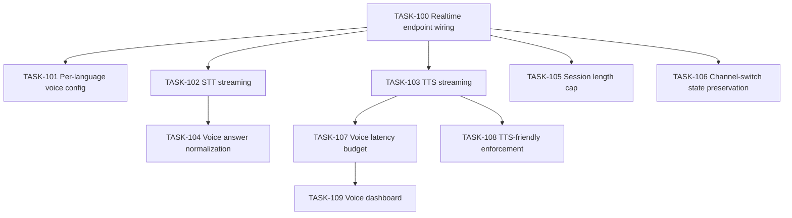

# 006 — Voice (Foundry Realtime API)

## Scope

Wire the voice channel on the same agent instance: Realtime endpoint, per-language voices, STT/TTS, voice answer normalization, latency budget enforcement, voice session length cap, and a voice-specific observability dashboard.

**Driving requirements**: FR-007, FR-009, NFR-001, NFR-013, NFR-014, ADR-001.

## Dependency Graph

---

## TASK-100 — Foundry Realtime endpoint wiring

- **Objective**: Connect the Hosted Agent to the Realtime endpoint provisioned in 001-infrastructure TASK-013 so voice runs the same agent code as text.
- **Dependencies**: 001-infrastructure TASK-013, 004-agent-framework TASK-065.
- **Implementation**:
  1. Configure the agent registration to expose both the Playground (text) and Realtime (voice) entry points.
  2. Verify WebRTC handshake to the Realtime endpoint via the Foundry Realtime client SDK.
  3. Single agent serves both channels; no second codebase.
- **Acceptance criteria**:
  - A WebRTC connection to the Realtime endpoint reaches the same `QuizAgent` instance the Playground uses.
  - No duplicate tool registrations between channels.
- **Risks**: regional gaps in Realtime support — verified in 001-infrastructure TASK-003 region pin.
- **Testing**: TEST-005.
- **Complexity**: M.
- **Refs**: FR-007, §002-system-architecture §9.

---

## TASK-101 — Per-language voice config

- **Objective**: Match the TTS voice to the session language for stability and intelligibility.
- **Dependencies**: TASK-100.
- **Implementation**:
  1. Define a voice-per-language map in AppConfig (e.g., `voices:en=nova`, `voices:fr=alloy`, `voices:es=alloy`).
  2. On session start (or resume), select the voice based on `session.language`.
  3. STT auto-detect is allowed per turn but **defaults to the session language** to avoid language flapping on brief code-switching.
- **Acceptance criteria**:
  - A French session uses the French-configured voice end-to-end.
  - A brief English interjection does not flip the session language.
- **Risks**: low-quality voices for some languages — track Foundry voice catalog updates.
- **Testing**: TEST-005 (Spanish smoke).
- **Complexity**: S.
- **Refs**: §004-agent-behavior §7.4, FR-005.

---

## TASK-102 — STT streaming integration

- **Objective**: Stream user audio → text via Foundry Realtime STT, with per-turn transcripts surfaced to the agent.
- **Dependencies**: TASK-100.
- **Implementation**:
  1. Connect the Realtime client to receive partial + final transcripts.
  2. Final transcripts feed into the agent's normal turn loop.
  3. Confidence scores attached for downstream voice normalization (TASK-104).
- **Acceptance criteria**:
  - A spoken French answer produces a French transcript with confidence > 0.7 in steady test conditions.
  - Partial transcripts are not sent to tools — only finals.
- **Risks**: STT errors leak into tool calls — only finals reach tools.
- **Testing**: TEST-005.
- **Complexity**: M.
- **Refs**: FR-007.

---

## TASK-103 — TTS streaming integration

- **Objective**: Stream agent response text → audio via Foundry Realtime TTS in the session voice.
- **Dependencies**: TASK-101.
- **Implementation**:
  1. Pipe agent text turn into TTS in the configured voice for the session language.
  2. Strip any latent markdown defensively (TASK-108).
- **Acceptance criteria**:
  - Audio output is in the configured voice with no rendered markdown artifacts ("*", "`", etc.).
- **Risks**: dead-air leakage between turns — flush behavior tuned in Realtime client settings.
- **Testing**: TEST-005.
- **Complexity**: M.
- **Refs**: NFR-014, NFR-013.

---

## TASK-104 — Voice answer normalization

- **Objective**: STT output ("the second one", "letter B", "VPN gateway") → option key — via the normalizer from 005-tools TASK-086.
- **Dependencies**: TASK-102, 005-tools TASK-086.
- **Implementation**:
  1. STT final transcript is passed verbatim to the agent.
  2. The agent calls `submit_answer` with the transcript as `answer`.
  3. The tool runs the normalizer (already language-aware) before grading.
  4. Voice-specific cases (filler words, hesitations) are handled in the normalizer's pre-processing step (strip "um", "uh", "euh", "este").
- **Acceptance criteria**:
  - "Uh, letter B" → `B`.
  - "Je crois que c'est la deuxième" → `B`.
  - Spanish "la verde" with no option matching → `None` and agent re-prompts.
- **Risks**: locale-specific fillers — extensible per language; documented.
- **Testing**: TEST-005; 009-testing TASK-174.
- **Complexity**: M.
- **Refs**: §004-agent-behavior §6, NFR-014.

---

## TASK-105 — Voice session length cap

- **Objective**: Cap maximum voice session length to control Realtime per-minute billing (NFR-013).
- **Dependencies**: TASK-100.
- **Implementation**:
  1. Max session length read from AppConfig (`voice:maxSessionMinutes`, default 30).
  2. On exceed → graceful close: agent says farewell in the session language; durable state preserved in Cosmos; user can resume in text or new voice session.
  3. **Two-stage dead-air handling (matches `009-agent-governance.md §2.6` GOV-014)**:
     - First idle threshold (`voice:idleReprompSeconds`, default 30 s): agent re-prompts the user once in the active language using the phrasing block's "are you still there?" copy.
     - Second idle threshold (`voice:idleCloseSeconds`, default 60 s total since last input): close the connection. Durable state preserved in Cosmos; user can resume.
- **Acceptance criteria**:
  - A simulated 31-minute voice session terminates cleanly with state preserved.
  - 30 seconds of silence triggers a re-prompt in the session language; another 30 s without input closes the connection.
  - On close, the next `submit_answer` for the same `session_id` succeeds (state is intact).
- **Risks**: aggressive idle cutoff frustrates slow speakers — value is configurable.
- **Testing**: synthetic integration test.
- **Complexity**: M.
- **Refs**: NFR-013.

---

## TASK-106 — Channel-switch state preservation

- **Objective**: Switching mid-quiz between voice and text (FR-009) preserves session state and language.
- **Dependencies**: TASK-100, 004-agent-framework TASK-068, 003-cosmos-db TASK-048.
- **Implementation**:
  1. The agent loads state from Cosmos on every turn — channel is metadata.
  2. On a new connection for an existing `session_id`, greet in the persisted language; restate the current question.
  3. The `channel` field on `grading_event` is updated per submission (text/voice).
- **Acceptance criteria**:
  - A quiz started in voice and continued in text resumes at the next unanswered question, in the persisted language.
- **Risks**: tooling differences between channels — none expected because state is centralised.
- **Testing**: TEST-009.
- **Complexity**: M.
- **Refs**: FR-009, ADR-003.

---

## TASK-107 — Voice latency budget enforcement (NFR-001)

- **Objective**: Tool execution under ~300 ms p95 on the voice hot path.
- **Dependencies**: TASK-100, 004-agent-framework TASK-069.
- **Implementation**:
  1. Each tool emits a span with `channel` dimension.
  2. Alert on voice p95 > 300 ms for 5 minutes (008-observability TASK-145).
  3. Hot path forbidden activities (codified in code review checklist + lint):
     - No Foundry Evaluations.
     - No more than one AI Search call per turn (start_quiz can do two; one for IDs, one for Q1 fetch — accepted).
     - No long-running blob reads.
- **Acceptance criteria**:
  - Smoke voice run keeps p95 ≤ 300 ms under nominal load.
- **Risks**: cold start on Hosted Agent — warm pool sized appropriately.
- **Testing**: TEST-005; ongoing dashboard.
- **Complexity**: M.
- **Refs**: NFR-001, §004-agent-behavior §11.

---

## TASK-108 — TTS-friendly enforcement (voice channel)

- **Objective**: Defensive enforcement: even if a tool slipped a markdown char, the voice channel strips it before TTS.
- **Dependencies**: TASK-103, 005-tools TASK-087.
- **Implementation**:
  1. The Realtime client pipeline runs a lightweight stripper before TTS: removes `*`, `` ` ``, `#`, raw URLs.
  2. Logs a warning (App Insights) if the stripper actually had to act — surface to remediate at source.
- **Acceptance criteria**:
  - No markdown ever reaches the TTS stage.
  - Warning fires in tests when a tool was tainted.
- **Risks**: legitimate `*` (e.g., wildcard) being stripped — accept; voice content shouldn't contain wildcards.
- **Testing**: integration test injecting tainted output; TEST-005.
- **Complexity**: S.
- **Refs**: NFR-014.

---

## TASK-109 — Voice-specific dashboard

- **Objective**: Separate dashboard for the voice hot path: STT latency, TTS latency, tool-call round-trip in voice mode.
- **Dependencies**: TASK-107, 008-observability TASK-140.
- **Implementation**:
  1. Workbook in App Insights titled "Quiz Voice — Hot Path".
  2. Charts: STT-final p50/p95/p99, TTS first-byte latency, voice tool-call round-trip, per-language counts.
  3. Alerting threshold: voice tool-call p95 > 300 ms.
- **Acceptance criteria**:
  - Dashboard populated within 10 minutes of first voice turn.
  - Alert wired (off by default in dev).
- **Risks**: noisy alerts on cold paths — configure quiet hours.
- **Testing**: post-deploy verification after TEST-005.
- **Complexity**: M.
- **Refs**: §007-operational-runbook §2.3, NFR-001.

---

## Cross-cutting acceptance for this task pack

- Same agent + tools + state across voice and text.
- Voice channel does not see markdown artifacts.
- Voice billing protected by session length cap and idle cutoff.
- Voice latency observably within budget.
