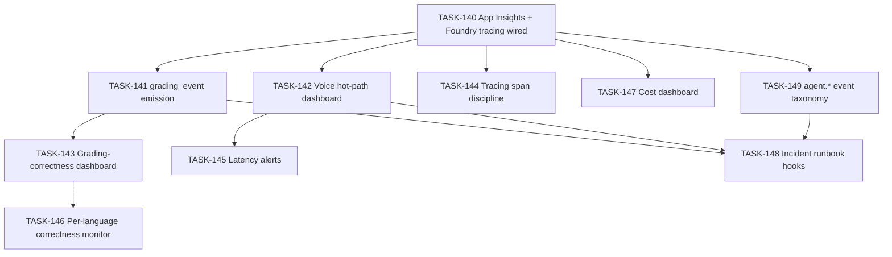

# 008 — Observability

## Scope

Wire Application Insights + Foundry tracing, emit the structured `grading_event` per submission, stand up the grading-correctness dashboard and the voice hot-path dashboard, configure latency alerts, and document the metrics that matter for an exam system (correctness rate per language — not just uptime).

**Driving requirements**: NFR-001, NFR-008, NFR-009; FR-013; SEC-008 (retention surface); ADR-001 (Foundry tracing).

## Dependency Graph

---

## TASK-140 — App Insights + Foundry tracing wired (NFR-008)

- **Objective**: Telemetry is sent from the Hosted Agent into App Insights; Foundry tracing for thread/tool spans is enabled.
- **Dependencies**: 001-infrastructure TASK-009, TASK-012.
- **Implementation**:
  1. Initialise OpenTelemetry with `azure-monitor-opentelemetry` in the agent boot path.
  2. Enable Foundry tracing on the project (Bicep diagnostic settings already wired in 001-infrastructure TASK-009).
  3. Verify thread + tool spans appear in App Insights end-to-end transactions.
- **Acceptance criteria**:
  - End-to-end transaction view shows agent → tool → Cosmos/Search spans.
  - Connection string sourced from env, not Key Vault.
- **Risks**: high cardinality on dimensions — see TASK-141 dimension policy.
- **Testing**: TEST-010 prerequisite.
- **Complexity**: M.
- **Refs**: NFR-008.

---

## TASK-141 — `grading_event` structured event emission (NFR-009)

- **Objective**: Every successful `submit_answer` emits one structured event with the dimensions for tracking correctness over time. The App Insights event must NOT carry the answer-key (`expected`) or raw utterance (`receivedRaw`) — those persist only to the server-only `audit` container.
- **Dependencies**: TASK-140, 005-tools TASK-084.
- **Implementation**:
  1. Event name: `grading_event`.
  2. App Insights dimensions (matches `specs/008-api-contracts.md §4.5.1`): `sessionId`, `questionId`, `userId` (opaque Entra OID), `language`, `received` (normalized option key, NOT free text), `verdict`, `channel` (`text|voice`), `scoreDelta`, `latencyMs`, `timestamp`.
  3. **Explicitly excluded** from the App Insights event (asserted by TEST-010): `expected` (🟡 — would expose answer keys to a broader-access telemetry surface), `receivedRaw` (PII, transcript-retention governed).
  4. The Cosmos `audit` row written in the same code path **does** carry `expected` and `receivedRaw` per `specs/008-api-contracts.md §2.4`. The audit container's RBAC scope (analyst/auditor only) is the access control.
  5. Emitted **only on the successful write path** in `submit_answer` (never on idempotent no-op).
- **Acceptance criteria**:
  - One event per persisted answer; duplicate `submit_answer` calls emit zero additional events.
  - Required dimensions present.
  - `expected` and `receivedRaw` are **absent** from the App Insights event (asserted by TEST-010 + AL-006).
- **Risks**: someone "helpfully" adds `expected` to the event for dashboard convenience — call it out in code review; pair with the assertion in TEST-010.
- **Testing**: TEST-010; TEST-007 (the idempotency test asserts no double-emit); AL-006 (telemetry redaction).
- **Complexity**: M.
- **Refs**: NFR-009, SEC-001, SEC-014, `infra/README §11.2` (INF-101).

---

## TASK-142 — Voice hot-path dashboard

- **Objective**: Workbook tracking STT latency, TTS latency, tool-call round-trip in voice mode.
- **Dependencies**: TASK-140, 006-voice-realtime TASK-107.
- **Implementation**:
  1. App Insights workbook "Quiz Voice — Hot Path".
  2. Charts (p50/p95/p99):
     - STT first-final latency.
     - TTS first-byte latency.
     - Tool-call round-trip filtered by `channel == 'voice'`.
  3. Per-language splits where available.
- **Acceptance criteria**:
  - Workbook visualises live voice traffic within ten minutes of first session.
- **Risks**: low-volume scenarios produce empty charts — add minimum-sample annotation.
- **Testing**: post-TEST-005 verification.
- **Complexity**: M.
- **Refs**: NFR-001, §007-operational-runbook §2.3.

---

## TASK-143 — Grading-correctness dashboard

- **Objective**: Workbook tracking correctness rate per language, per topic, per channel — the metric that actually matters for an exam system (not uptime).
- **Dependencies**: TASK-141.
- **Implementation**:
  1. App Insights workbook "Quiz Correctness".
  2. KPIs: overall correctness %, per-language correctness %, per-topic correctness %.
  3. Drilldown: per-question verdict distribution (find chronically wrong questions for author review).
- **Acceptance criteria**:
  - Per-language correctness % visible.
  - Per-question heatmap surfaces outliers.
- **Risks**: tiny per-question sample sizes mislead — annotate with confidence-bands once volume justifies.
- **Testing**: post-deploy with seeded smoke runs.
- **Complexity**: M.
- **Refs**: NFR-009, §007-operational-runbook §2.

---

## TASK-144 — Tracing span discipline

- **Objective**: Spans cover the right operations with the right attributes — no more, no less.
- **Dependencies**: TASK-140.
- **Implementation**:
  1. Spans:
     - `tool.list_topics`, `tool.set_language`, `tool.start_quiz`, `tool.submit_answer`, `tool.get_results`.
     - `cosmos.read`, `cosmos.conditional_write`, `search.query`, `search.get_question_view`, `search.get_answer_key`.
  2. Attributes: `language`, `channel`, `verdict` (where applicable). **Forbid** attributes that leak: never set `correct_answer` as an attribute.
  3. Lint check: any span attribute named `correct_answer` fails the build.
- **Acceptance criteria**:
  - Span tree on a single submission reflects the call graph clearly.
  - Lint check rejects forbidden attributes.
- **Risks**: noisy attribute names — keep to the documented set.
- **Testing**: TEST-010; review test transcripts.
- **Complexity**: M.
- **Refs**: NFR-008, SEC-001.

---

## TASK-145 — Latency alerts

- **Objective**: Alerts wired for SLO breaches.
- **Dependencies**: TASK-142, 006-voice-realtime TASK-107.
- **Implementation**:
  1. Alert: voice tool-call p95 > 300 ms over 5-minute window → ticket.
  2. Alert: Cosmos 429 rate > 1% → ticket.
  3. Alert: AI Search 503 rate > 0 sustained → ticket.
  4. All alerts off by default in `dev` env; on by default in `prod` env.
- **Acceptance criteria**:
  - Synthetic latency spike fires the voice alert.
- **Risks**: noisy alerts erode signal — quiet hours configured for `dev`.
- **Testing**: synthetic test injecting latency.
- **Complexity**: M.
- **Refs**: NFR-001, NFR-005.

---

## TASK-146 — Per-language correctness rate monitor

- **Objective**: Track per-language correctness rate over time as the early-warning signal for translation drift.
- **Dependencies**: TASK-141, TASK-143.
- **Implementation**:
  1. Saved query in App Insights: 7-day rolling correctness rate per language.
  2. Alert when one language deviates by > X % from the rolling baseline.
  3. Triggers the per-language Foundry Evaluation (TEST-011) for the affected language.
- **Acceptance criteria**:
  - Query returns per-language rates.
  - Alert wired (off by default in dev).
- **Risks**: small sample noise — minimum-N gate before the alert fires.
- **Testing**: synthetic correctness-drift run.
- **Complexity**: M.
- **Refs**: NFR-010, TEST-011, §007-operational-runbook §9.

---

## TASK-147 — Cost dashboard

- **Objective**: Visibility into the cost dimensions that move: Realtime audio minutes, Foundry model tokens, Cosmos RU, AI Search SU.
- **Dependencies**: TASK-140.
- **Implementation**:
  1. Workbook "Quiz Cost" with one row per resource and a "Realtime audio minutes per session" KPI (NFR-013 anchor).
  2. Voice session length cap (006-voice-realtime TASK-105) visible alongside.
- **Acceptance criteria**:
  - Per-resource cost surfaces visible.
- **Risks**: cost data lag (Azure cost API is hours-late) — acceptable.
- **Testing**: post-deploy review.
- **Complexity**: S.
- **Refs**: §007-operational-runbook §5, NFR-013.

---

## TASK-148 — Incident runbook hooks

- **Objective**: Connect runbook items in §007-operational-runbook §9 to specific saved queries / dashboards.
- **Dependencies**: TASK-141 through TASK-146.
- **Implementation**:
  1. For each runbook symptom, attach the App Insights query that surfaces evidence:
     - Double-scoring → query on duplicate `(sessionId, questionId)` audit rows.
     - Voice latency spike → voice workbook link.
     - Wrong-language served → query on `start_quiz` events where session language ≠ user language without explicit override.
     - Answer key in agent text → P0 — direct link to TEST-006 failures.
- **Acceptance criteria**:
  - Each runbook entry has a query or workbook link.
- **Risks**: rot — re-validate quarterly.
- **Testing**: runbook tabletop dry-run.
- **Complexity**: M.
- **Refs**: §007-operational-runbook §9.

---

## TASK-149 — `agent.*` governance event taxonomy + Security & Governance workbook

- **Objective**: Emit the operational expression of GOV-* rules as a small set of structured custom events to App Insights, and surface them on the `Security & Governance` workbook (`infra/README §10.4`). These events are the missing operational layer between GOV-* contracts and the dashboards/alerts in `infra/README §10.2`.
- **Dependencies**: TASK-140 (App Insights wiring), 004-agent-framework TASK-070/071/072 (dispatcher/prompt-hash/output-cap), 007-security TASK-126 (injection detection), 007-security TASK-134 (GDPR erasure).
- **Implementation**:
  1. Event taxonomy (canonical names — used by code, alerts, and workbook KQL):

     | Event | Severity | Emitted by | Dimensions (🟢 only — no PII, no answer keys) |
     |-------|----------|------------|-------------------------------------------------|
     | `agent.injection_detected` | P2 (page only on rate spike) | Agent loop on detection (GOV-061) | `session_id`, `language`, `channel`, `payload_hash` (SHA-256 of utterance), `payload_encoding` (`plain\|base64\|rot13\|leet`), `redirect_class` (`soft\|hard`) |
     | `agent.coverage_gap` | P1 (alert if rate > 1% / 24h) | `start_quiz` when `E_NO_COVERAGE` (GOV-025) | `session_id`, `topic`, `requested_language`, `suggested_fallback`, `consent_path` (`pending\|accepted\|declined`) |
     | `agent.refusal_loop` | P1 | Agent loop on 3 consecutive refusals (GOV-072) | `session_id`, `language`, `channel`, `refusal_class` |
     | `agent.unknown_tool` | P1 (page only on rate spike) | Dispatcher (TASK-070 / GOV-010) | `session_id`, `requested_tool_name`, `principal_oid` |
     | `agent.prompt_hash_mismatch` | **P0** | Dispatcher (TASK-071 / GOV-003) | `session_id`, `expected_hash`, `actual_hash`, `language` |
     | `agent.output_truncated` | P2 | Renderer (TASK-072 / GOV-091) | `session_id`, `language`, `channel`, `requested_max`, `returned` |
     | `agent.user_erased` | P2 (informational) | `tasks/007 TASK-134` cascade | `pseudo_userid`, `requested_by`, `ticket_ref`, `counts.users`, `counts.sessions`, `counts.audit_pseudonymized` |
     | `agent.user_erased.repeat` | P3 (debug) | Same, idempotent re-run | `pseudo_userid`, `ticket_ref` |
     | `audit.erasure_archive_locked` | P2 (informational) | Erasure cascade when archive snapshots are immutable | `pseudo_userid`, `locked_snapshot_ids[]` (Blob versions) |
     | `sweeper.stranded_released` / `sweeper.expired_swept` / `sweeper.paused_swept` | P3 (debug, count metric) | Sweeper (`tasks/003 TASK-191`) | `count` |

  2. **Hash discipline**: the `payload_hash` on `agent.injection_detected` is SHA-256 of the raw utterance with a service-wide salt (Key Vault: `injection-hash-salt`). The raw utterance is **never** in the event. CI lint forbids any field name overlapping with `008-api §0.1 🟡/🔴` (e.g., no `expected`, no `correct_answer`, no `_etag`).
  3. **Workbook**: `Security & Governance` workbook (Bicep `infra/modules/observability/workbooks/security-governance.bicep`):
     - Tile: 24-hour rate per event name.
     - Tile: top 10 `topic`s with `agent.coverage_gap` events (content-team triage signal).
     - Tile: `agent.injection_detected` by `payload_encoding` (catches encoded-attack trend).
     - Tile: `agent.prompt_hash_mismatch` — single occurrence highlight (P0 escalation).
     - Tile: `sweeper.*` counts per hour (operational health).
  4. **Alerts** (matching `infra/README §10.2`):
     - `agent.prompt_hash_mismatch` ≥ 1 → P0 page.
     - `agent.injection_detected` rate > 10× rolling baseline → P2 page (DoS-shaped).
     - `agent.coverage_gap` rate > 1% of `start_quiz` over 24 h → P1 ticket (content team).
     - `agent.unknown_tool` ≥ 1 → P1 ticket (model drift signal).
- **Acceptance criteria**:
  - Every event in the table is emitted exactly where the table says (verified by event-emission tests).
  - No 🟡/🔴 fields appear in any event payload (CI lint over the event-emission code).
  - Workbook is deployed and surfaces live data within 10 minutes of first event.
- **Risks**: cardinality explosion if `payload_hash` were unbounded — capped by SHA-256 (256 bits, but the value space is bounded by realistic utterance entropy). Dimension policy: never emit free-text `received` to App Insights (already enforced in TASK-141).
- **Testing**: TEST-023 (injection corpus asserts hashed payload, TASK-181); TEST-019 (unknown-tool event, TASK-177); TEST-025 (prompt-hash mismatch event, TASK-183); TEST-028 (erasure event, TASK-186); TEST-022 (coverage-gap event, TASK-180).
- **Complexity**: M.
- **Refs**: NFR-008, GOV-003, GOV-010, GOV-025, GOV-052, GOV-060, GOV-061, GOV-072, GOV-091, ADR-006.

---

## Cross-cutting acceptance for this task pack

- `grading_event` emits once per persisted answer with all required dimensions and **no 🟡/🔴 fields in App Insights** (TASK-141).
- Voice hot path is observable to the 300 ms p95 budget.
- Per-language correctness is the headline metric, not uptime.
- No span attribute or event ever contains `correct_answer`.
- The `agent.*` governance event taxonomy (TASK-149) makes every GOV-* P0/P1/P2 escalation actionable.
