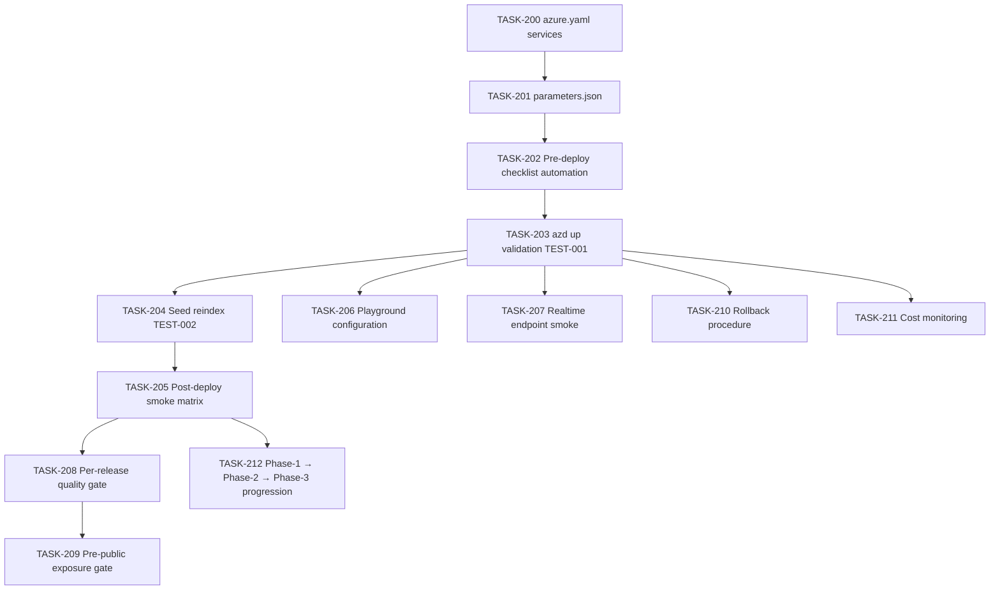

# 010 — Deployment & Operational Polish

## Scope

Make the system deployable end-to-end via `azd up` from a clean subscription, seed the question bank, run smoke tests, and codify the operational gates (pre-deploy / post-deploy / per-release / pre-public). Includes rollback, cost monitoring, and incident runbook activation.

**Driving requirements**: NFR-012 (azd up); TEST-001/002/003/004/005/010/011; SEC-008 (retention), SEC-011 (APIM gate), §007-operational-runbook §7–§9.

## Dependency Graph

---

## TASK-200 — `azure.yaml` services declaration

- **Objective**: Declare every deployable service so `azd deploy` covers them.
- **Dependencies**: 001-infrastructure TASK-001.
- **Implementation**:
  1. `azure.yaml` declares:
     - `quiz-agent` → Hosted Agent target, source `src/agent/`.
     - `seed-loader` → optional script target, source `src/seed/`.
  2. Pre-/post-provision hooks defined (`infra/hooks/`).
- **Acceptance criteria**:
  - `azd deploy` enumerates both services.
- **Risks**: misaligned service↔resource mapping — `azd env get-values` confirms outputs.
- **Testing**: TEST-001.
- **Complexity**: S.
- **Refs**: NFR-012.

---

## TASK-201 — `infra/main.parameters.json` env knobs

- **Objective**: Environment-specific knobs centralised.
- **Dependencies**: TASK-200.
- **Implementation**:
  1. Keys:
     - `environmentName`, `location`, `modelDeploymentName`.
     - `supportedLanguages` (default `["en","fr","es"]`).
     - `cosmosSessionsTtlDays`, `auditTtlDays`.
     - `voiceMaxSessionMinutes`, `voiceIdleSeconds`.
     - `features:apim` (bool).
  2. Per-environment files: `parameters.dev.json`, `parameters.prod.json`.
- **Acceptance criteria**:
  - Switching `azd env select prod` picks up `parameters.prod.json`.
- **Risks**: silent default drift — review on every env addition.
- **Testing**: TEST-001.
- **Complexity**: S.
- **Refs**: §007-operational-runbook §1.

---

## TASK-202 — Pre-deploy checklist automation

- **Objective**: A `make pre-deploy` (or `azd hooks` equivalent) that runs the pre-deploy checklist from §007-operational-runbook §8.1.
- **Dependencies**: TASK-201.
- **Implementation**:
  1. Hook checks:
     - All Bicep modules referenced from `main.bicep`.
     - `parameters.<env>.json` populated.
     - Managed Identity role assignments enumerable.
     - AppConfig keys present (model name, search endpoint, supported languages).
     - Key Vault accessible to the deployer.
- **Acceptance criteria**:
  - Hook exits 0 when ready; nonzero with a clear message otherwise.
- **Risks**: false-confidence checks — pair with TASK-203 validation.
- **Testing**: pre-deploy dry-run.
- **Complexity**: M.
- **Refs**: §007-operational-runbook §8.1.

---

## TASK-203 — `azd up` validation — TEST-001

- **Objective**: End-to-end IaC deploy from a clean subscription.
- **Dependencies**: 001-infrastructure TASK-014 (already specified), TASK-202.
- **Implementation**:
  1. `azd up` in a fresh subscription/RG.
  2. Post-provision hook asserts each resource healthy and emits the consolidated outputs (.env).
- **Acceptance criteria**:
  - `azd up` exits 0; hook prints `OK` for every resource.
- **Risks**: regional quota — pre-check in TASK-202.
- **Testing**: TEST-001.
- **Complexity**: M.
- **Refs**: NFR-012, TEST-001.

---

## TASK-204 — Seed + reindex — TEST-002

- **Objective**: Load authored content into AI Search across three languages and three topics.
- **Dependencies**: TASK-203, 002-ai-search TASK-026, TASK-028.
- **Implementation**:
  1. Run `python src/seed/seed_index.py` from the deploy host (uses MI).
  2. Assert ≥30 logical questions × 3 languages = ≥90 docs in the index.
  3. Per-language counts logged.
- **Acceptance criteria**:
  - Per-language counts equal expected for the seeded set.
- **Risks**: blob auth on first run — MI assignments from 001-infrastructure TASK-011 cover this.
- **Testing**: TEST-002.
- **Complexity**: S.
- **Refs**: TEST-002.

---

## TASK-205 — Post-deploy smoke matrix

- **Objective**: Run TEST-003 / TEST-004 / TEST-005 plus TEST-010 against the deployed environment.
- **Dependencies**: TASK-204, 009-testing TASK-164/165/166/170.
- **Implementation**:
  1. CI job triggered post-`azd up`:
     - Text English smoke.
     - Text French smoke.
     - Voice Spanish smoke.
     - Observability smoke (`grading_event` dimensions).
  2. Report a single pass/fail per smoke.
- **Acceptance criteria**:
  - All four smokes pass.
- **Risks**: voice flake in CI — retry once; document.
- **Testing**: post-deploy.
- **Complexity**: M.
- **Refs**: §007-operational-runbook §8.2.

---

## TASK-206 — Playground configuration

- **Objective**: Foundry Playground exposes the agent for human testing in v1.
- **Dependencies**: TASK-203.
- **Implementation**:
  1. Verify the Hosted Agent surfaces in the Playground for the deployed project.
  2. Document the path in `docs/playground.md` (project URL, agent ID).
- **Acceptance criteria**:
  - A reviewer can open the Playground and chat with the agent.
- **Risks**: per-tenant config — document fallback.
- **Testing**: TEST-003 entry.
- **Complexity**: S.
- **Refs**: FR-006.

---

## TASK-207 — Realtime endpoint smoke verification

- **Objective**: Confirm voice connectivity end-to-end before TEST-005.
- **Dependencies**: TASK-203, 006-voice-realtime TASK-100.
- **Implementation**:
  1. Synthetic WebRTC connect, send a short utterance, receive a transcript.
  2. Verify Realtime endpoint logs in App Insights.
- **Acceptance criteria**:
  - Synthetic round-trip completes within 2 seconds.
- **Risks**: regional outage — fail loud.
- **Testing**: TEST-005 entry.
- **Complexity**: M.
- **Refs**: FR-007.

---

## TASK-208 — Per-release quality gate

- **Objective**: Enforce the per-release checklist from §007-operational-runbook §8.3.
- **Dependencies**: TASK-205, 009-testing TASK-160/161/167/175.
- **Implementation**:
  1. Release pipeline gates a tag on:
     - All automated tests in `tests/` pass.
     - TEST-006 leak test passes for every supported language.
     - TEST-011 per-language Foundry Evaluation passes parity tolerance.
  2. Tagging rejected if any gate fails.
- **Acceptance criteria**:
  - A test failure blocks the tag.
- **Risks**: tag-bypass via local push — protect tag namespace in the platform.
- **Testing**: dry-run release.
- **Complexity**: M.
- **Refs**: §007-operational-runbook §8.3.

---

## TASK-209 — Pre-public exposure gate

- **Objective**: Mandatory checks before any public traffic.
- **Dependencies**: TASK-208, 007-security TASK-129, TASK-130, TASK-132.
- **Implementation**:
  1. Gate enforces:
     - APIM quotas configured (SEC-011).
     - Retention applied to `sessions` (TTL) and transcripts (SEC-008).
     - "What does the LLM see" boundary reviewed (SEC-009).
- **Acceptance criteria**:
  - Public-ready tagging blocked unless all three are checked.
- **Risks**: false-positive checklist sign-off — pair with code/config evidence.
- **Testing**: dry-run release.
- **Complexity**: M.
- **Refs**: §007-operational-runbook §8.4, SEC-011, SEC-008, SEC-009.

---

## TASK-210 — Rollback procedure

- **Objective**: Documented and tested rollback for the agent, the index, and the data.
- **Dependencies**: TASK-203, 002-ai-search TASK-028.
- **Implementation**:
  1. Agent: `azd deploy` of the previous tag.
  2. Index: reindex from authored Blob at the previous tag (Blob is the source of truth; AI Search is rebuilt).
  3. Cosmos: out-of-scope for rollback (system of record; do not roll back data state).
  4. Document the procedure in `docs/rollback.md`.
- **Acceptance criteria**:
  - Dry-run rollback restores the prior agent + index state.
- **Risks**: silent schema drift between versions — `seed_index.py` validates against the Pydantic model before write.
- **Testing**: dry-run.
- **Complexity**: M.
- **Refs**: §007-operational-runbook §3.

---

## TASK-211 — Cost monitoring setup

- **Objective**: Wire cost alerts and dashboards (Realtime audio minutes, model tokens, Cosmos RU, AI Search SU).
- **Dependencies**: 008-observability TASK-147.
- **Implementation**:
  1. Azure cost alerts at 50/80/100% of monthly budget.
  2. Dashboard tile for "Realtime audio minutes per session" (NFR-013 anchor).
- **Acceptance criteria**:
  - Alerts fire at thresholds; dashboard tile populated.
- **Risks**: budget set too tight or too loose — review monthly.
- **Testing**: post-deploy.
- **Complexity**: S.
- **Refs**: §007-operational-runbook §5, NFR-013.

---

## TASK-212 — Phase progression (Phase 1 → 2 → 3)

- **Objective**: Drive the system through §007-operational-runbook §7 phases.
- **Dependencies**: all preceding task packs.
- **Implementation**:
  - **Phase 1 — PoC core** (2–3 days):
    - Bicep skeleton (001-infrastructure).
    - One topic, ≥10 hand-written questions × 3 languages (002-ai-search subset).
    - MAF agent + five tools (004 + 005).
    - Cosmos sessions, AI Search index (002 + 003).
    - Runs in Playground text mode (TEST-003).
  - **Phase 2 — Voice + hardening** (3–4 days):
    - Realtime endpoint (006).
    - Answer normaliser, TTS-friendly returns (005-tools TASK-086/087).
    - Conditional-write idempotency (003-cosmos-db TASK-047; 007-security TASK-131).
    - Answer-leakage tests (009-testing TASK-160).
    - Grading observability (008-observability TASK-141).
    - Managed Identity end-to-end (007-security TASK-120/121).
    - App Insights wiring (008-observability TASK-140).
  - **Phase 3 — Operational polish** (2–3 days):
    - Foundry Evaluations per language (009-testing TASK-167).
    - Retention policy + TTL (003-cosmos-db TASK-050/051).
    - Rate limiting via APIM (007-security TASK-129).
    - Runbook + cost dashboard (008-observability TASK-147; this pack TASK-211).
    - Channel-switch test (009-testing TASK-171).
- **Acceptance criteria**:
  - Each phase ends with a documented checkpoint and a passing smoke.
- **Risks**: scope creep across phases — feature freeze per phase.
- **Testing**: per-phase smoke.
- **Complexity**: L (programme management).
- **Refs**: §007-operational-runbook §7.

---

## Cross-cutting acceptance for this task pack

- `azd up` from a clean subscription is sufficient to land a working text-mode environment.
- Smoke tests gate every deploy.
- Public exposure is impossible without APIM, retention, and compliance review (SEC-011/008/009).
- Cost dashboards reflect Realtime audio minutes and per-resource spend.
