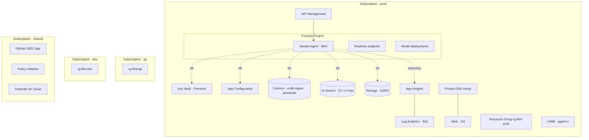

# Flint Quiz — Azure Infrastructure Specification

- **Version**: v1.0
- **Last reviewed**: 2026-05-17
- **Owner**: Platform
- **Status**: Accepted

This document is the **authoritative infrastructure contract** for the Flint Quiz platform. It defines the Azure resource topology, environment shape, identity/RBAC posture, networking, cost discipline, scaling, DR, and observability. It is the artifact a platform reviewer reads before approving a deploy.

It does **not** contain Bicep code — §15 enumerates the recommended module hierarchy. Bicep authoring is a separate task tracked against this spec.

Cross-references: [001-product-requirements](../specs/001-product-requirements.md), [002-system-architecture](../specs/002-system-architecture.md), [003-data-contracts](../specs/003-data-contracts.md), [005-security-model](../specs/005-security-model.md), [007-operational-runbook](../specs/007-operational-runbook.md), [008-api-contracts](../specs/008-api-contracts.md), [009-agent-governance](../specs/009-agent-governance.md).

---

## 0. Conventions

### 0.1 Requirement IDs

| Prefix  | Domain                                                                  |
| ------- | ----------------------------------------------------------------------- |
| `INF-`  | Infrastructure requirement (this document).                             |
| `SEC-`  | Security requirement — see [005-security-model](../specs/005-security-model.md). |
| `NFR-`  | Non-functional requirement — see [001-product-requirements](../specs/001-product-requirements.md). |
| `OPS-`  | Operational requirement — see [007-operational-runbook](../specs/007-operational-runbook.md). |

### 0.2 Sensitivity Tiers (inherited)

Inherits [008-api-contracts §0.1](../specs/008-api-contracts.md): `LLM-OK` 🟢 / `SERVER` 🟡 / `SECRET` 🔴. Infra-relevant rule: **🔴 fields live in Key Vault, accessed via Managed Identity, never in environment variables baked into a container image or in app settings stored as plain text**.

### 0.3 Authoring Principles

| #  | Principle                                                                                              |
| -- | ------------------------------------------------------------------------------------------------------ |
| 1  | **One environment per Azure subscription.** Hard subscription boundary between `dev`/`qa`/`prod`.       |
| 2  | **Bicep is the source of truth.** No portal-only resources. CI applies via `what-if` → approve → deploy. |
| 3  | **Managed Identity for everything that supports it.** No connection strings, no client secrets in code. |
| 4  | **Private by default.** All data-plane services route over Private Endpoint in `qa` and `prod`.         |
| 5  | **Diagnostic Settings on every resource.** No exceptions. Sinks differ by env (see §11).               |
| 6  | **Cost guardrails are infra concerns**, not afterthoughts. Budgets + alerts deploy with the env (§8).  |
| 7  | **No shared resources across environments.** Even Log Analytics is per-env. Avoid cross-env blast radius. |
| 8  | **Idempotent deploys.** `bicep what-if` clean run is a CI gate. No imperative scripts to "fix" state.   |

---

## 1. Resource Topology

### 1.1 Per-Environment Resource Inventory

Each environment (`dev`, `qa`, `prod`) contains the following resources, all in the same Azure region as the environment's primary region (§9.2). Region pairs: `westeurope` ↔ `northeurope` (primary topology; can be swapped per tenant policy).

| #  | Resource                              | Azure Type                                | SKU (prod)              | SKU (qa)                | SKU (dev)               | Notes                                                                 |
| -- | ------------------------------------- | ----------------------------------------- | ----------------------- | ----------------------- | ----------------------- | --------------------------------------------------------------------- |
| 1  | Resource Group                        | `Microsoft.Resources/resourceGroups`      | n/a                     | n/a                     | n/a                     | One per env. Locked `CanNotDelete` in `prod`/`qa`.                    |
| 2  | Foundry AI Hub                        | `Microsoft.MachineLearningServices/workspaces` (kind=`Hub`) | Standard               | Standard               | Standard               | Tenant of the Foundry project.                                       |
| 3  | Foundry Project                       | `Microsoft.MachineLearningServices/workspaces` (kind=`Project`) | n/a                     | n/a                     | n/a                     | Hosts the Hosted Agent + Realtime endpoint.                          |
| 4  | Hosted Agent (MAF)                    | Foundry Agent resource (project-scoped)   | Auto-scale              | Min 1                   | Min 1                   | Python MAF agent; see [002 §6.2](../specs/002-system-architecture.md). |
| 5  | Foundry Realtime endpoint             | Project-scoped endpoint                   | Provisioned             | Provisioned             | On-demand               | Voice channel; same agent.                                            |
| 6  | Model deployment(s)                   | Foundry model deployment                  | PTU + fallback PAYGO    | PAYGO                   | PAYGO                   | Pin model+version; see §8.4.                                          |
| 7  | Azure AI Search                       | `Microsoft.Search/searchServices`         | `standard` (S1, 2 reps) | `basic`                 | `basic`                 | Question bank index, multilingual.                                    |
| 8  | Cosmos DB (NoSQL)                     | `Microsoft.DocumentDB/databaseAccounts`   | Autoscale, multi-region, zone-redundant | Autoscale, single region | Serverless           | Sessions, users, topics, audit.                                       |
| 9  | Storage Account (Blob)                | `Microsoft.Storage/storageAccounts`       | `Standard_GZRS`         | `Standard_ZRS`          | `Standard_LRS`          | Authoring source-of-truth for questions.                              |
| 10 | Key Vault                             | `Microsoft.KeyVault/vaults`               | Premium, RBAC, soft-delete + purge protection | Standard, RBAC, soft-delete | Standard, RBAC, soft-delete | All 🔴 secrets.                                                    |
| 11 | App Configuration                     | `Microsoft.AppConfiguration/configurationStores` | Standard         | Standard                 | Free                    | Feature flags, allowlists (SEC-010).                                  |
| 12 | Log Analytics Workspace               | `Microsoft.OperationalInsights/workspaces`| PerGB, 90d retention    | PerGB, 30d retention    | PerGB, 30d retention    | Diagnostic sink for *all* resources.                                  |
| 13 | Application Insights                  | `Microsoft.Insights/components`           | Workspace-based         | Workspace-based         | Workspace-based         | Bound to (12). App + Foundry tracing.                                 |
| 14 | API Management (optional in `dev`)    | `Microsoft.ApiManagement/service`         | `Developer` (HA-off) or `Premium` | `Developer`     | n/a                     | Per-user quotas (SEC-011). Mandatory in `prod`.                       |
| 15 | Private DNS Zones (×N)                | `Microsoft.Network/privateDnsZones`       | n/a                     | n/a                     | n/a                     | One per PE-bearing service (§7.3).                                    |
| 16 | Virtual Network + subnets             | `Microsoft.Network/virtualNetworks`       | `/22`                   | `/23`                   | `/24` (or omitted)      | Hub-spoke optional; see §7.                                           |
| 17 | Private Endpoints (×N)                | `Microsoft.Network/privateEndpoints`      | n/a                     | n/a                     | n/a (dev uses public + firewall) | One per data-plane resource (§7.3).                                 |
| 18 | Managed Identities (UAMI)             | `Microsoft.ManagedIdentity/userAssignedIdentities` | n/a            | n/a                     | n/a                     | Workload identities; see §3.                                          |
| 19 | Budget                                | `Microsoft.Consumption/budgets`           | n/a                     | n/a                     | n/a                     | Per-env spend ceiling + alerts (§8.6).                                |
| 20 | Action Group                          | `Microsoft.Insights/actionGroups`         | n/a                     | n/a                     | n/a                     | Pager target for alerts (§11.5).                                      |

### 1.2 Cross-Environment Resources

A small set of resources is shared across environments and lives in a dedicated `shared` resource group in a dedicated subscription:

| Resource                          | Purpose                                                                                          |
| --------------------------------- | ------------------------------------------------------------------------------------------------ |
| Azure DevOps / GitHub OIDC App    | CI federation. Per-env service principal via OIDC; no long-lived secrets.                        |
| Azure Container Registry (ACR)    | Optional — only if we move off Foundry's bundled image flow. Premium SKU if used.                |
| Microsoft Defender for Cloud      | Tenant-level CSPM. Plans enabled per subscription.                                               |
| Policy & Initiative Definitions   | Tenant-scoped Azure Policy. Enforces tags, regions, SKUs, public-IP bans (§7.5).                 |

### 1.3 Topology Diagram



---

## 2. Naming Conventions (INF-010)

### 2.1 Tokens

| Token         | Values                                  | Notes                                              |
| ------------- | --------------------------------------- | -------------------------------------------------- |
| `<workload>`  | `flint`                                 | Short product code. Lowercase. Fixed.              |
| `<role>`      | `web` / `agent` / `data` / `obs` / etc. | Resource role (omitted if implied by `<type>`).    |
| `<env>`       | `dev` / `qa` / `prod`                   | No additional environments without a written ADR.  |
| `<region>`    | `weu` / `neu` / `eus` / `wus2` / ...    | 3-letter region code.                              |
| `<instance>`  | `01`, `02`, ...                         | Two-digit. Default `01` if singleton.              |
| `<type>`      | Per-resource abbreviation (table 2.3).  | Lowercase, fixed across the org.                   |

### 2.2 Pattern

```
<type>-<workload>-<role?>-<env>-<region>-<instance?>
```

- Hyphens between tokens.
- All lowercase.
- Omit `<role>` when redundant with `<type>` (e.g., `kv` is always Key Vault).
- Omit `<instance>` for singletons; mandatory when count ≥ 2 is expected.

### 2.3 Resource-Type Abbreviations & Globally-Unique Rules

| Resource                  | `<type>`       | Globally unique? | Special rule                                                                 |
| ------------------------- | -------------- | ---------------- | ---------------------------------------------------------------------------- |
| Resource Group            | `rg`           | No               |                                                                              |
| Foundry Hub / Project     | `hub` / `proj` | No (per RG)      | `hub-flint-prod-weu`, `proj-flint-prod-weu`.                                |
| AI Search                 | `srch`         | **Yes**          | No hyphens permitted by service; use `srch<workload><env><region><instance>` → `srchflintprodweu01`. |
| Cosmos DB account         | `cosmos`       | **Yes**          | Lowercase, max 44 chars: `cosmos-flint-prod-weu`.                            |
| Storage Account           | `st`           | **Yes**          | 3–24, lowercase, no hyphens: `stflintprodweu01`.                            |
| Key Vault                 | `kv`           | **Yes**          | 3–24, hyphens allowed: `kv-flint-prod-weu`.                                  |
| App Configuration         | `appcs`        | **Yes**          | `appcs-flint-prod-weu`.                                                      |
| Log Analytics             | `law`          | No (per RG)      | `law-flint-prod-weu`.                                                        |
| Application Insights      | `appi`         | No (per RG)      | `appi-flint-prod-weu`.                                                       |
| API Management            | `apim`         | **Yes**          | `apim-flint-prod-weu`.                                                       |
| VNet                      | `vnet`         | No (per RG)      | `vnet-flint-prod-weu`.                                                       |
| Subnet                    | `snet`         | n/a              | `snet-pe`, `snet-apim`, `snet-build`.                                        |
| Private Endpoint          | `pe`           | No (per RG)      | `pe-cosmos-flint-prod-weu`, etc.                                             |
| Private DNS Zone          | n/a            | n/a              | Standard names (e.g., `privatelink.documents.azure.com`). Do not rename.    |
| UAMI                      | `uami`         | No (per RG)      | `uami-agent-flint-prod-weu`, `uami-deploy-flint-prod-weu`, etc.              |
| Budget                    | `budg`         | n/a              | `budg-flint-prod`.                                                           |
| Action Group              | `ag`           | n/a              | `ag-flint-prod-oncall`.                                                      |

### 2.4 Tags (INF-011)

**Every** resource carries these tags. Policy denies create without them (§7.5).

| Tag                | Allowed values / format                              | Purpose                                          |
| ------------------ | ---------------------------------------------------- | ------------------------------------------------ |
| `workload`         | `flint`                                              | Cost allocation, search.                         |
| `env`              | `dev` \| `qa` \| `prod`                              | Filter, policy, cost.                            |
| `owner`            | Email or DL                                          | Routing for alerts / audits.                     |
| `costCenter`       | Finance code                                         | Chargeback.                                      |
| `dataClassification` | `public` \| `internal` \| `confidential` \| `restricted` | Required for SEC review.                    |
| `managedBy`        | `bicep` (always; manual resources are blocked)       | Drift detection.                                 |
| `revision`         | Git short SHA of the Bicep that created/updated it.  | Forensic.                                        |

`prod` data-plane resources (`cosmos`, `st`, `kv`, `srch`) carry `dataClassification=confidential` minimum.

---

## 3. Managed Identity Strategy (INF-020)

### 3.1 Why User-Assigned (UAMI)

We use **User-Assigned Managed Identity (UAMI) per workload**, not System-Assigned. UAMI gives:

- Stable principal ID across recreates (System-Assigned rotates on resource recreate → breaks RBAC).
- Pre-assigned RBAC before resource exists (no chicken-and-egg).
- Multiple resources can share the same identity when the trust boundary matches.

### 3.2 Identity Inventory (per env)

| UAMI                              | Used by                                          | Scopes (see §4)                                                                                                  |
| --------------------------------- | ------------------------------------------------ | ---------------------------------------------------------------------------------------------------------------- |
| `uami-agent-flint-<env>-<region>` | Foundry Hosted Agent (MAF runtime, tools)        | Cosmos data plane (specific containers), AI Search read, Key Vault `Secrets User`, App Config `Reader`.          |
| `uami-realtime-flint-<env>-...`   | Foundry Realtime endpoint (if separable)         | Same as `uami-agent` minus Cosmos write (Realtime channel does not own state; reuses agent tool path).            |
| `uami-deploy-flint-<env>-...`     | CI/CD pipeline (GitHub OIDC federated)           | Resource Group `Contributor` (env-only). **No** data-plane RBAC.                                                 |
| `uami-indexer-flint-<env>-...`    | AI Search indexer pulling from Blob              | Blob `Storage Blob Data Reader` on authoring container.                                                          |
| `uami-monitor-flint-<env>-...`    | Action Group runbooks / diagnostic forwarders    | Log Analytics `Reader`. No data-plane.                                                                          |

### 3.3 Identity Rules (INF-021)

| #  | Rule                                                                                                              |
| -- | ----------------------------------------------------------------------------------------------------------------- |
| 1  | **No connection strings or client secrets in code, config, or pipelines.** Mirrors SEC-004.                       |
| 2  | **CI authenticates via GitHub OIDC** → federated UAMI (`uami-deploy-*`). No `AZURE_CLIENT_SECRET` GitHub secrets. |
| 3  | **Cross-env identity is forbidden.** A `uami-*-dev` cannot grant access to anything in `prod`.                    |
| 4  | **Identity → resource binding is per-env Bicep.** No portal-bound identities.                                     |
| 5  | **Token caching is the SDK's job.** Tools do not pass tokens around; they request via `DefaultAzureCredential`.   |

---

## 4. RBAC Model (INF-030)

### 4.1 Principle — Least Privilege, Per-Resource Scope

Every role assignment is at the **narrowest possible scope** (resource, then sub-resource where supported), with a **data-plane role** in preference to a control-plane role. We never grant `Contributor` on a Resource Group to a workload identity. CI is the only exception (and only on its env).

### 4.2 Role Assignments (per env)

| Principal                | Resource                                | Role                                                                | Scope                                  | Notes                                            |
| ------------------------ | --------------------------------------- | ------------------------------------------------------------------- | -------------------------------------- | ------------------------------------------------ |
| `uami-agent-*`           | Cosmos DB                               | `Cosmos DB Built-in Data Contributor` (custom data-plane role)      | DB-level, scoped to required containers | Read+write `sessions`, `users`, `audit`; read `topics`. Mirrors SEC-005. |
| `uami-agent-*`           | AI Search                               | `Search Index Data Reader`                                          | Index `questions`                       | **Read-only.** Indexer uses separate identity.   |
| `uami-agent-*`           | Key Vault                               | `Key Vault Secrets User`                                            | Per-secret if possible, else vault     | No `Secrets Officer` for runtime identity.       |
| `uami-agent-*`           | App Configuration                       | `App Configuration Data Reader`                                     | Store                                  | Reads feature flags + allowlists (SEC-010).      |
| `uami-agent-*`           | App Insights                            | `Monitoring Metrics Publisher`                                      | AI resource                            | Telemetry write.                                 |
| `uami-indexer-*`         | Blob Storage                            | `Storage Blob Data Reader`                                          | Container `authoring`                  | Indexer-only.                                    |
| `uami-indexer-*`         | AI Search                               | `Search Service Contributor`                                        | Search service                         | Required to write the index.                     |
| `uami-deploy-*`          | Resource Group (env)                    | `Contributor` + `User Access Administrator` (split via PIM in prod) | RG of that env                         | CI deploy. Never cross-env. PIM-elevated in `prod`. |
| `uami-monitor-*`         | Log Analytics                           | `Log Analytics Reader`                                              | Workspace                              | Query only.                                      |
| Human on-call (group)    | Log Analytics + App Insights            | `Log Analytics Reader` + `Application Insights Component Reader`     | Workspace + AI                         | Read-only. PIM-elevated for write.               |
| Human SRE (group)        | Resource Group (env)                    | `Contributor` (JIT via PIM)                                         | RG of that env                         | Eligible, not active. Activation requires MFA + approval in `prod`. |
| Human content author     | Storage Account `authoring` container   | `Storage Blob Data Contributor`                                     | Container only                         | Write authoring source-of-truth only.            |

### 4.3 RBAC Rules (INF-031)

| #  | Rule                                                                                                                                 |
| -- | ------------------------------------------------------------------------------------------------------------------------------------ |
| 1  | **No `Owner`, no `Contributor` on subscriptions** for workload identities, ever.                                                     |
| 2  | **Data-plane RBAC > control-plane RBAC** wherever the service supports it (Cosmos, Storage, Key Vault, AI Search).                   |
| 3  | **Local auth disabled** where the service supports it: Cosmos `disableLocalAuth=true`; Key Vault `enableRbacAuthorization=true`; AI Search `disableLocalAuth=true`; Storage `allowSharedKeyAccess=false`. |
| 4  | **PIM for human roles in `prod`**: zero standing access. Eligible-only. MFA + approval to activate.                                  |
| 5  | **All assignments are deployed via Bicep.** Portal-created assignments are surfaced by drift detection and removed.                  |
| 6  | **Custom data-plane roles** (e.g., Cosmos) are defined in Bicep and content-addressed; changes require a PR.                         |

---

## 5. Networking (INF-040)

### 5.1 Posture per Environment

| Concern                  | `dev`                                    | `qa`                                  | `prod`                                                 |
| ------------------------ | ---------------------------------------- | ------------------------------------- | ------------------------------------------------------ |
| Data-plane access        | Public + service firewall (allowlist)    | Private Endpoints                     | Private Endpoints + service firewall deny-by-default   |
| Egress                   | Default Azure egress                     | Default + NSG controls                | NAT Gateway or Azure Firewall (where Foundry permits)  |
| Foundry network mode     | Public                                   | Public + IP allowlist                 | Project private + workload subnet egress               |
| API Management           | n/a                                      | External, public IP                   | Internal (VNet-integrated) **or** external w/ WAF; per security review |
| Cross-env peering        | None                                     | None                                  | None                                                   |

### 5.2 VNet Layout (`qa` / `prod`)

```
vnet-flint-<env>-<region>  /22 (prod) | /23 (qa)
├─ snet-pe         (/26)   private endpoints
├─ snet-apim       (/27)   APIM internal mode
├─ snet-build      (/27)   ephemeral CI runners (prod only)
├─ snet-agent      (/26)   Foundry workload subnet (delegated)
└─ snet-bastion    (/27)   Bastion Host for break-glass (prod only)
```

NSG defaults: deny all inbound on `snet-pe`; allow only required egress on `snet-agent`.

### 5.3 Private Endpoints (INF-041)

One Private Endpoint per resource, per env (except `dev`). Associated Private DNS Zones:

| Service              | Private DNS Zone                              |
| -------------------- | --------------------------------------------- |
| Cosmos DB (SQL)      | `privatelink.documents.azure.com`             |
| AI Search            | `privatelink.search.windows.net`              |
| Blob Storage         | `privatelink.blob.core.windows.net`           |
| Key Vault            | `privatelink.vaultcore.azure.net`             |
| App Configuration    | `privatelink.azconfig.io`                     |
| Foundry              | `privatelink.api.azureml.ms` + `privatelink.notebooks.azure.net` |
| App Insights / LAW   | `privatelink.monitor.azure.com` (+ companions)|

### 5.4 Public Surface

Only two public surfaces in `prod`:

1. **APIM front door** for the agent endpoint. TLS 1.2 minimum, WAF policy attached if external mode.
2. **Foundry Realtime endpoint** for voice WebRTC. Locked down per Foundry capabilities; behind APIM where supported.

Everything else: private.

### 5.5 Policy Enforcement (INF-042)

Azure Policy (deployed from the `shared` subscription) enforces in `qa`/`prod`:

| Policy                                                       | Effect       |
| ------------------------------------------------------------ | ------------ |
| Required tags (`workload`, `env`, `owner`, `costCenter`, `dataClassification`, `managedBy`) | `Deny` on create |
| Allowed regions (per tenant policy)                          | `Deny`       |
| Storage account public access                                | `Deny`       |
| Key Vault soft-delete & purge protection                     | `Audit`+`DeployIfNotExists` |
| Cosmos local auth                                            | `Deny`       |
| Public IP creation outside permitted SKUs                    | `Deny`       |
| Diagnostic Settings present on all resources                 | `DeployIfNotExists` |

---

## 6. Environments (INF-050)

### 6.1 Three Environments, Three Subscriptions

| Env    | Purpose                                                              | Promotion gate to next env                                                |
| ------ | -------------------------------------------------------------------- | ------------------------------------------------------------------------- |
| `dev`  | Developer iteration. Hot-reload Bicep, low SKUs, public endpoints OK.| Green CI on `main` + lint + `bicep what-if` clean.                        |
| `qa`   | Pre-production. Full security posture (PE, MI, RBAC). Synthetic data.| All TEST-* green ([006-testing-strategy](../specs/006-testing-strategy.md)), per-language eval floors met (NFR-010, GOV-026), security review sign-off. |
| `prod` | Production. Real users. PII. Audit-bearing.                          | Manual approver in pipeline + change-window + DR drill within 90 days.    |

### 6.2 What Differs Between Envs

| Concern                       | dev                              | qa                                | prod                                                |
| ----------------------------- | -------------------------------- | --------------------------------- | --------------------------------------------------- |
| **Subscription**              | sub-flint-dev                    | sub-flint-qa                      | sub-flint-prod                                      |
| **Regions**                   | 1                                | 1                                 | 1 primary + 1 paired (Cosmos multi-region)          |
| **Cosmos mode**               | Serverless                       | Provisioned, single region        | Provisioned multi-region, autoscale, zone-redundant |
| **AI Search**                 | Basic, 1 replica                 | Basic, 1 replica                  | S1, 2 replicas, 1 partition                         |
| **Storage redundancy**        | LRS                              | ZRS                               | GZRS                                                |
| **Key Vault SKU**             | Standard                         | Standard                          | Premium (HSM-backed available)                      |
| **APIM**                      | None                             | Developer SKU                     | Premium (HA) or Developer behind WAF                |
| **Endpoints**                 | Public + service firewall        | Private                           | Private + WAF/APIM                                  |
| **Log Analytics retention**   | 30 days                          | 30 days                           | 90 days hot + 730 days archive                      |
| **Backups**                   | Continuous 24h                   | Continuous 7d                     | Continuous 30d + periodic weekly                    |
| **Foundry model deployment**  | PAYGO, small TPM                 | PAYGO                             | PTU primary + PAYGO fallback                        |
| **Quotas (APIM)**             | n/a                              | Lenient                           | Strict per-user (SEC-011)                           |
| **Diagnostic destination**    | Workspace only                   | Workspace                         | Workspace + Storage (immutable, long-term)          |
| **Alerts pager**              | None (email)                     | Email + chat                      | Email + chat + on-call rotation                     |
| **Cost budget**               | Hard cap (auto-disable on breach)| Soft cap                          | Soft cap with FinOps review                          |
| **Synthetic data only**       | Yes                              | Yes                               | No (real users)                                     |

### 6.3 Promotion Discipline (INF-051)

| #  | Rule                                                                                                              |
| -- | ----------------------------------------------------------------------------------------------------------------- |
| 1  | **Same Bicep across all envs.** Differences live in parameters, not in code branches.                             |
| 2  | **No `dev` → `prod` skip.** Every change clears `qa` first.                                                       |
| 3  | **Parameters are env-pinned** in `infra/env/{dev,qa,prod}.bicepparam`. CI rejects mismatched env+subscription.    |
| 4  | **`prod` deploys require a human approver** in the pipeline (GitHub Environment protection rule).                 |
| 5  | **Rollback is a forward deploy** of the prior tagged release commit. No portal patches.                           |

---

## 7. Cost Optimization (INF-060)

### 7.1 Cost Drivers Ranked (prod, monthly)

| Rank | Driver                              | Why it dominates                                                                | Lever                                                                             |
| ---- | ----------------------------------- | ------------------------------------------------------------------------------- | --------------------------------------------------------------------------------- |
| 1    | Model inference (Foundry)           | Per-token + per-realtime-minute                                                 | PTU for baseline + PAYGO for burst; prompt caching; output token cap (GOV-091).  |
| 2    | Cosmos RU/s                         | Autoscale ceiling, multi-region multiplier                                      | Autoscale floor low; partition right (`/userId`); TTL on completed sessions.     |
| 3    | AI Search replicas/partitions       | Per-replica per-hour                                                            | Keep S1 ×2 reps; bank < 100k stays here; scale partitions only on real growth.    |
| 4    | APIM Premium                        | Per-unit per-hour                                                               | Developer SKU until public exposure (SEC-011); promote to Premium with traffic.   |
| 5    | Egress + voice minutes              | Realtime audio bandwidth + outbound                                              | Region-affined deploys; codec choice; cap per-user voice minutes (SEC-011).       |
| 6    | Log Analytics ingestion             | Per-GB ingest + retention                                                       | Sampling, basic-tier tables for verbose telemetry, archive past 90 days.          |

### 7.2 Mechanisms

| Mechanism                          | Where applied                                                                                                       |
| ---------------------------------- | ------------------------------------------------------------------------------------------------------------------- |
| **Autoscale floor/ceiling**        | Cosmos RU/s (e.g., `400 → 4000` autoscale prod). AI Search via manual replica scaling (no autoscale).               |
| **TTL on Cosmos containers**       | `sessions` rows older than retention TTL deleted automatically. `audit` retained longer per SEC-014.                |
| **Cool/Archive Blob tiers**        | Authoring snapshots → Cool after 30 days. Audit log archives → Archive after 90 days.                               |
| **Diagnostic Settings sampling**   | App Insights adaptive sampling at 5% in `prod` for `requests`/`dependencies`; 100% for `exceptions`/`auditEvents`.   |
| **Reserved Instances / Savings Plans** | Apply to AI Search and APIM in `prod` once usage is steady (>30 days at SKU).                                  |
| **Prompt caching**                 | System prompt layers (§1.1 of [009-agent-governance](../specs/009-agent-governance.md)) are stable → cache eligible. |
| **Per-user quotas**                | APIM enforces voice-min/day, questions/min, quizzes/day (SEC-011). Caps cost-DoS risk.                              |

### 7.3 Budgets & Alerts (INF-061)

Every env has a Budget resource (`budg-flint-<env>`) deployed with the env:

| Threshold | Action                                                  |
| --------- | ------------------------------------------------------- |
| 50%       | Notify `owner` + FinOps.                                |
| 80%       | Notify on-call. Triage in standup.                      |
| 100%      | Page on-call. Freeze non-critical deploys (manual).     |
| 120%      | `dev` only: subscription-level resource auto-stop hook. `prod`: incident. |

### 7.4 Cost Anti-Patterns to Watch

| Anti-pattern                                              | Symptom                                  | Fix                                          |
| --------------------------------------------------------- | ---------------------------------------- | -------------------------------------------- |
| AI Search replicas left at 3+ when load doesn't warrant   | Flat cost line above forecast            | Replica = ceil(p95 QPS / 50). Scale down.   |
| Cosmos autoscale ceiling >> peak                          | Provisioned RUs idle                     | Pin ceiling to 2× observed p95.              |
| Log Analytics 100% sampling on chatty dependency calls    | LAW ingest cost dominates Foundry        | Adaptive sampling; basic-tier tables.        |
| Long-lived `dev` resources                                | "Forgotten" Cosmos/Search in `dev`       | Resource tag `expiresAt`; CI sweep deletes.  |
| `prod`-grade SKUs in `qa`                                 | qa cost ≥ prod                           | Param mismatch — CI guard rejects.           |

---

## 8. Autoscaling (INF-070)

### 8.1 Autoscale Surfaces

| Resource              | Mode               | Floor / Ceiling                                | Trigger                                       |
| --------------------- | ------------------ | ---------------------------------------------- | --------------------------------------------- |
| Cosmos DB             | Autoscale RU/s     | prod: `1000 / 10000` per container             | Cosmos internal (RU consumption).             |
| Foundry Hosted Agent  | Managed by Foundry | prod: min 1 instance, ceiling per project quota| Concurrent sessions.                          |
| Foundry Realtime      | Managed by Foundry | prod: min 1                                    | Concurrent voice channels.                    |
| AI Search             | Manual replica scale | 2 → 4 replicas (NFR-006)                     | p95 latency > target for 10 min.              |
| APIM Premium          | Manual unit scale  | 1 → 4 units                                    | CPU + requests-per-unit threshold.            |

### 8.2 Rules (INF-071)

| #  | Rule                                                                                                                |
| -- | ------------------------------------------------------------------------------------------------------------------- |
| 1  | **Scale-out is always automatic where supported; scale-in is conservative** (longer cool-down) to avoid thrash.     |
| 2  | **Autoscale ceilings are budgets in disguise.** Set them from cost, not from "what if traffic 100×". Page on hit.   |
| 3  | **No autoscale on cost-dominant resources without an alert** at 80% of ceiling.                                     |
| 4  | **Scaling events are first-class telemetry** — emit `infra.scale_event` to Log Analytics (§11).                     |

---

## 9. Disaster Recovery (INF-080)

### 9.1 RTO / RPO Targets (prod)

| Scenario                           | RTO     | RPO    | Mechanism                                                                                  |
| ---------------------------------- | ------- | ------ | ------------------------------------------------------------------------------------------ |
| Single AZ failure in primary region| < 5 min | 0      | Cosmos zone-redundant; Storage GZRS; AI Search 2 replicas (single region availability).    |
| Region failure (primary)           | < 60 min| < 5 min| Cosmos multi-region with manual failover; Storage GZRS read-access; AI Search rebuild from Blob. |
| Foundry project unavailable        | < 60 min| 0 (read-only degrade) | Static maintenance page; resume on recovery; sessions remain durable in Cosmos.   |
| Question bank corruption           | < 4 hr  | 0      | Reindex from Blob authoring source-of-truth (immutable).                                   |
| Audit log loss                     | 0 tolerance | 0   | Append-only Cosmos container + Blob immutable copy + LAW export.                            |

### 9.2 Region Strategy

- Primary `westeurope`, paired `northeurope` (or per tenant residency policy).
- **Cosmos multi-region writes are disabled in v1**; writes pinned to primary, secondary used for read failover and DR. Writes failover manually (RPO = replication lag, < 5 min).
- AI Search has no native cross-region replication — recovery is reindex from Blob (which is GZRS).
- Foundry: deploy a **cold-standby project in the paired region**; Bicep ready, model deployments dormant. Activate on DR.

### 9.3 Backup Policy (INF-081)

| Resource          | Backup mechanism                                       | Retention                  |
| ----------------- | ------------------------------------------------------ | -------------------------- |
| Cosmos DB         | Continuous backup (30d in prod)                        | 30 days point-in-time      |
| Blob Storage      | GZRS + versioning + soft-delete (90 days)              | 90 days                    |
| Key Vault         | Soft-delete + purge protection                         | 90 days                    |
| App Configuration | Periodic snapshot to Blob (Bicep-managed)              | 90 days                    |
| AI Search         | No service backup — reindex from Blob authoring source | Source-of-truth retention  |

### 9.4 DR Drill (INF-082)

A documented DR drill runs at least every 90 days (OPS-004):

1. Failover Cosmos to paired region (test account or shadow database).
2. Reindex AI Search from Blob into the standby region.
3. Activate the cold-standby Foundry project.
4. Run end-to-end smoke test against the failover stack.
5. Fail back. Capture timings and gaps.

A failed drill blocks the next `prod` deploy until remediated.

---

## 10. Monitoring (INF-090)

### 10.1 Stack

- **Azure Monitor** baseline (metrics, activity log).
- **Application Insights** (workspace-based) for app + Foundry tracing.
- **Log Analytics** as the single sink (all diagnostic settings point here).
- **Azure Monitor Alerts** → Action Group → email/chat/pager.
- **Workbook(s)** for dashboards (see §10.4).

### 10.2 Required Metrics & Alerts

| Signal                                                                | Threshold                                 | Severity | Owner                |
| --------------------------------------------------------------------- | ----------------------------------------- | -------- | -------------------- |
| Tool latency p95 (per tool, voice channel)                            | > 300 ms for 5 min                        | Sev 2    | App                  |
| `submit_answer` failure rate                                          | > 1% over 5 min                           | Sev 1    | App                  |
| Cosmos RU throttling (429) rate                                       | > 0.5% over 5 min                         | Sev 2    | Platform             |
| Cosmos request charge p95                                             | > 50 RU/op for 15 min                     | Sev 3    | Platform             |
| AI Search query latency p95                                           | > 200 ms for 10 min                       | Sev 2    | Platform             |
| Foundry model token-rate-limit                                        | Any 429 in 5 min window                   | Sev 2    | Platform             |
| API Management 5xx rate                                               | > 1% over 5 min                           | Sev 1    | Platform             |
| Authentication failures (Entra)                                       | > 5% over 5 min                           | Sev 1    | Security             |
| Prompt-hash mismatch (GOV-003)                                        | Any occurrence                            | Sev 1 P0 | Security             |
| Answer-leakage indicator (TEST-006 prod canary)                       | Any failure                               | Sev 1 P0 | Security             |
| Budget at 80% / 100% / 120%                                           | per §7.3                                  | Sev 3 → 1 | FinOps              |
| DR readiness (drill > 90 days old)                                    | n/a                                       | Sev 3    | Platform             |

### 10.3 Required Traces (INF-091)

Every tool invocation emits an OpenTelemetry span (via App Insights / Foundry tracing):

| Attribute                  | Description                                                 |
| -------------------------- | ----------------------------------------------------------- |
| `flint.session_id`         | Session identifier.                                         |
| `flint.tool`               | Tool name (one of the five).                                |
| `flint.lang`               | Active session language.                                    |
| `flint.channel`            | `text` \| `voice`.                                          |
| `flint.prompt_hash`        | Composed system prompt hash (GOV-003).                      |
| `flint.idempotency_class`  | `idempotent` \| `mutating`.                                 |
| `flint.outcome`            | `ok` \| `error.{code}` \| `already_graded`.                 |
| `flint.duration_ms`        | Server-measured.                                            |

User PII and 🔴/🟡 fields are **never** span attributes (mirrors SEC-009).

### 10.4 Workbooks (deploy as code)

| Workbook                      | Audience      | Contents                                                                              |
| ----------------------------- | ------------- | ------------------------------------------------------------------------------------- |
| `Agent SLO`                   | App + on-call | Tool latency, error rate, voice round-trip, prompt-hash stability.                    |
| `Cosmos & Search Health`      | Platform      | RU usage, 429s, query latency, replica health.                                        |
| `Security & Governance`       | Security      | Injection-detected rate, refusal-loop rate, coverage-gap rate, answer-leakage canary. |
| `Cost`                        | FinOps        | Per-resource spend, budget burn, top cost drivers, anomaly detection.                 |

### 10.5 Action Groups & On-Call (INF-092)

- One Action Group per env: `ag-flint-<env>-oncall`.
- Channels: email DL, Microsoft Teams webhook, PagerDuty (prod only).
- P0 alerts route to pager; P1 to chat + email; P2 to dashboard only.

---

## 11. Logging (INF-100)

### 11.1 What Gets Logged

| Source                       | Sink                                          | Notes                                                                          |
| ---------------------------- | --------------------------------------------- | ------------------------------------------------------------------------------ |
| Resource activity log (every)| Log Analytics + immutable Storage (prod)      | Control-plane changes.                                                         |
| Diagnostic Settings (every)  | Log Analytics                                 | Required by policy (§7.5).                                                     |
| Foundry agent telemetry      | App Insights → Log Analytics                  | Spans (§10.3), exceptions, custom events.                                      |
| Cosmos data plane            | Log Analytics (`DataPlaneRequests`)           | RU per op, throttles. Sample at 5% in prod.                                    |
| AI Search                    | Log Analytics (`OperationLogs`, `AuditLogs`)  | Query log NEVER includes answer keys (validated by TEST-006 corpus).           |
| Key Vault                    | Log Analytics + immutable Storage             | Secret access logs; never log secret values.                                   |
| API Management               | Log Analytics + App Insights                  | Includes per-user quota counters.                                              |
| Audit (app-emitted)          | Cosmos `audit` container + Log Analytics      | Grading-correctness events for dispute resolution (SEC-014).                   |

### 11.2 What Must NOT Be Logged (INF-101)

| Forbidden in any log                                              | Why                                            |
| ----------------------------------------------------------------- | ---------------------------------------------- |
| `correct_answer` (any language)                                    | SEC-001. P0 if observed.                       |
| User raw utterances at debug level in prod                         | PII (SEC-008). Hash or omit.                   |
| Cosmos `_etag` values                                              | 🔴 tier (auth material).                       |
| Bearer tokens, MI access tokens, connection strings                | SEC-004/SEC-013.                               |
| Full URLs containing SAS tokens                                    | Treated as secret.                             |

Validated by `tests/test_no_answer_leakage.py` extended with log-stream samplers in `qa` (TEST-006).

### 11.3 Structured Logging Standard

JSON, single line per event, required fields: `timestamp` (ISO8601 UTC), `level`, `event`, `flint.session_id` (if applicable), `flint.tool`, `flint.outcome`, `flint.prompt_hash`. Free-form `message` is allowed but not searched primary-key.

---

## 12. Retention Policies (INF-110)

### 12.1 Policy Table

| Data class                   | Where                                       | Retention                                       | Disposition           | Driver                                |
| ---------------------------- | ------------------------------------------- | ----------------------------------------------- | --------------------- | ------------------------------------- |
| Active sessions              | Cosmos `sessions`                           | 30 days after `Completed`/`Expired` (TTL)       | Hard delete           | NFR-005, SEC-008                      |
| User profile                 | Cosmos `users`                              | Lifetime of account; purge on user delete (GDPR-eligible) | Hard delete   | SEC-008, GDPR                         |
| Audit log                    | Cosmos `audit` + Blob immutable copy        | 7 years                                          | Archive then delete   | SEC-014, dispute resolution           |
| Authoring source-of-truth    | Blob `authoring`                            | Indefinite (versioned)                          | n/a                   | Re-indexability                       |
| Indexed question bank        | AI Search                                   | Rebuildable from authoring                      | n/a                   | Re-indexable                          |
| Telemetry (App Insights)     | Log Analytics                               | 90 days hot, 730 days archive                   | Auto-purge            | Cost + investigation window           |
| Voice transcripts            | App Insights / Foundry tracing              | 30 days; PII-scrubbed beyond                    | Auto-purge            | SEC-008                               |
| Activity log                 | LAW + Storage (immutable, prod)             | 2 years                                          | Auto-purge            | Compliance                            |
| Key Vault secret history     | Key Vault (soft-delete + purge protection)  | 90 days post-deletion                            | Auto-purge            | SEC-013                               |
| Backups (Cosmos PITR)        | Cosmos                                      | 30 days                                          | Auto-purge            | DR (§9)                               |

### 12.2 Rules (INF-111)

| #  | Rule                                                                                                              |
| -- | ----------------------------------------------------------------------------------------------------------------- |
| 1  | **TTL is the default disposition** for ephemeral data (sessions, telemetry, transcripts).                          |
| 2  | **Audit log retention is independent** of session retention (SEC-014) — never co-deleted.                          |
| 3  | **Immutable storage** for audit + activity logs in `prod` (Blob immutable policies, time-based).                  |
| 4  | **User-initiated deletion** (GDPR right-to-erasure) cascades to `users` + `sessions` but **not** to `audit` — replaced with a pseudonym. |
| 5  | **Retention changes require an ADR.** Adjusting an SEC-tagged retention is a security review.                     |

---

## 13. Deployment & CI/CD (INF-120)

### 13.1 Pipeline Shape

```
PR → lint (bicep + psrule) → unit tests → bicep what-if (dev) → deploy dev → integration tests → tag → bicep what-if (qa) → approve → deploy qa → smoke + perf → approve → deploy prod → post-deploy verification
```

### 13.2 Rules

| #  | Rule                                                                                                                  |
| -- | --------------------------------------------------------------------------------------------------------------------- |
| 1  | **CI auths via GitHub OIDC** to env-specific UAMI (no client secrets).                                                |
| 2  | **`bicep what-if` is a required check.** Non-empty unexpected delta on `prod` is a blocker.                            |
| 3  | **Drift detection** runs nightly (`bicep what-if` against current params) and pages on diff in `prod`.                |
| 4  | **No `--mode complete` on shared RGs**; per-resource updates only.                                                    |
| 5  | **Pinned versions**: Bicep CLI, Az CLI, model deployment versions, Foundry runtime — all in `infra/versions.yml`.    |

---

## 14. Secrets & Configuration (INF-130)

| Source             | Examples                                                          | Read by           |
| ------------------ | ----------------------------------------------------------------- | ----------------- |
| Key Vault          | Model API keys (only when MI is not supported), webhook secrets   | Agent via MI (rare path) |
| App Configuration  | Model deployment name, language allowlist, feature flags, evaluator floors | Agent via MI |
| Bicep params       | SKUs, region, retention windows                                   | CI                |
| Environment vars   | Only non-sensitive: `WORKLOAD=flint`, `ENV=prod`, telemetry endpoints | Runtime         |

**Application code reads dynamic config from App Configuration**, not from environment variables. Restart-free reload via the App Config refresh API.

---

## 15. Recommended Bicep Module Hierarchy (INF-140)

This section is the **plan**, not the implementation. Each module gets one PR; we land them depth-first and verify in `dev` before composing.

### 15.1 Directory Layout

```
infra/
├─ README.md                  ← this document
├─ versions.yml               ← pinned CLI + SDK + model versions
├─ env/
│  ├─ dev.bicepparam
│  ├─ qa.bicepparam
│  └─ prod.bicepparam
├─ main.bicep                 ← env entrypoint; subscription-scoped
├─ modules/
│  ├─ rg/
│  │  └─ resource-group.bicep
│  ├─ identity/
│  │  ├─ uami.bicep
│  │  └─ role-assignment.bicep
│  ├─ network/
│  │  ├─ vnet.bicep
│  │  ├─ nsg.bicep
│  │  ├─ private-dns-zones.bicep
│  │  └─ private-endpoint.bicep
│  ├─ observability/
│  │  ├─ log-analytics.bicep
│  │  ├─ app-insights.bicep
│  │  ├─ action-group.bicep
│  │  ├─ alerts.bicep
│  │  └─ workbooks/
│  │     ├─ agent-slo.bicep
│  │     ├─ data-health.bicep
│  │     ├─ security-governance.bicep
│  │     └─ cost.bicep
│  ├─ data/
│  │  ├─ cosmos-account.bicep
│  │  ├─ cosmos-database.bicep
│  │  ├─ cosmos-container.bicep
│  │  ├─ search.bicep
│  │  └─ storage.bicep
│  ├─ platform/
│  │  ├─ key-vault.bicep
│  │  ├─ app-configuration.bicep
│  │  └─ api-management.bicep
│  ├─ foundry/
│  │  ├─ ai-hub.bicep
│  │  ├─ project.bicep
│  │  ├─ hosted-agent.bicep
│  │  ├─ realtime-endpoint.bicep
│  │  └─ model-deployment.bicep
│  ├─ cost/
│  │  └─ budget.bicep
│  └─ policy/
│     ├─ required-tags.bicep
│     ├─ allowed-regions.bicep
│     └─ deny-public-access.bicep
└─ shared/                    ← tenant/shared subscription scope
   ├─ main.bicep
   ├─ policy-initiative.bicep
   ├─ oidc-federation.bicep
   └─ defender.bicep
```

### 15.2 Module Responsibilities

| Module                                  | Inputs (selected)                                          | Outputs                                                | Notes                                                                  |
| --------------------------------------- | ---------------------------------------------------------- | ------------------------------------------------------ | ---------------------------------------------------------------------- |
| `rg/resource-group.bicep`               | `name`, `location`, `tags`, `lockLevel`                    | `id`, `name`                                           | Locks `CanNotDelete` in `qa`/`prod`.                                   |
| `identity/uami.bicep`                   | `name`, `tags`                                             | `id`, `principalId`, `clientId`                        | One per role (agent, deploy, indexer, monitor).                       |
| `identity/role-assignment.bicep`        | `principalId`, `roleDefinitionId`, `scope`                 | `id`                                                   | Idempotent via deterministic `guid()`.                                |
| `network/vnet.bicep`                    | `name`, `addressPrefix`, `subnets[]`, `tags`               | `id`, `subnetIds`                                      |                                                                        |
| `network/private-dns-zones.bicep`       | `zones[]`, `vnetId`                                        | `zoneIds`                                              | All zones from §5.3.                                                  |
| `network/private-endpoint.bicep`        | `name`, `targetResourceId`, `groupId`, `subnetId`, `dnsZoneId` | `id`                                              | One invocation per PE.                                                |
| `observability/log-analytics.bicep`     | `name`, `retentionDays`, `dailyCapGB?`                     | `id`, `customerId`                                     |                                                                        |
| `observability/app-insights.bicep`      | `name`, `workspaceId`                                      | `id`, `connectionString`                               | Workspace-based only.                                                  |
| `observability/alerts.bicep`            | `workspaceId`, `appInsightsId`, `actionGroupId`            | n/a                                                    | Emits the §10.2 alert set.                                            |
| `data/cosmos-account.bicep`             | `name`, `locations[]`, `consistencyLevel`, `backupPolicy`, `disableLocalAuth=true` | `id`, `endpoint`                | Multi-region in `prod` only.                                           |
| `data/cosmos-database.bicep`            | `accountName`, `dbName`                                    | `id`                                                   |                                                                        |
| `data/cosmos-container.bicep`           | `dbName`, `containerName`, `partitionKey`, `autoscaleMax`, `ttl?` | `id`                                            | One invocation per: `sessions`, `users`, `topics`, `audit`.            |
| `data/search.bicep`                     | `name`, `sku`, `replicas`, `partitions`, `disableLocalAuth=true` | `id`, `endpoint`                                |                                                                        |
| `data/storage.bicep`                    | `name`, `sku`, `allowSharedKeyAccess=false`, `containers[]`| `id`, `primaryBlobEndpoint`                            | Containers: `authoring`, `audit-archive`.                              |
| `platform/key-vault.bicep`              | `name`, `sku`, `enableRbacAuthorization=true`, `softDelete=true`, `purgeProtection=true` | `id`, `uri`              |                                                                        |
| `platform/app-configuration.bicep`      | `name`, `sku`, `disableLocalAuth=true`                     | `id`, `endpoint`                                       |                                                                        |
| `platform/api-management.bicep`         | `name`, `sku`, `virtualNetworkType?`, `policies[]`         | `id`, `gatewayUrl`                                     | Optional in `dev`/`qa`, mandatory in `prod`.                          |
| `foundry/ai-hub.bicep`                  | `name`, `kvId`, `appInsightsId`, `storageId`               | `id`                                                   |                                                                        |
| `foundry/project.bicep`                 | `hubId`, `name`, `uamiId`                                  | `id`                                                   |                                                                        |
| `foundry/hosted-agent.bicep`            | `projectId`, `uamiId`, `runtime`, `scaleSettings`          | `id`, `endpoint`                                       |                                                                        |
| `foundry/realtime-endpoint.bicep`       | `projectId`, `voiceModelDeployments[]`                     | `id`, `endpoint`                                       |                                                                        |
| `foundry/model-deployment.bicep`        | `projectId`, `model`, `version`, `capacity`, `mode`        | `id`                                                   | Pin model+version; one call per model.                                |
| `cost/budget.bicep`                     | `name`, `amount`, `thresholds[]`, `contacts[]`             | `id`                                                   |                                                                        |
| `policy/*.bicep`                        | per policy params                                          | n/a                                                    | Deployed from `shared`.                                               |

### 15.3 Composition (`main.bicep`)

`main.bicep` is **subscription-scoped** and composes the modules in dependency order:

1. `rg/resource-group.bicep`
2. `identity/uami.bicep` (×N)
3. `observability/log-analytics.bicep` → `observability/app-insights.bicep`
4. `network/vnet.bicep` (qa/prod) → `network/private-dns-zones.bicep`
5. `platform/key-vault.bicep` → `platform/app-configuration.bicep`
6. `data/storage.bicep` → `data/cosmos-account.bicep` → `data/cosmos-database.bicep` → `data/cosmos-container.bicep` (×4) → `data/search.bicep`
7. `network/private-endpoint.bicep` (qa/prod, ×N)
8. `identity/role-assignment.bicep` (×N) — once principals + resources exist
9. `foundry/ai-hub.bicep` → `foundry/project.bicep` → `foundry/model-deployment.bicep` → `foundry/hosted-agent.bicep` → `foundry/realtime-endpoint.bicep`
10. `platform/api-management.bicep` (qa/prod)
11. `observability/alerts.bicep` + `observability/workbooks/*.bicep`
12. `cost/budget.bicep`

### 15.4 Authoring Conventions for Bicep (INF-141)

| #  | Rule                                                                                                                |
| -- | ------------------------------------------------------------------------------------------------------------------- |
| 1  | **No `existing` resources across resource groups** in module code. Pass `id` in.                                    |
| 2  | **No hardcoded role definition IDs**; use `subscriptionResourceId('Microsoft.Authorization/roleDefinitions', ...)`. |
| 3  | **Outputs are minimal** — `id`, `name`, endpoint, principalId only. No secret material.                            |
| 4  | **PsRule + bicep-lint** in CI; warnings fail.                                                                       |
| 5  | **Diagnostic settings deployed inline** with each resource module (not a separate orchestrator).                    |
| 6  | **Module file names match resource name; one resource type per module.**                                            |

---

## 16. Open Questions / Deferred

| #  | Question                                                                                                          | Owner          |
| -- | ----------------------------------------------------------------------------------------------------------------- | -------------- |
| 1  | Hub-spoke vs flat VNet — defer until a second workload joins the subscription.                                    | Platform       |
| 2  | APIM Premium vs Developer + WAF for `prod` — depends on traffic + tenancy.                                        | Platform + Sec |
| 3  | Cross-region Cosmos multi-region writes — defer to v2 if cross-region latency justifies.                          | Platform       |
| 4  | Foundry multi-tenant project vs per-tenant projects — depends on certification-platform v2 requirements.          | Product        |
| 5  | Whether to adopt Azure Container Registry now or stay with Foundry-bundled images — defer until image customization is needed. | Platform |
| 6  | Defender for Cloud plan selection per resource type — coordinate with security.                                   | Security       |

---

## 17. Acceptance Checklist

Before this spec is considered "implemented" against `prod`:

- [ ] All resources from §1.1 deployed via Bicep, no portal drift (verified by §13.2 rule 3).
- [ ] All resources tagged per §2.4; policy reports clean.
- [ ] No connection strings in any pipeline secret or config (verified by scan).
- [ ] All workload identities are UAMI; role assignments match §4.2 exactly.
- [ ] Private Endpoints in place for every data-plane service (qa + prod).
- [ ] Diagnostic Settings on every resource → LAW.
- [ ] Alerts from §10.2 deployed and tested (synthetic failure → page received).
- [ ] Budgets deployed with thresholds and contacts.
- [ ] DR drill executed within last 90 days (§9.4).
- [ ] TEST-006 answer-leakage canary green in `prod`.
- [ ] All Bicep modules from §15 reviewed and CI-gated by `what-if` clean.
